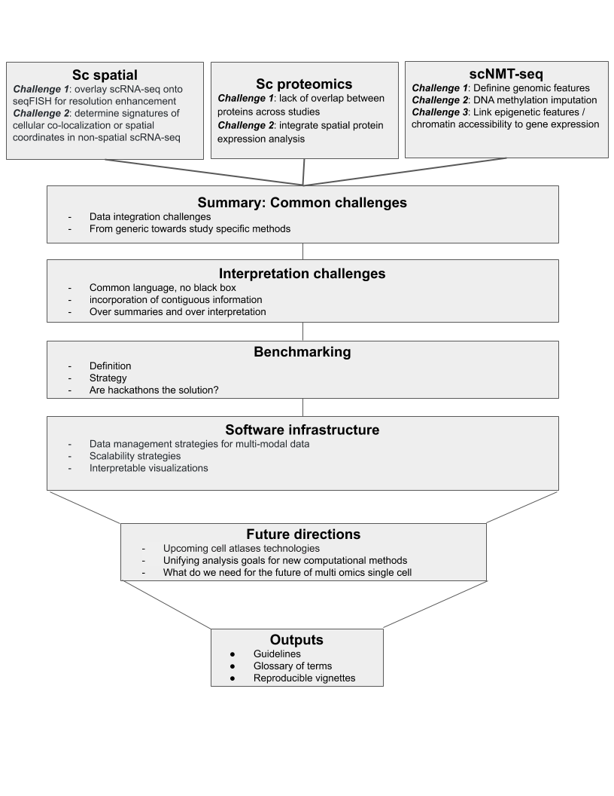

<!--
## Introduction
### Comprehensive characterization of biological systems with multi-omics
 - Single cell community has advanced technologies to enable concurrent processing of biological systems at multiple molecular resolutions
 - The lack of prior knowledge and gold standard benchmark naturally leads to a data-driven approach
<!--
### New single cell multi omics initiatives:
 - Human Cell Atlas (HCA): assess variation in normal tissues
 - Brain initiative and Allen Brain
 - Human Tumor Atlas Network (HTAN): Single-cell, longitudinal, and clinical outcomes atlases of cancer transitions for diverse tumor types.
<!--
### What bulk multi-omics (e.g. TCGA, ENCODE) have taught us:
 - Type of omics that can answer a specific biological question
 - The value of open resources for methodological developments
 - New hypotheses
<!--
### Using hackathons to illustrate analysis standards and challenges for capturing biological information from multi-omics technologies
 - Brief overview of our three hackathon studies highlighting state of the art challenges (e.g., spatial transcriptomics, cross-study analysis, epigenetic regulation)
 - Challenges include issues with noise and experimental design, Time lag between regulatory levels not addressed and many open questions
remain (e.g methylation / gene expression), Direction of regulation not captured
 - We present our findings from hackathon case studies that helped us obtain benchmarks and define a common language for multi-omics
<!--
- **Objectives of this paper**
    - Provide guidelines on tools / data / technologies / methods and needs to model the multi-scale regulatory processes in biological systems for a computational biologist audience
<!--
- **Outline and messages**
    - Cellular and molecular regulation is fundamentally multi-scale and captured by distinct data modalities
    - Traditional hypothesis-driven multi-omics/view studies only consider one facet of these technologies, but more can be learned through a holistic approach extending into atlases
    - We present our findings from hackathon case studies that helped us obtain a broader picture and language
-->

## Multi-omics hackathon studies illustrate standards and computational challenges in cell biology

Single-cell multimodal omics has claimed the title of method of the year only six years after single-cell sequencing [@https://www.nature.com/articles/s41592-019-0703-5], demonstrating the rapid pace of technological development in biology. Multi-omics technologies provide a unique opportunity to characterize cellular systems at both the spatial and molecular level. While each high-throughput measurement technology can resolve specific biological scales, complementary data integration techniques can reveal multi-scale interactions between modalities. While advances in multi-omics have coincided with the formation of tremendous new data resources and atlas-based initiatives to characterize biological systems, computational techniques and benchmarking strategies to integrate these datasets remains an active area of research. 

To determine the optimal methods and new developments required to analyze multi-modal data effectively, we selected hackathon studies focused on data integration for the Mathematical Frameworks for Integrative Analysis of Emerging Biological Data Workshop. The first challenge included spatial molecular profiling. While this technology is rapidly emerging, it often provides lower molecular resolution than its non-spatial counterparts. Integration strategies that merge spatial and omics datasets have the promise to enhance the molecular resolution of spatially resolved profiling. Thus, we designed a hackathon using spatially resolved transcriptional data from seqFISH with corresponding non-spatial single-cell profiling data from the mouse visual cortex [@doi:10.1038/nn.4216, @doi:10.1038/nbt.4260]. The second challenge dealt with the limited availability of tissue to obtain multiple measurements in samples from identical conditions, raising the question as to whether information can be transferred from datasets between distinct sample cohorts. Therefore, we designed the second hackathon to contain two triple-negative breast cancer cohorts profiled with single-cell proteomics profiling from mass cytometry (CyTOF) [@doi:10.1016/j.cell.2019.03.005] and spatial in-situ proteomics from Multiplexed Ion Beam Imaging (MIBI) [@doi:10.1016/j.cell.2018.08.039]. In contrast to the previous challenges, the third challenge presented data at different molecular scales but from the same cells to investigate how genetic and epigenetic alterations to DNA drive the transcriptional regulation underlying cellular state transitions. Our third hackathon was designed with scNMT-seq data to obtain concurrent DNA methylation, chromatin accessibility, and RNA expression from the same cells to delineate the regulatory networks that underlie mouse gastrulation [@doi:10.1093/humupd/dmy021]. 

Altogether, the analysis approaches employed to address these hackathons provide a unique opportunity to identify technology-specific challenges and unifying themes across disparate biological contexts, which are essential to effectively leverage multi-omics datasets for new biological knowledge. This article presents the study-specific and common challenges faced during this workshop. We provide guidelines and articulate the needs of technologies, data, tools, and computational methods to model the multi-scale regulatory processes of biological systems. 

<!--
{#fig:outline width = 50%}
-->
