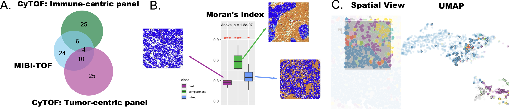

## Spatial proteomics as a case for cross-study and cross-platform analysis

### Overview and biological question

Whereas the first hackathon with seqFISH and scRNA-seq data included samples from the same biological conditions, our second hackathon challenged participants to analyze two datasets obtained from different single cell targeted proteomics (antibody-based) technologies, applied to breast cancer tissue of different patient cohorts, from different laboratories. Both studies examined the tumor-immune microenvironment in primary breast cancer: Wagner, et al. used Mass Cytometry (CyTOF) to assay 73 proteins across two panels (tumor and immune) in 194 tissue samples from 143 subjects, of which 6 patients had triple-negative negative breast cancer [@doi:10.1016/j.cell.2019.03.005], while Keren, et al. applied Multiplexed Ion Beam Imaging (MIBI) to quantify spatial in-situ expression of 36 proteins in 41 triple-negative breast cancer patients [@doi:10.1016/j.cell.2018.08.039] (Figure {@fig:proteomics}A).

This hackathon focused on integrative data analysis across studies and platforms, given limited overlap in features (Section \@ref{sec:common}). Three main challenges emerged. The first challenge was whether analytical methods could integrate partially-overlapping proteomic data collected on different patients with similar phenotypes, and whether measurements from one technology (MIBI spatial location and expression of proteins) could be transferred and used to predict information in the second technology (e.g., spatial expression patterns of proteins measured on CyTOF). The second challenge pertained to the added value of spatial technologies and whether integrated analyses of spatial single cell data could uncover additional information about immune cell populations in breast cancer beyond cell composition. The third challenge was whether data from patients with heterogeneous phenotypes could still be integrated, given few common features and no overlap in biological samples.

{#fig:proteomics width = 50%}

Caption figure: 
**A** The datasets selected for this hackathon had limited overlap in features (MIBI-TOF, CyTOF immune-centric panel, and CyTOF tumor-centric panel; illustrating **Challenge 1**) 
**B** Spatial analysis with Moran's index computed on Gabriel graph shown in boxplot according to tumor/immune status showing a significant difference between groups (Red asterisks indicate significance of an ANOVA of each group with all others with p-value from an overall ANOVA across the three groups reported; exploring **Challenge 2**). 
**C** Cells can be studied through either spatial or gene expression relationships, and correspondences between both representations can be highlighted through linked brushing, an interactive visualization technique (exploring **Challenge 2**).

<!-- NOTE: figure will need to be updated, still in discussion with Lauren + Kris, see comment below for B (KA) -->

### Computational challenges

#### Challenge 1: Limited overlap between protein features across studies

There were only 20 proteins that were assayed in both the CyTOF [@doi:10.1016/j.cell.2019.03.005] and MIBI-TOF [@doi:10.1016/j.cell.2018.08.039] studies (Figure {@fig:proteomics}A), which precluded integration of features at the level of gene set or pathways and required the use of surrogate measures for cross-study association. The majority of proteins were cell-type markers or biomarkers targets of breast cancer therapeutic intervention, providing the opportunity to perform cross-study integration of cell type proportions in tumor tissue samples.
<!-- there are more than 20 proteins indicated in the Figure, what is going on here? (KA)-->

Several semi-supervised and supervised algorithms were applied to transfer cell labels and cell compositions from one dataset to the second (see [Vignettes](#vignette-table)). Random forest was considered to capture the hierarchical structure of cell lineage and perform feature transfer learning of cell type labels, using an adaptation of the prediction strength approach [@doi:10.1198/106186005X59243] to assess model robustness: first, a model was trained on the labeled dataset, then used to predict labels in the unlabeled dataset; next, a second model was trained based on the second dataset with the newly predicted labels; finally, the ability of the second model to recover the correct original labels when making predictions on the labeled dataset was assessed. 
Mapping cells from CyTOF to imaging with spatial information was handled by solving an entropic regularization optimal transport problem [@doi:10.1016/j.cell.2019.02.026] [@doi:10.1038/s41467-020-15968-5], using the cosine distance of the common proteins between the two datasets as transport cost. The constructed optimal transport plan can be considered as likelihood of cells from one modality mapped to cells from the other modality, which allows the prediction of protein expression measured only in CyTOF on imaging data. After cluster analysis of the resulting imputed expression matrix, sub tumour cell type could be identified that was not revealed in the original matrix.

Another issue encountered with this challenge was that the different scales of protein expression across technologies meant that cell compositions could not be integrated using correlation of the expression of protein markers, as some cell markers were expected on a range of cell types (e.g. CD45), while others were more specialized and appeared in only a subset of those cells (e.g. CD4). Other challenges associated with cell composition analysis of proteomics data included uncertainty about antibody specificity and consistency between studies; specific sensitivity and specificity of protein markers for cell types and tissues; and disease heterogeneity. Cell type assignment was also a significant challenge, as it relied on manually curated protein annotation, and was therefore dependent on domain-specific knowledge (e.g. CD4 is expressed by T-cells). To date, methods for cell type assignment, classification or extraction of differentially expressed proteins cannot easily be applied to targeted proteomics. There is thus an urgent need for a unifying map between cells present in different datasets, and for annotation resources to provide quality metric or priors of protein cell type markers. The construction of protein expression atlases would support cell type classification, even if antibodies used and their performances might vary between labs.

#### Challenge 2: spatial analysis of protein expression

CyTOF mass spectrometry data provided protein expression and counts/composition of cells in breast tumor-immune environment, while the MIBI-TOF data provided spatial information that quantified cell attributes (shape, size, spatial coordinates) in addition to expression levels. These two data sets thus provide the opportunity to examine protein expression, cell microenvironment, and predict cell-cell interactions and the cellular community ecosystem.

Spatial information can be encoded as a set of XY coordinates (cell centroid), a line (e.g. tumor-immune boundary), or a polygon, which is a closed plane defined by a number of lines and can define complex shapes such as a cell or a community of cells. Spatial protein expression can be summarized using spatial descriptive statistics, such as the autocorrelation of the expression of a protein within a neighborhood of polygons, using techniques developed in geographical information science or ecology to assess whether a spatially measured variable has a random, dispersed or clustered pattern [@doi:10.1038/s41580-018-0094-y].

We investigated whether expression data could be used to predict spatial properties of tissue samples using a variety of approaches (see [Vignettes](#vignette-table)). A K-nearest neighbor graph was used to build spatial response variables and random forest model trained from expression data to predict spatial features. A topic model was trained on protein expression of CyTOF and MIBI-TOF data to predict cell co-locations of CyTOF immune cells where 10% of MIBI-TOF considered test data. Among the five topics identified, the first topic was dominated in most of the immune cells from CyTOF data and the other four dominated in all other cells. Prognostic performance of different higher level spatial metrics was also examined using Moran’s Index  with a sphere distance, cell type localisation using nearest neighbour correlation, or cell type interaction composition with Ripley's L-function. Cox models with fused lasso penalty and random forest survival models were then fitted based on clinical features such as tumor stage, tumor grade, age and tumor size, as well as cell type composition. The spatial metrics were found to be predictive, especially in triple negative breast cancer where clinical features such as grade are often poor prognostics. Further investigation of Moran’s Index using a graph-based neighborhood measure (Gabriel graph, based on Delaunay triangulation; as opposed to sphere distance) found the values of this metric differed significantly between the three prognostic tumor scores described by [@doi:10.1016/j.cell.2018.08.039](Figure {@fig:proteomics}B). This challenge demonstrated the prognostic potential of spatial single cell proteomics data and underscores the need to develop new spatial measures specifically for these data. 

#### Challenge 3: Fourth corner Integration of data at the level of phenotype

Cross-study integration also raises the challenge of non-overlapping biological samples but with similar phenotypes. Here the aim was to identify biomarkers from the different data types to predict phenotype, and, more importantly, to explore concordance among markers selected across multiple studies and datasets. Depending upon how well these markers can be transferred across datasets, as well as the amount of distinctive information encoded by different markers, integrating datasets with only some overlap in markers could potentially provide more biological insight than from individual ‘omics studies. To consider this third challenge, phenotypic data (such as the cell attributes) were the critical factors that should be used to link the two datasets (Figure {@fig:common}D).

Integrating patient phenotype measures such as grade, stage and overall survival is one first step that we were able to achieve. However, integrating proteins from data sets that used different approaches to cell type annotation and had limited proteins in common was extremely challenging. Borrowing from ecology and the French school of ordination, this problem can be described as a case of the fourth corner problem (or RLQ, Figure {@fig:common}D). Briefly, given two 'omics data where both features and samples are non overlapping, and phenotypical data are available for each omics data, multiplying the two phenotypical factors should derive a bridging matrix that links the features of two omics data. This requires the two phenotypical matrices to be  multiplicable, i.e. describing the same phenotypical factors. The fourth corner RLQ can be solved using matrix decomposition [@doi:10.1007/BF02427859; doi:10.1111/ecog.02302]. However, this approach was not attempted in this hackathon.

<!-- line 47: mentions 13 proteins and those numbers dont match with Figure B (KA)--> 
<!-- would be good to justify why this approach was not attempted (KA) -->

