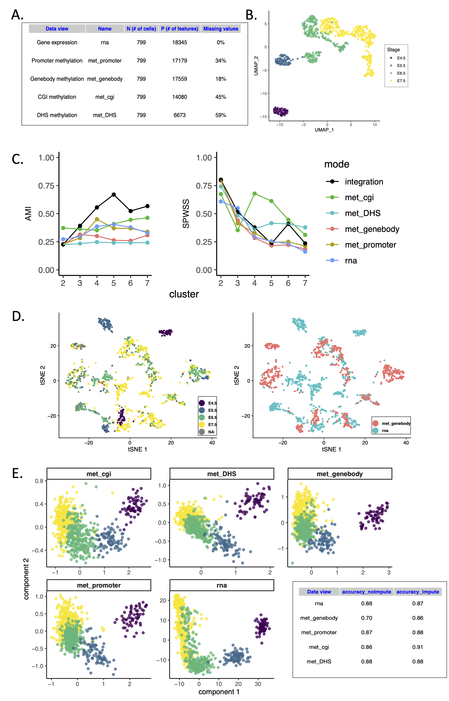

## scNMT-seq as a case-study for epigenetic regulation

### Overview and biological question

The first two hackathons leveraged paired datasets from complementary technologies that measure the same molecular modality at distinct resolutions and aim to develop integration strategies to merge them to enable high molecular and spatial resolution of biological systems. Datasets spanning disparate molecular scales, such as between DNA and RNA, are critical to further resolve the regulatory networks that mediate cell fate decisions. For example, the maturation of single-cell sequencing technologies has enabled the identification of transcriptional profiles associated with lineage diversification and cell fate commitment[@doi:10.15252/msb.20178046]. Yet, the accompanying epigenetic changes and the role of epigenetic layers in driving cell fate decisions still remains poorly understood[@doi:10.1016/j.stem.2014.05.008].

scNMT-seq is one of the first experimental protocols that enable simultaneous quantification of RNA expression and epigenetic information from individual cells[@doi:10.1038/s41467-018-03149-4]. Briefly, in scNMT-seq cells are incubated with a GpC methyltransferase  enzyme that labels accessible GpC sites via DNA methylation. Thus, after bisulfite sequencing, GpC methylation marks can be interpreted as direct readouts for chromatin accessibility. This stands in contrast to CpG methylation marks, which can be interpreted as endogenous DNA methylation. In addition, by physically separating the genomic DNA from the mRNA, scNMT-seq can profile RNA expression, DNA methylation and chromatin accessibility readouts from the same cell. This hackathon leverages scNMT-seq data to assess the performance of data integration strategies to infer mechansisms underlying gene regulation in cell fate decisions.

### Data set description

Gastrulation marks a major lineage specification event in mammalian embryos, accompanied by profound transcriptional rewiring and epigenetic remodelling [@doi:10.1093/humupd/dmy021]. scRNA-seq studies have identified major transcriptional changes associated with cell fate commitment, but the accompanying epigenetic reprogramming and the coordination between different epigenetic layers remains poorly understood.

In this hackaton we used a data set where scNMT-seq was applied to mouse gastrulation [@doi:10.1038/s41586-019-1825-8]. A total of 749 cells across four developmental stages (E4.5 to E7.5) passed quality control for all three data modalities. For simplicity, in the workshop we focused on the integration of RNA expression and DNA methylation, quantified over the following genomic contexts: gene bodies (D=15837), promoters (D=12092), CpG islands (D=5536), p300 binding sites (D=101), CTCF binding sites (D=175) and DHS (D=66) open sites.

Applying standard dimensionality reduction algorithms confirms that all three embryonic stages can be separated on the basis of RNA expression. The task of the workshop was to evaluate whether the same stages can also be discerned on the basis of DNA methylation.

### Computational integration

We considered three computational strategies:  

*  **PLS (as implemented in [@doi:10.1093/biostatistics/kxu001; @doi:10.1371/journal.pcbi.1005752]):** projection to least squares model. A sparse generalisation of canonical correlation analysis that maximises covariation between prespecified pairs of data modalities.
* **LIGER** [@doi:10.1016/j.cell.2019.05.006]: unsupervised non-negative matrix factorisation model for manifold alignment. It assumes a common feature space by aggregating DNA methylation over gene-centric elements (promoters or gene bodies) but allows cells to vary between data modalities.  
* **MOSAIC** [XXX]: a multi-omics supervised clustering algorithm inspired from `survClust`.

Overview of hackathon analyses.
**a** A summary of a subset of data types used. Challenges 1 and 2: defining genomic contexts, varying dimensions and different amount of missing values across various modalities.
**b** Uniform Manifold Approximation and Projection of RNA measurements using 671 highly variable genes resolves the various embryonic stages shown by different colors.
**c** Supervised analysis using view-specific and integrative distance measures (MOSAIC). The integration finds 5 clusters of cell populations based on Adjusted Mutual Information (AMI) and Standardized Pooled Within Sum of Squares (SPWSS) and outperforms individual analyses.
**d** Shared axes of variation are driven by emryonic stages. Unsupervised integration using Projection to Latent Structures characterizes common variation between RNA and methylation data while selecting for most relevant features. Each point represents a cell on covarying components. The method either omits the missing values while integration or incorporates the inferred values in the integration (shown). Balanced accuracy measures for a k-means clustering analysis using the extracted components from the two scenarios (bottom right).
**e** Joint clustering of cells finds common and view-specifc patterns of variation. LIGER uses non-negative matrix factorization to integrate transcriptome and genebody methylome and align cells in the common subspace. The poor alignment suggests decoupling of the gene expression and genebody methylation during gastrulation and highlights the importance of linking relevant epigenetic features to transcriptome (challenge 3). 

### Computational challenges

#### Challenge 1: defining genomic features

The first challenge concerns the definition of the input data. The output of single-cell bisulfite sequencing are binary DNA methylation measurements for individual CpG sites. Integrative analysis at the CpG level is extremely challenging due to (1) the sparsity levels, (2) the binary nature of the readouts, and (3) the challenging interpretability of individual dinucleotides.
To address these problems, DNA methylation measurements are typically aggregated over predefined sets of genomic elements (i.e. promoters, enhancers, etc.). This preprocessing step reduces sparsity, permits the calculation of binomial rates that are approximately continuous and can also improve interpretability of the input features.

There are two common strategies to define genomic elements. The first one is to use a running window approach across the entire genome. This strategy has been succesful to distinguish heterogeneous cell types, but it does not improve interpretabiliy and it leads to a massively large feature set. The alternative strategy is to adopt a supervised approach where ChIP-seq data or chromatin accessibility information is employed to restrict the feature space to genomic regions of regulatory potential.

<!-- n our results we observe remarkable differences between genomic contexts on the integration performance.  -->

[DESCRIBE RESULTS]

Our results confirm that the appropriate selection of the feature space is critical for a successful integration with RNA expression.

<!-- DESCRIBE REGULATORY CHROMATIN ATLASES -->

#### Challenge 2: Missing values in DNA methylation

Because of the low amounts of starting material, single-cell bisulfite sequencing protocols are limited by incomplete CpG coverage. Nonetheless, in contrast to scRNA-seq, missing data can be discriminated from dropouts.

Two strategies were put forward in the workshop to handle missing values. The first is to define an inference framework that omits missing values, as done in PLS and MOSAIC. The second approach, for methods that do not handle missing information, including LIGER, is to perform *a priori* imputation of DNA methylation values.

Here we compared the integration performance for PLS ~and MOSAIC~ with and without imputation. We observe that after inferring the missing values in methylation data using a nearest neighbors approach, the axes of concordnat variation with gene expression better resolve the population structure in some epigentic regions. To quantify any improvement in biological relevance of the extracted components of shared variation, we used a supervised analysis which used the number of embryonic stages as the number of clusters. Notably, the balanced accuracy of prediction based on genebody methylation components improved from 70% for the original data to 86% after inferring the missing values.

#### Challenge 3: Linking epigenetic features to gene expression

One of the main advantages of single-cell multi-modal assays is the ability to unbiasedly link epigenetic variation with gene expression.
Transcriptional activation is associated with specific chromatin states near the gene of interest. This includes deposition of activatory histone marks such as H3K27ac (in promoters and enhancers), H3K4me3 (in promoters) and H3K36me3 (in gene bodies), binding of transcription factors, promoter and/or enhancer demethylation and chromatin remodelling. All these events are closely interconnected and leave a footprint across multiple molecular layers that can be (partialy) recovered by performing an association analysis between a specific chromatin readout and mRNA expression. However, given the large amount of genes and regulatory regions, this task can become prohibitively large and it is mandatory to restrict the feature space to avoid a complex multiple testing problem.

A simple and practical approach from a computational perspective involves considering only putative regulatory elements within each gene's genomic neighbourhood. Nonetheless, this might miss important links with regulatory elements located far away from the neighbourhood.

In recent years, chromosome conformation capture experiments, have uncovered a complex network of chromatin interactions inside the nucleus connecting regions separated by multiple megabases along the genome and potentially involved in gene regulation. Early genome-wide contact maps generated by HiC uncovered domains spanning on the order of 1 Mb (in humans) within which genes would be coordinately regulated. Thus, a second strategy to associate putative regulatory elements to genes is to build on existing promoter-centered chromatin contact networks to restrict the association analysis to putative regulatory elements that are in 3D contact with genes.
Although this is a promising strategy to reduce the complexity of the association analysis, most of our 3D interaction datasets are produced in bulk samples and it is so far unclear how much of these structures are preserved across individual cells. Single-cell conformation capture experiments are still limited by data sparsity and high levels of technical noise, but we envision that technological advances in this area will deepen our understanding on the regulatory roles of chromatin states.
