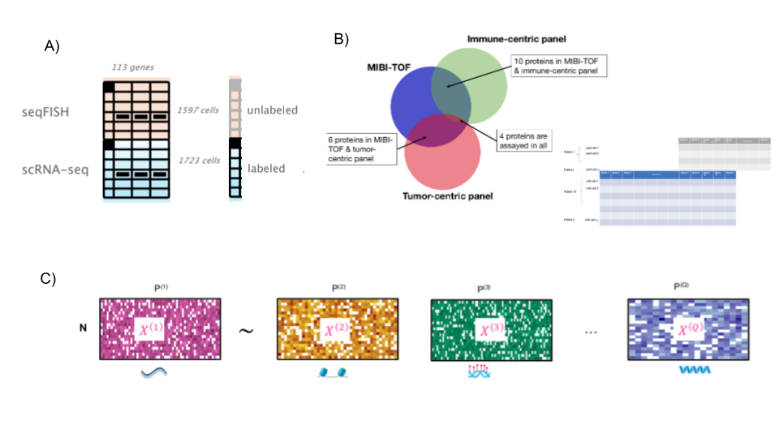

## Overview of common challenges and analytical methods spanning technologies and hackathon case studies

Short introduction explaining that we focus here on the common challenges across hackathons
### Data integration

#### Selection of pre-processing method and/or variable selection for integration
 - Why this is needed and how it was addressed across all hackathons
    - Normalisation / data transformation (seqFish), pre-processing, gene summaries (scNMT-seq) to variable selection (seqFish), these steps affect the downstream analyses, e.g. Alexis selected 19 genes whereas Zhu original paper based on 47 genes (difference in methods / processed data)
- Limitations and further developments required
  - No consensus reached as those are emerging data with no ground truth nor established biological results
  - Difficulty in reproducing original results (Alexis)

####  Partial overlap of information (cells / features) and how to predict (cell type, dataset) using another data set
  - Why this is needed
    - Common across all studies (seqFish: same features but not cells; scProt: same proteins, not cells but similar patients; scNMT-seq: same cells but not features)
    - We need some commonalities to anchor information across datasets
- How it was solved across all hackathons: 
   - See table, in particular Partial feature overlap (but cells not matching) and No cell overlap but some / all feature overlap addressed by participants
- Limitations and further developments required
   - See table, Partial cell overlap (but no features matching) and No overlap were not addressed

####  Managing differences in scale and size
- Why this is needed
  - Datasets do not match cells or features.
  - scNMTQ-seq: MOFA limitation when # features vary (and size of datasets). 
  - seqFish: greedy approach to select the best gene subset (Alexis, size); consider batch effect removal method (Amrit, scale)

- How it was solved across all hackathons
  - See table, projection based methods seem to work best across all studiesAlso note that pre-processing was performed (but still large datasets)

- Limitations and further developments required
  - Additional weighting is needed (e.g. Arora, Abadi).

####  Incorporation of existing knowledge (also in future directions)
- Why this is needed
  - ‘From discovery to detection’ (Meuleman + debrief), time is ripe to include more knowledge in our data driven approaches

- Further developments required

  - Better gene ontology and hypothesis generated need to be validated (see debrief)

### From generic to study specific approaches 

#### Methods previously developed for bulk data that were applied to single cell across our hackathons
- Attempts to tweak existing methods and challenges associated
  - See table Generic approaches for supervised analysis / prediction, Study specific methods and Managing differences in scale: most methods were developed for bulk and applied with some tweaks (e.g dealing with missing values, size). 
  - List methods that are either technology dependent (e.g. spatial) vs universal and how to choose them

####  What do we need for seamless methods extensions to single cell data
- Methods that can span technologies
- Benchmark data 
- Better software infrastructure for methods benchmark

Figure caption:

A) scSpatial: required overlap of features (genes), but cells do not overlap. Cell type prediction for seqFISH data was performed based on scRNA-seq (known) [credit: Amrit Singh]
B) scProteomics: a small number of features overlap (proteins) but patients and cells do not overlap. Data imputation (?), spatial co-localisation or cell type prediction was performed   [credit: Lauren Hsu and Pratheepan Jenagan]
C) scNMT-seq: cells are matching across assays but features do not overlap. Data integration was performed [credit: Al Abadi]

