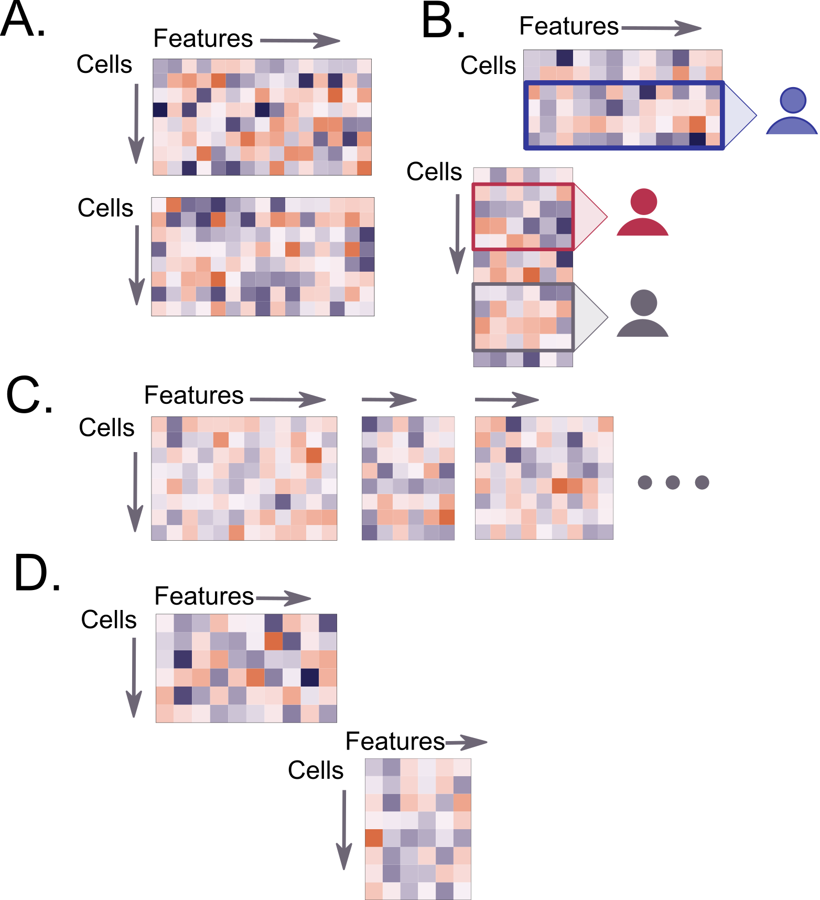

## Commonalities between analytical multi-omics approaches for hackathons {#sec:common}

Each hackathon study highlighted disparate challenges to multi-omics from different measurement technologies. Yet, these studies were unified by the underlying problem of data integration. We summarize the common problems faced across all hackathons and shared approaches adopted by participants. These commonalities highlight the critical computational issues in multi-omics single-cell data analysis. 

The choice of methods mostly relied on the biological question to address: data integration was conducted using projection approaches, cell prediction required machine or statistical learning methods (SVM, Enet), and spatial analysis was conducted using Hidden Markov random field or Moran's Index. As computational methodologies span technologies, so do the central challenges highlighted in each hackathon. For example, the accuracy of the analysis critically depended on data pre-processing (e.g. normalization, upstream feature selection), differences in scale across data sets, and overlap (or lack thereof) of features (Figure {@fig:common}). In many cases, preprocessing can yield data mapping to common molecular features, such as genes, that can be the focus of the integration task. However, the spatial proteomics challenge showed that many multi-omics datasets have limited shared features between studies. In cross-study and cross-platform analyses, methods that investigate hierarchical structure and apply measures of higher order concordance among the omics, cell, and phenotype layers are critical. Even in cases with matching molecular features, such analyses can reveal novel aspects of biology.

Table {@tbl:common} summarizes the main methods that were applied across all hackathons. A large number of computational analysis methods that were applied derive from bulk RNA-seq literature, with the exception of projection methods developed for single-cell such as tSNE, UMAP, and LIGER. In this section, we briefly highlight the three common challenges faced across all hackathons. 

### Common challenge 1: Dependence on pre-processing method and/or variable selection

Pre-processing steps strongly affect downstream analyses. Our participants thoroughly assessed the effect of normalization and data transformation (e.g. spatial transcriptomics, Figure {@fig:spatial}A), as well as preliminary feature selection (mostly on based on highly variable genes) or feature summarization (scNMT-seq study). Ease of comparisons between analyses was facilitated by providing processed input data (@ref{sec:software}), which still encountered reproducibility issues between the original published study and the new analyses. For example, in the spatial transcriptomics study, 19 genes were selected in [COullomb vignette to ref] (*in scRNA-seq? or seqFISH?*) whereas the original paper selected 47 genes based on the same feature selection process [@doi:10.1038/nbt.4260]. No consensus was reached across participants’ analyses regarding the best way to process such emerging data, as no extensive benchmark, ground truth, or established biological results are yet available, which we discuss in @ref{sec:benchmark}. ** the last sentences here are unclear **

### Common challenge 2: Managing differences in scale and size across datasets

Various techniques were used to address the differences in scale or resolution across data sets. For spatial transcriptomics and proteomics, participants focused on a common set of genes (via feature selection in spatial transcriptomics) or proteins. The scNMT-seq study that included overlap between cells raised the issue of differences in data set size with a varying number of features per dataset ranging from 6,673 to 18,345 (Figure {@fig:scNMT-seq}A). Some projection-based methods, such as MOFA [@doi:https://doi.org/10.1186/s13059-020-02015-1], require a similar number of features in each data set, while others such as PLS / sGCCA [@doi:10.1093/biostatistics/kxu001] do not have this limitation and enable more flexible analysis (Abadi vignette). Differences in data scale may result in one data set contributing to either too much variation or noise during data integration. Techniques such as re-scaling (Jenagan vignette), batch effect removal approaches, such as Combat [@doi:10.1093/biostatistics/kxj037] (Singh vignette) or weighting specific data sets (Arora, Abadi vignettes), were considered and each offered further improvement in the analyses.

### Common challenge 3: Addressing partial overlap of information across cells or features

The degree of feature or cell overlap between datasets varied dramatically within each study. Intuitively, to integrate information across modalities, at least one type of overlap (whether on the features or cells, Figure {@fig:common}) is required. The field has made progress in developing methods to integrate data sets across the same (bulk) samples of single cells, mostly based on dimension reduction techniques. Amongst them, NMF (LIGER) and Projection to Latent Structures (sGCCA [@doi:10.1093/biostatistics/kxu001]) were used for the scNMT-seq study. When there was no cell overlap, such as in the spatial studies, imputation methods were used to predict gene, protein, or spatial expression values based on nearest neighbors, latent variables, or optimal transport. These methods were also used to predict cell types (Hsu vignette). The most challenging study was the spatial proteomics, which raised the issue of no overlap between cells or features - the so called fourth corner that relies on phenotypes (Challenge 3 in @ref{sec:proteomics}). We anticipate that this scenario will be avoided once technological progress and increase in data availability is achieved [@doi: 10.1186/s13059-020-1926-6].

{#fig:common width="50%"}
Caption figure: **A.** Overlap of features (genes) but not cells (e.g. spatial transcriptomics where cell type prediction for seqFISH data was performed based on scRNA-seq where cell types are known.
**B.** Partial overlap of features (proteins) but no overlap of cells (e.g. spatial proteomics that required data imputation or cell type prediction).
**C.** Overlap of cells across assays, but no overlap of features (e.g. scNMT-seq where data integration was performed).
**D.** Lack of overlap between cells and features (the so-called fourth corner problem @ref{sec:proteomics}).

Table: Different methods were used in the hackathon. * indicates that the method was not applied on the hackathon data. For some common challenges, ‘bulk’ indicates the method was originally developed for bulk omics, 'sc’ indicates the method was specifically developed for single-cell data **table will include links to vignettes rather than name of participants TO DO** {#tbl:common}

<table class="tg">
  <thead>
    <tr>
      <th>Common challenges</th>
      <th>Tasks</th>
      <th>sc Spatial</th>
      <th>sc targeted proteomics</th>
      <th>sc NMT-seq</th>
    </tr>
  </thead>
  <tbody>
    <tr>
      <td class="tg-bold">Pre-processing</td>
      <td class="tg-bold">Normalization & data transformation</td>
      <td>Data distribution checks (Coullomb, Singh)  High Variable Genes selection (Xu) </td>
      <td>Variance Stabilization Normalisation [@doi:10.1093/bioinformatics/18.suppl_1.s96] (Meng)  Arcsinh transformation (Jeganathan).  Inverse transformation (Jenagan)  Selection of patients (Jenagan) </td>
      <td>Summaries of DNA measurements (input data provided in hackathon)</td>
    </tr>
    <tr>
      <td class="tg-bold"> Managing differences in scale 
      </td>
      <td class="tg-bold"> Data integration </td>
      <td> LIGER [@doi:10.1101/459891] (Sodicoff) (sc)  ComBat (Singh)  Projection methods MFA, sGCCA [@doi:10.1093/biostatistics/kxu001] (Singh*) (bulk)  UMAP/tSNE (Sodicoff) (sc) </td>
      <td> Multi-block PCA [@doi:10.18129/B9.bioc.mogsa]  Weighting matrices based on their similarities: STATIS, MFA (Chen*)(bulk)  Scale MIBI-TOF to the range of CyTOF values (Jenagan) </td>
      <td> LIGER [@doi:10.1101/459891] (Welch) (sc)  Projection method sGCCA [@doi:10.1093/biostatistics/kxu001] (Abadi) (bulk)  Multi Omics Supervised Integrative Clustering with weights (Arora) (bulk) </td>
    </tr>
    <tr>
      <td class="tg-bold" rowspan="6">Overlap</td>
      <td><b>Cell overlap</b>  (features not matching) </td>
      <td></td>
      <td></td>
      <td>
        <b>Dimension reduction and projection methods:</b>  LIGER [@doi:10.1101/459891] (Welch) (sc)  sGCCA [@doi:10.1093/biostatistics/kxu001] (Abadi) (bulk) 
      </td>
    </tr>
    <tr>
      <td>
        <b>Partial feature overlap</b>  (cells not matching)
      </td>
      <td></td>
      <td>
        <b>Imputation:</b>  Direct inversion with latent variables (Sankaran)  Optimal transport to predict protein expression (Lin)  K Nearest Neighbor averaging (Jenathan*) 
         
        <b>No imputation:</b>  Biological Network Interaction (Foster*)
      </td>
      <td></td>
    </tr>
    <tr>
      <td><b>Partial cell overlap</b>  (features not matching) </td>
      <td></td>
      <td>Multi block PCA [@doi:10.18129/B9.bioc.mogsa] (Meng*)</td>
      <td></td>
    </tr>
    <tr>
      <td><b>No cell overlap</b>  (complete feature overlap) </td>
      <td>Averaging nearest neighbors in latent space to impute unmeasured expression values (Coullomb?)</td>
      <td>Transfer cell type label with Random Forest (Hsu)</td>
      <td>LIGER [@doi:10.1101/459891] (Welch)</td>
    </tr>
    <tr>
      <td><b>No cell overlap</b>  (partial feature overlap) </td>
      <td></td>
      <td> Topic modeling to predict cell spatial co-location or spatial expression (Jenathan, partial feature overlap) 
      </td>
      <td></td>
    </tr>
    <tr>
      <td class="tg-bold">No overlap</td>
      <td></td>
      <td>RLQ [@doi:10.1890/13-0196.1] (Chen*)</td>
      <td></td>
    </tr>
    <tr>
      <td class="tg-bold" rowspan="4"> Generic approaches </td>
      <td class="tg-bold"> Classification &amp; feature selection </td>
      <td> Backward selection with SVM (Coullomb)  self training ENet (Singh)  Balanced error rate (Coullomb, Singh)  Recursive Feature Elimination (Xu) 
          (all bulk)
      </td>
      <td></td>
      <td> Multi Omics Supervised Integrative Clustering (Arora) (bulk)  Lasso penalization in regression-type models (bulk) </td>
    </tr>
    <tr>
      <td class="tg-bold">Cell type prediction</td>
      <td>Projection with LIGER [@doi:10.1101/459891] (Sodicoff)  SVM (Coullomb, Xu)  ssEnet (Singh)  (all bulk) </td>
      <td></td>
      <td></td>
    </tr>
    <tr>
      <td class="tg-bold">Spatial analysis</td>
      <td>Hidden Markov random field  Voronoi tesselation (Coullomb) (bulk) </td>
      <td>Spatial autocorrelation with Moran's Index (Hsu, Lin) 
          Selection of spatial discriminative features:  Moran's Index, NN correlation, Cell type, interaction composition, L function (Lin) 
          (all bulk?)
      </td>
      <td></td>
    </tr>
    <tr>
      <td class="tg-bold">Inclusion of additional information</td>
      <td></td>
      <td>Survival prediction: Cox regression based on spatial features (Lin)</td>
      <td>Include annotated hypersensitive sites index to anchor new/unseen data from DNase-seq, (sc)ATAC-seq, scNMT-seq, for <em>de novo</em> peak calling (Meuleman*) (bulk) </td>
    </tr>
  </tbody>
</table>
