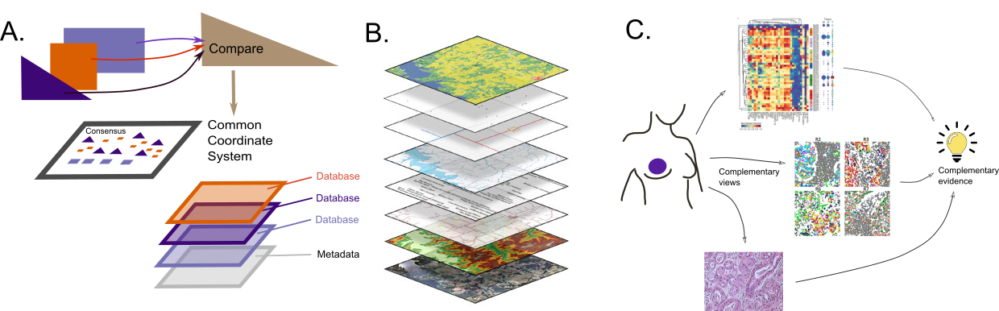

<!-- Susan, you would refer to this section, or the other sections as (see [Section](#challenges-interp-section))
Kris has updated the Figure and caption, liase with him if you need to.
We'll fix up the references, apparently just a url works week, see example in any other section
Figures in general will be improved + accompanying vignette after the first round.
-->

## Challenges for interpretation

The analyses from each hackathon emphasized that regardless of the common difficulties faced by our participants, there is no one method fits all for multi-omics integration. An equally important complement to the diverse computational methods used to solve multi-omics analysis problems rests in the biological interpretation of their solutions. A notable challenge to interpretation is that the integrated data from these approaches are often higher dimensional than the input datasets. For example, even abstract lower dimensional representations providing spatial coordinates are often interpreted in terms of their ability to capture higher level cellular structure or prognostics, requiring even further contiguous data than the original high-throughput multi-omics data as input. These approaches also suggest that new measures of the tumor or cell ecosystems of interacting cells are needed because these interactions are fundamental to biological systems. Both the high dimensionality and biological complexity introduce further challenges in understanding and communicating the results from these analyses. Thus, efforts to interpret multi-omics data require standardized vocabulary, benchmarked methods, and abstracted latent variables that can be compared between studies. 

### Supervised versus unsupervised {#subsec:super}

Interpretation hinges on the analysis method selected for a given dataset. One simple delineation between methods used throughout the hackathons and summarized in [Table 1](#commontable), is that some
aim to predict a clearly defined outcome at the start of the project, such as recognizing the environment of tumor cells versus that of healthy cells (see [proteomics](#proteomics-section) section).
The supervised setting  often provides easier interpretations; one can easily rank the covariates and contiguous data in terms of their predictive potential.

On the other hand when data are collected without the availibility of a clear response (survival time, tumor size, cell growth,..) using multiple
different technologies, data integration requires the production of organizing patterns that enable interpretation.
Clustering is often used as one unsupervised method and is a good example of the use of a latent variable, in this case a factor or categorical variable which was not directly measured on the data but is often used to enable simple interpretations.

In cellular biology,  a favorite such division into clusters is that involved in the definition of cell type
[@doi:10.1016/j.cels.2017.03.006]. Unfortunately, biological phenomenona are often not as clearcut.

Some scientists overseparate  their data using clustering, forcing the data into types, even when the variation is along gradients or along a continuum. In early single cell methods such as flow cytometry, cell gating was often overused and the intermediary cells lost in the preprcoessing steps.
Eliminating cells in intermediary states to provide clearly delineated inventories of cell types or cells in discrete states only provides a static description and does not enable researchers down the road to predict or understand transtitions between types.

Although a latent factor can be a useful first approximation,  keep in mind that development of cells and their fate is a dynamic process and it can often be beneficial to keep data that enable interpretation of the cell trajectories: in that case, locally the underlying latent variable of interest is continuous along a gradient of development.

So far, we have seen two types of latent variables: clusters and a one dimensional continuous "gradient", (pseduo-time, disease progression are two examples of such latent gradients).
However the idea of latent variables is a rich anchor for many multimodal methods and can often be useful in highlighting what the modalities have in "common" and how they differ.
The commonalities are well understood in the case of classical multivariate factor  analyses where the data are decomposed into "commonalities" and uniqueness components [@doi:10.1037/h0069792].

A schematic summary of the different stages in interpretation is provided here:

{#fig:interpretation width="95%"}

Caption figure: 
**A** Schematic diagram of stages of interpretation and integration of data sources. 
**B** Standards in Geographic Information Systems enable the integration of multiple layers of data. 
**C** Integrative analysis across multiple modes of data results in complementary evidence, allowing stronger conclusions, an instance of Cardinal Newman's principle.

Multiple domains of knowledge can be combined easily if there is a common coordinate system, as in geospatial analyses.This is often a goal in multimodal or conjoint analyses, when the first step is to find a common compromise or consensus on which to project each of the individual modalities.
Conjoint analyses also known as STATIS [@doi:10/c8xttz] was a very early multimodal method designed as PCA of PCAs where the first step in the analyses was to find what the different modalities had in common and define a consensus [@doi:10.1214/193940307000000455] onto which the individual tables were projected.
This method can be seen as an extension of the class of matrix decomposition methods to data cubes.
Many extensions to matrix decompositions have been designed for multimodal data, [@doi:10.3389/fgene.2019.00627] offers an overview of the relations between many of them.

### Reasoning by analogy with geospatial problems

In both the [proteomics](#proteomics-section) example
and the [spatial](#spatial-section) examplary data, a spatial dimension was already naturally available.
As in previous studies one can leverage
extensive methods developed in spatial statistics to
quantify spatial effects [@doi:10.1371/journal.pone.0012420].
Contiguity and clustering can be tested and easily understood in the spatial context.

In these cases,  layers of information can be mapped to the natural coordinate system in the same way
a GIS system incorporates them (Figure {@fig:interpretation}B).
The spatial coordinate system analogy can be pursued
further by finding a "consensus space" that provides a common coordinate system. Thus by creating an abstract coordinate space, we can
leverage methods developed for true spatial co-occurrences and use them in evaluating co-occurrences in the abstract spatial coordinates, this is an effective strategy for creating layered maps, even in the absence of a physical coordinate system.

There are however pitfalls in using very sophisticated dimension reduction techniques which lead to over-interpretation or misinterpretation of spatial relations, one example is the size and closeness of clusters in t-SNE which do not represent true densities or similarities in the
original data.

### Disparate sources of evidence are more compelling than more of the same.

Following [Cardinal Newman's principle](https://www.encyclopedia.com/people/philosophy-and-religion/roman-catholic-and-orthodox-churches-general-biographies/john-henry-newman)^[Supposes a thesis (e.g. the guilt of an accused man) is supported by a great deal of circumstantial evidence of different forms, but in agreement with each other; then even if each piece of evidence is in itself insufficient to produce any strong belief, the thesis is decisively strengthened by their joint effect.]
disparate sources of evidence, or in this case data from different technologies, are more compelling than many replicates of the same technology.
Thus, if different technologies allow a consensus on  underlying latent variables, this information is worth retaining.

### Explaining results to biologists through generative models and simulations (ex: Factor Analysis, Hierarchical models).

Several difficulties arise when explaining summaries and conclusions, problems encountered include non-identifiability of models
or non-sufficiency of summaries, simulations can often provide effective communication tools.

One can often generate data from different probabilistic models and show that the methods cannot differentiate between the generation processes, this is the identifiability problems that most overparametrized models lead to.
Added constraints on the parameters can often
be integrated into the analyses to make them more realistic and reduce if not eliminate the identifiability issues.

### Meaningful Interpretation by linking in databases

In the right side of Figure {@fig:interpretation}A we show how connections to layers of information from outside databases can be incorporated into the final output. Real biological understanding is often subordinated to the integration
 of this contiguous information.
Either from the metadata already available in the multiassay containers as for instance in the [MultiAssayExperiment package](https://bioconductor.org/packages/release/bioc/html/MultiAssayExperiment.html) or from exterior sources such as Gene Ontologies, Biomart [@doi:10.1038/nprot.2009.97], Kegg, Human Cell Atlas (HCA) or other sources often available through links provided within systems like bioconductor [@https://bioconductor.org].

Redundant biological knowledge is often enlightening,
as many methods suffer from identifiability issues (ie in a gradient, the direction of the direction is unknown).
By providing information on the extreme points in a map
or brushing a map with known gene expression features
one can delineate orientations and clusters.

As an example, it is only through  coloring by CD56 across time that we can see  the dynamics of immune response [@doi:10.3389/fimmu.2020.00714] (Figure {@fig:interpretation}C).

### Visualization tools for interpretation and communication to biologists

An example of effective visual interpretation tools is interactive brushing of UMAP plot, see Figure {@fig:interpretation}C by Kris Sankaran.

### Interpretation for data scientists reading the methods sections requires a good understanding of the building blocks

Spanning all of these interpretation challenges is a further central communication barriers within the community of data scientists, computer scientists and computational biologists ie communicating about methods within a community of practitionners who do not have the same vocabulary or background.

Many tools are used as black boxes and users
don't know or agree on what exactly the methods are doing (MOFA and tSNE are examples).
The first step in unblinding these black boxes used as methodology shortcuts is to have a clear glossary of terms and how we are using them.
Many synonyms for multimodal data exist and some have nuances, see the table we have compiled (ref: Table1).
Understanding the relation between methods developed by different teams is essential and we often try to organize the methods first, thus it is useful to create a dichotomy of methods and their underlying properties.

A very useful tool for making methodological black boxes more transparent are simulated data.
These can follow benchmark methods such as those presented in [benchmarking](#benchmarking-section) and use well defined generative processes to clarify what some complex methods do.

Visualization of the data, following the step by step transformations and optimizations of data representations also help  clarify how certain methods fit models or  compress and reduce data dimensionality.
These visualizations are often very specialized (think for instance, correspondence analyses, goodness of fit plots like qqplots or rootograms or mean-variance fitting).
These intermediary plots don't usually end up in the main text of final biological publications and serve as intermediary checks to unpack the black boxes.

UMAP:
[@doi:10.1038/nbt.4314]
https://arxiv.org/abs/1802.03426v2

Spatial tumor and immune cells:
[@doi:10.1371/journal.pone.0012420]

CD56 Immune cell coloring, paper with C. Blish:
[@doi:10.3389/fimmu.2020.00714]

Footnote:
Cardinal Newman wrote  **The Grammar of Assent.** and cited in  [Bruno de Finetti, Volume 1, 1974 Theory of Probability]:

*Supposes a thesis (e.g. the guilt of an accused man) is supported by a great deal of circumstantial evidence of different forms, but in agreement with each other; then even if each piece of evidence is in itself insufficient to produce any strong belief, the thesis is decisively strengthened by their joint effect.*

