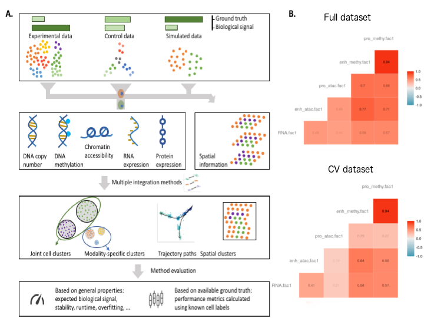

## Techniques and challenges for benchmarking methods

Visualizations and biological assessment of marker gene lists
resulting from multi-omics analyses provide a critical interpretation of high-throughput data integration, but additional
quantitative metrics are necessary to delineate biologically-relevant
features from features arising from either computational or
technical artifacts. Quantitative benchmarks
are also essential to enable unbiased comparisons between analytical
methods. For example, the goal of multi-platform single-cell data
analysis is often the recovery of known cell types through
computational methods. Metrics such as the adjusted Rand Index
(ARI) enable a direct assessment of the clustering results with respect
to known cell types. When cell types or biological features are not
known *a priori*, benchmark methods can also be used to discover known
relationships between data modalities. For example, *cis* gene
regulatory mechanisms observed between chromatin accessibility and
gene expression. Our hackathons highlighted that many of these relationships are not fully understood
at the single-cell level, and that benchmarking standards are critically needed for validation (Figure {@fig:benchmark}A).
  
{#fig:benchmark width="50%"}

Caption figure: **A** Systematic benchmarking of single-cell multi-omic analysis 
methods can involve experimental data (as per our hackathons), 
custom control datasets, where known structure is imposed through the experimental design or simulated data. The amount of biological signal and ground truth available varies 
considerably between these types of data. The resulting multi-omics datasets are analysed 
by competing methods and compared using metrics that have general purpose or take ground truth into account (e.g. cell type labels or number of cell types simulated).
**B** scNMT-seq study: correlations with linear projections (MOFA+) evaluated with cross-validation.

### Challenges and strategies for benchmarking

Benchmarking multi-modal methods is inherently difficult, as ground
truth is rarely known. Ground truth can be introduced through simulating
high-throughput data *in silico*, but in the context of data integration,
the simulation of a realistic covariance structure across features and
across data modalities are challenging
[@doi:10.1093/bioinformatics/bty1054] and must rely on an underlying
generative model that may introduce further biases into the benchmarking
analysis. Another strategy is to use cross-validation within a study,
or conduct cross-study validation to assess whether solutions found by
multi-modal methods generalize to held-out observations or held-out
studies. The latter was attempted in the spatial proteomics
cross-study hackathon, but where ground truth was unknown
(@ref{sec:proteomics}).

<!--. Moreover, these simulations can inadvertently embed the same underlying assumptions as the computational methods employed for analysis, introducing further biases into benchmark studies. Therefore, high-throughput datasets with known ground truth are also critical for multi-omics studies and robust test grounds for future hackathon studies that were widely discussed throughout the workshop.-->

#### Challenge 1: creating benchmarking datasets

Benchmark datasets serve two main purposes: to provide ground truth for the intended effect of exposure in a proposed study design, and to provide validation for an analytic task for which a new computational method may be proposed (e.g. data integration in our hackathons), Figure {@fig:benchmark}A.

For single-cell studies, benchmark datasets have largely focused on  measuring sequencing depth and diversity of cell types derived from a single assay of interest (e.g. scRNA-seq). Common experimental designs involve creating artificial samples through the mixing of cells in known proportions [@doi:10.1038/s41592-019-0425-8; @doi:10.1038/s41587-020-0469-4; @doi:10.1038/s41587-020-0465-8] or creating dilution series to simulate variation in cell size [@doi:10.1038/nmeth.2645; @doi:10.1038/s41592-019-0425-8]. Simulating data is also popular and made more convenient through software such as the `splatter` R package [@doi:10.1186/s13059-017-1305-0]. 

For multi-modal assays, while the intended effects can vary based on the leading biological questions, one may abstract out common data integration tasks such as co-embedding, mapping or correlation, and inferring causal relationships. We distinguish data integration from further downstream analyses that may occur on integrated samples such as differential analysis of both assays with regard to a certain exposure. Both the intended effects and data integration task rely on study design that takes into account the biological and technical variability via replicates, block design, randomization, the power analysis for the intended effect or data integration task, and the dependencies between modalities. For example, gene expression depends on gene regulatory element activity and thus requires that experiment design must also account for spatial and temporal elements in sampling for a given observation.

As such, no universal benchmark data scheme may suit every combination of modalities (e.g. mising cells design does not generalise to the spatial context), and benchmark datasets should be established for commonly used combinations of modalities or technologies towards specific data integration tasks.
  
  
#### Challenge 2: cross-validation within study

Cross-validation within a representative
multi-modal study is one possible approach for quantitative assessment
for unbiased comparison of methods. We note that the approach of
cross-validation -- in which observations are split into folds or left
out individually for assessing model fit -- has been used often for
parameter tuning within methods, or for other aspects of model selection
[@doi:10.2202/1544-6115.1390; @doi:10.1016/j.jmva.2007.06.007;
@doi:10.2202/1544-6115.1329; @doi:10.18637/jss.v023.i12;
@doi:10.1142/S0218339009002831; @doi:10.1093/biostatistics/kxp008;
@doi:10.2202/1544-6115.1406; @doi:10.1186/1471-2105-11-191;
@doi:10.1186/1471-2164-13-160; @doi:10.1093/bioinformatics/bts476;
@doi:10.1371/journal.pcbi.1005752;
@doi:10.1093/bioinformatics/bty1054].  
Similarly, permutation has been used to create null datasets, either
as a demonstration that a particular method is not overfitting, or for
parameter tuning, where the optimal parameter setting should result in
a model score that is far from the null distribution of model scores
[@doi:10.1186/1471-2105-4-59;
@doi:10.2202/1544-6115.1470; @doi:10.1074/mcp.TIR118.001251].
Cross-validation is particularly useful as a quantitative assessment
of a method's self-consistency, even though it cannot determine the
*accuracy* of a method in a completely unbiased way if we do not have
access to an external test data set for further confirmation. 

As part of the third hackathon, a cross-validation analysis of the scNMT-seq dataset using MOFA+ demonstrated that strong
relationships found among pairs of modalities in single-cells used
for training the model was often found to be equally strong
in held out cells (Figure {@fig:benchmark}B)**this sentence is unclear**. This analysis revealed how we could reliably match dimensions of
latent space across cross-validation folds. Previous evaluations of
multi-modal methods have focused only on the top 'latent factor'
[@doi:10.1093/bib/bbz070], however, we showed in our analyses, many latent factors can be reliably
discovered in held out cells in studies of complex biological
processes such as the differentiation of embryonic cells.

For clustering assessment, several studies have used resampling or
data-splitting strategies to determine prediction strength
[@doi:10.1073/pnas.161273698;
@doi:10.1186/gb-2002-3-7-research0036; @doi:10.1198/106186005X59243;
@doi:10.1093/jnci/djr545]. These techniques could be further extended
in a multi-modal setting for clustering of cells into putative cell
types or cell states. Community-based benchmarking efforts in the
area of multi-modal data analysis could follow the paradigm of
the [DREAM Challenges](http://dreamchallenges.org/), with multi-modal
training data provided and test samples held out, in order to evaluate
the method submissions from participating groups.

<!--
Mike: I will add the vignettes refs in a supp table and cross refer appropriately
[cross-validation analysis of the scNMT-seq dataset](https://mikelove.github.io/BIRSBIO2020.Benchmarking.CVmofa/)
was performed as part of the hackathon for this meeting using MOFA+ (Figure {@fig:benchmark}B).
-->

#### Challenge 3: cross-validation between studies

Our benchmarking hackathons have emphasized the need to access
external studies for methods assessment and validation, where either
the ground truth is based on biological knowledge of the system being 
studied, or via high-quality control experiments where the ground truth 
(e.g. cell type labels) are known (Figure {@fig:benchmark}A). 
To take advantage of all data and technologies available, cross-study 
validation could also extend to cross-platform, to assess whether 
relationships discovered in one dataset are present in other datasets, 
looking across single-cell and bulk, as was recently proposed in [@doi:10.1101/2020.03.09.984468].

