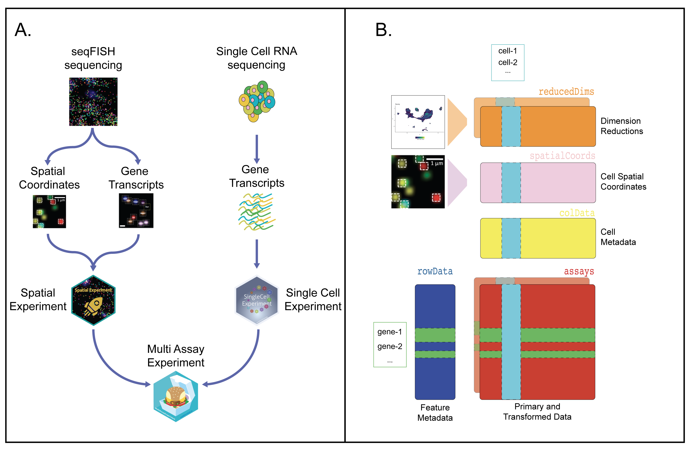

## Software strategies to enable analyses of multimodal single cell experiments

Open-source software are essential in bioinformatics and computational biology. Benchmark datasets, analysis pipelines, and development of multimodal genome-scale experiments are all enabled through community-developed, open source software and data sharing platforms.  A wide array of genomics frameworks for multi-platform single cell data have been developed in R and Python. Along with other software, these frameworks use standardized licensing in Creative Commons, Artistic, or GNU so that all components are accessible for full vetting by the community. Our hackathons hinged on the central challenges such as widescale adoption, extension, and collaboration to enable inference and visualization of the multimodal single-cell experiments in our analytic frameworks. We designed each case study to leverage and build on these open frameworks to further develop and evaluate robust benchmark strategies. Easy to use data packages to distribute the multi-omics data and reproducible vignettes were key outputs from our workshop. 

#### Collaboration enabled through continuous integration 
Open-source software efforts facilitate a community-level coordinated approach to support collaboration rather than duplication of effort between groups working on similar problems. Real-time improvements to the tool-set should be feasible, respecting needs for stability, reliability, and continuity of access to evolving components. To that end, exploration and engagement with all these tools is richly enabled through code sharing resources. Our hackathons directly leveraged through GitHub with our [reproducible analyses reports](https://github.com/BIRSBiointegration/Hackathon/blob/master/analysis-vignettes.md) enable continuous integration of changes to source codes (using Github Action), and containerized snapshots of the analyses environments. The hackathons analyses conducted in R were assembled into R packages to facilitate libraries loading, while those conducted in Python enabled automatic installation and deployment 
<!--(using https://github.com/fastai/fastpages).-->

#### Useability and adoption by the community
Robust software ecosystems are required to build broad user bases [@doi:10.1126/science.aaf6162; @https://chaoss.github.io/grimoirelab/; @http://ceur-ws.org/Vol-987/3.pdf]. Bioconductor is one example of such ecosystem, that provides multiplatform and continuous delivery of contributed software, while assisting a wide range of users with standardised documentation, tests, and by hosting community forums and workshops [@https://bioconductor.org; @https://bioconductor.org/checkResults/; @https://bioconductor.org/support/]. In the case of the hackathons, the R/Bioconductor ecosystem for multi-omics enabled data structures and vignettes to support reproducible, open-source, open development analysis. During this workshop we identified key software goals needed to advance the methods and interpretation of multi-omics.

<!-- consider removing
The hackathons highlighted central challenges that require further community-level software development, in particular: 
* The management of multimodal single cell data for interactive and batch analyses,
* The development of software infrastructure to support scalable solutions for multimodal single cell analysis,
* The implementation of robust visualization methods for multimodal single cell analysis and ensure their accessiblity to researchers with visual impairments?
-->
<!--A wide array of open-source genomics frameworks for multi-platform single cell data are also developing in R, Python, and in other software frameworks that enable graphical user interfaces for point-and-click exploration. We take it for granted that __openness__ is a _sine qua non_ for computational tooling in 
bioinformatics.  This widespread availability combined with standardized licensing
in Creative Commons, Artistic, or GNU frameworks enables all components need to be accessible for full vetting by the community, thereby facilitating widescale adoption, extension, and collaboration. 
These open source software efforts also facilitate a community-level __coordinated approach__,
to support collaboration rather than duplication of effort between groups working on similar problems. Real-time improvements to the tool-set should
be feasible, respecting needs for stability, reliability, and continuity of access to evolving components. To that end, exploration and engagement with all these tools is richly enabled through code sharing resources like GitHub. Our hackathons directly leveraged such code sharing through GitHub, with contributed analyses reports [https://github.com/BIRSBiointegration/Hackathon/blob/master/analysis-vignettes.md] compiled into reproducible workflows [using GitHub Actions] enabling continuous integration of changes to source codes and continuous delivery of vignettes as well as containerized snapshots of the analyses environments. For challenge studies conducted in R, the source code and vignettes were assembled into R packages which took the loaded libraries as dependencies. For those carried out in Python, the requierments were included in the source files for automatic installation and deployment[using https://github.com/fastai/fastpages].
-->
<!-- 
While GitHub enables code distribution and accessibility, it does not address issues of useability or adoption. The open source and community needs for multi-omics go beyond code sharing and ultimately addressed through robust software ecosystems [@doi:10.1126/science.aaf6162; @https://chaoss.github.io/grimoirelab/; @http://ceur-ws.org/Vol-987/3.pdf]. As an example of an ecosystem of broad scope, we cite bioconductor.org [@https://bioconductor.org].  Bioconductor supports developers who seek to build broad user bases by providing multiplatform/multistream continuous integration/continuous delivery of contributed packages [@https://bioconductor.org/checkResults/], and users with different skill sets by articulating standards for documentation, and testing, and by hosting community forums and workshops [@https://bioconductor.org/support/]. In the case of the hackathons, the R/Bioconductor ecosystem for multi-omics enabled data structures and vignettes to support reproducible, open-source, open development analysis. The further community engagement and communication from the workshop were critical to identify additional key software goals needed to advance the methods and interpretation of multi-omics. 
-->
<!-- In this section, we reflect on the software infrastructure that enabled our analytic frameworks for inference and visualization of the multimodal single-cell experiments. Notably, the hackathons highlighted the following central challenges that require further community-level software development. 
* How should multimodal single cell data be managed for interactive and batch analyses?
* What methods will help software developers create scalable solutions for multimodal single cell analysis?
* How can we implement robust visualization methods for multimodal single cell analysis and ensure their accessiblity to researchers with visual impairments?
-->

### Challenge 1: data accessibility 
Providing data to the scientific community is a long-standing issue. In our hackathons, a particular challenge was that each mode of data was characterized by a different collection of features on possibly non-overlapping collections of samples from similar biological conditions @ref{sec:common}. Common data structures are needed to store and operate on these data collections, and support data dissemination with robust metadata and implementation of the common analysis frameworks. 

The `MultiAssayExperiment` integrative data class from Bioconductor was our class of choice to enable the collation of standard data formats, easy data access and processing. It uses the S4 object-oriented structure in R [@doi:10.18129/B9.bioc.MultiAssayExperiment; @doi:10.1158/0008-5472.CAN-17-0344] and includes several  features to support multi-platform genomics data analysis to store features from multiple data modalities (e.g. gene expression units from scRNA-seq and protein units in sc-proteomics), from the same or distinct cells, biological specimen of origin or from multiple dimensions (e.g. spatial coordinates, locations of eQTLs), to store sample metadata (e.g. study, center, phenotype, perturbation) and provide a map between the datasets from the different assays to enable analysis.

<!--
questions still unanswered from Elana / Vince
Is this an unique storage feature of Bioconductor or is there something comparable in python or other bioinformatics ecosystems that we should discuss as well to be comprehensive?
-->

In our hackathons, the pre-processing steps taken to generate the analyses data from raw data were fully documented. The input data were stored as `MultiAssayExperiment` objects centrally managed and hosted on `ExperimentHub`[@doi:10.18129/B9.bioc.ExperimentHub] as a starting point for all analyses. Figure {@fig:spatialExpt} shows how this class was used to amalgamate and annotate the multimodal dataset consisting of seqFISH and scRNA-seq experimental data from the first hackathon. The `SingleCellMultiModal` package was used to query the relevant datasets for each analysis [doi:10.18129/B9.bioc.SingleCellMultiModal]. 

<!--Aedin, could you please check me that this is what you meant to say by "At the moment, it includes the hackathons scNMT-seq and the seqFISH+scRNA-seq (Fig. {@fig:spatialExpt}) datasets, easily stored because of the samples overlapping between multiple modalities, while we are working on the integration of the scProteomics dataset which has no overlap between samples."
-->

In addition to data storage, several hackathon contributors used the `MultiAssayExperiment` class to implement their analyses, allowing for easier pre-processing, transformation, extraction of spatial information from raster objects. While such infrastructure was readily suitable and employed for the spatial and scNMT-seq  hackathons, the lack of overlap between samples in the spatial proteomics hackathon revealed an important area of future work to develop software infrastructure that can link biologically related datasets without direct feature or sample mappings for multi-omics analysis.  

Further, our hackathons highlighted the need for scalability of storing and access of single cell data datasets [@doi:10.18129/B9.bioc.DelayedArray; @doi:10.18129/B9.bioc.rhdf5]. Emerging algorithms allow for data to be stored in memory or on disk, for example for cells clustering in R [@doi:10.1101/2020.05.27.119438; @doi:10.18129/B9.bioc.mbkmeans] or Python [@doi:10.1186/s13059-017-1382-0].

<!-- Note from Kim-Anh
This line 50 does not flow very well, should it be included elsewhere?
-->

{#fig:spatialExpt width="50%"}

Caption figure: **A** Software infrastructure for the first hackathon to combine seqFISH-based `SpatialExperiment` and `SingleCellExperiment` instances into a `MultiAssayExperiment`.  **B** To combine these two different experiments, the seqFISH data were stored into a `SpatialExperiment` S4 class object, while the scRNA-seq data were stored into a `SingleCellExperiment` class object [@doi:10.18129/B9.bioc.SingleCellExperiment]. These objects were then stored into a MultiAssayExperiment class object and released with the SingleCellMultiModal Bioconductor package [@doi:10.18129/B9.bioc.SingleCellMultiModal]. 

<!--
Common data structures to store and operate on these data collections can support data dissemination with robust metadata and implementation of the common analysis frameworks for multi-omics data interpretation that can be employed across diverse measurement technologies. As an example, Bioconductor has built a ready-to-use integrative data class `MultiAssayExperiment` on the S4 object oriented structure in R [@doi:10.1158/0008-5472.CAN-17-0344]. The `MultiAssayExperiment` class includes the following features to support multi-platform genomics data analysis
   1) Storage for variables or features from multiple data modalities (e.g. gene expression units from scRNA-seq and protein units in sc-proteomics), either from the same cells or distinct cells from the same or distinct starting samples or biological specimen of origin. In some cases, the feature may be multidimensional (e.g. spatial coordinates, locations of eQTLs).  
   2) Metadata for sample of origin for the individual cells, e.g. study, center, phenotype, perturbation, in all the variables or features stored.
   3) A map between the datasets from the different assays to enable analysis.
-->
<!-- I removed this part (Kim-Anh)
The `MultiAssayExperiment` class is designed so that the variables or features stored for each assay in `MultiAssayExperiment` each independently use Bioconductor data structures for the stored data modality and bind metadata annotating the molecular features for each assay into this class instance. For example,
genes and transcripts can be enumerated using gene labels from Ensembl [@doi:10.1093/nar/gkz966] as catalog identifiers, represented as
genomic regions through `GRanges` instances [@doi:10.1371/journal.pcbi.1003118], etc.  
-->
<!-- I reedited this part and included in caption
In our context, input data across all hackathons were pre-processed with steps documented, and the data were stored in `MultiAssayExperiment` [@doi:10.18129/B9.bioc.MultiAssayExperiment] objects which allows collating of standard data formats as well as powerful data access and data processing methods. The datasets were centrally managed and hosted on `ExperimentHub`[@doi:10.18129/B9.bioc.ExperimentHub] and the `SingleCellMultiModal` package [doi:10.18129/B9.bioc.SingleCellMultiModal] was used to query the relevant datasets for each analysis. Figure {@fig:spatialExpt} shows how this
class was used to amalgamate and annotate the multimodal dataset consisting of seqFISH and scRNA-seq experimental data employed for this first hackathon.
To combine these two different experiments, the seqFISH data were stored into the SpatialExperiment S4 class object, while the scRNA-seq data were stored into a SingleCellExperiment Bioconductor class object [@doi:10.18129/B9.bioc.SingleCellExperiment]. 
Then, these objects were easily stored into a MultiAssayExperiment class object and released with the SingleCellMultiModal Bioconductor package [@doi:10.18129/B9.bioc.SingleCellMultiModal]. 
<!-- In our hackathon context, we considered multi-assay measurements from the same cell (e.g. scNMT-seq) or integration of multi-assay measurements from  (seqFish, scProteomics).
-->

### Challenge 2: software infrastructure to handle assay-specific features
RNA-seq has well-defined units and IDs (e.g., transcript names), but other assays may be summarized at different genomic scales, e.g., gene promoters, exons, introns, or gene bodies, as was highlighted in the scNMT-seq hackathon. The `GenomicRanges` package [@doi:10.18129/B9.bioc.GenomicRanges] can be used to compute summaries at different scales and overlap between signal (e.g., ATAC-seq peaks) and genomic annotation. Further, the observations of different modalities may not be directly comparable: for instance, gene expression may be measured from individual cells in single-cell RNA-seq but spatial transcriptomics may have a finer (sub-cellular) or coarser (multi-cellular) resolution. Methods such as SPOTlight [@doi:10.1101/2020.06.03.131334] may be used to deconvolute multi-cellular spots signal. Finally, in the absence of universal standards, the metadata available may vary from analysis to analysis. A potential solution is to define the minimum set of metadata variables necessary for each assay, and for pairs of assays to be comparable for common analyses. 

<!--Is this problem solved through the multiAssayExperiment and/or broader Bioconductor ecosystem? If so how and if not what are areas of future work needed as a field.--> 

### Challenge 3: accessible vizualization
In addition to robust computational metrics, several hackathons developed novel data visualization strategies as essential components for interpreting multi-modal data. Often these visualization strategies rely on heatmaps or reduced dimension plots, and utilize color to represent the different dimensions. These colors and low dimensional plots facilate pattern detection and interpretation of increasingly complex and rich data. However, relying on color for interpretation leads to difficulties in perceiving patterns for a substantial proportion of the population with color vision deficiencies and can result in different data interpretations between individuals. 

<!--
(the basis for the Ishihara's color vision tests) in multi-colored figures Moreover, relying on perceived patterns through color can result in different data interpretations between individuals, particularly reflecting their individual color detection capacities. 
-->

One strategy to present standardized scientific information accessible information is to include colorblind friendly visualizations [@https://doi.org/10.1038/nmeth.1618; @doi:10.1038/nmeth0810-573] as a default setting, using palettes such as R/viridis [@https://cran.r-project.org/web/packages/viridis/vignettes/intro-to-viridis.html] and dittoSeq [@https://github.com/dtm2451/dittoSeq], while limiting to a number of 10 colors. Additional visual cues to differentiate regions (hatched areas) or cells (point shapes) can also reduce the dependence on colors. The inclusion an "accessibility caption" accompanying figures which to guide the reader's perception of the images would greatly benefit broader data accessibility. Thus, implementing community standards for accessible visualizations is essential for bioinformatics software communities to ensure standardized interpretation of multi-platform single cell data.

<!-- Overall, a broader discussion regarding the accessibility of our figures that is not just limited to color vision deficiencies would be greatly beneficial towards improving data accessibility.
Perhaps one tool to address broader accessibility could be
[US Government tools for accessibility](https://accessibility.18f.gov/tools/)
-->

<!--### Details of working components
you can interact with underlying data at [google sheet](https://docs.google.com/spreadsheets/d/1tSUQ9iDKqq72TB9G3Cx1evg2sekS-ytx5wRXDv6vxfg/edit?usp=sharing)
-->

|Type|Brief name (link)|Description|
|----|-----------------|-----------|
|Matlab package|[CytoMAP](https://gitlab.com/gernerlab/cytomap)|CytoMAP: A Spatial Analysis Toolbox Reveals Features of Myeloid Cell Organization in Lymphoid Tissues|
|Matlab package|[histoCAT](https://github.com/BodenmillerGroup/histoCAT)|histoCAT: analysis of cell phenotypes and interactions in multiplex image cytometry data|
|Python library|[PyTorch](https://pytorch.org)|General framework for deep learning|
|Python package|[SpaCell](https://github.com/BiomedicalMachineLearning/SpaCell)|SpaCell: integrating tissue morphology and spatial gene expression to predict disease cells|
|Python package|[Scanpy](https://github.com/theislab/scanpy)|Python package for single cell analysis|
|R data class|[MultiAssayExperiment](https://bioconductor.org/packages/MultiAssayExperiment)|unify multiple experiments|
|R data class|[SpatialExperiment](https://github.com/drighelli/SpatialExperiment)|SpatialExperiment: a collection of S4 classes for Spatial Data|
|R package|[Giotto](https://github.com/RubD/Giotto)|Spatial transcriptomics|
|R package|[cytomapper](https://github.com/BodenmillerGroup/cytomapper)|cytomapper: Visualization of highly multiplexed imaging cytometry data in R|
|R package|[Spaniel](https://github.com/RachelQueen1/Spaniel/)|Spaniel: analysis and interactive sharing of Spatial Transcriptomics data|
|R package|[Seurat](https://github.com/satijalab/seurat)|R toolkit for single cell genomics|
|R package|[SpatialLIBD](https://github.com/LieberInstitute/spatialLIBD)|Transcriptome-scale spatial gene expression in the human dorsolateral prefrontal cortex|
|R package|[Cardinal](https://cardinalmsi.org/)|Cardinal: an R package for statistical analysis of mass spectrometry-based imaging experiments|
|R package|[CoGAPS](https://github.com/FertigLab/CoGAPS)|scCoGAPS learns biologically meaningful latent spaces from sparse scRNA-Seq data|
|R package|[projectR](https://github.com/genesofeve/projectR)|ProjectR is a transfer learning framework to rapidly explore latent spaces across independent datasets|
|R package|[SingleCellMultiModal](https://github.com/waldronlab/SingleCellMultiModal)|Serves multiple datasets obtained from GEO and other sources and represents them as MultiAssayExperiment objects|
|R scripts|[SpatialAnalysis](https://github.com/drighelli/SpatialAnalysis)|Scripts for SpatialExperiment usage|
|Self-contained GUI|[ST viewer](https://github.com/jfnavarro/st_viewer)|ST viewer: a tool for analysis and visualization of spatial transcriptomics datasets|
|Shiny app|[Dynverse](https://zouter.shinyapps.io/server/)|A comparison of single-cell trajectory inference methods: towards more accurate and robust tools|
|R package|[mixOmics](https://github.com/mixOmicsTeam/mixOmics)|R toolkit for multivariate analysis of multi-modal data|
|Python package|[totalVI](https://github.com/YosefLab/scVI)|A variational autoencoder (deep learning model) to integrate RNA and protein data from CITE-seq experiments|
|Python web application||[ImJoy](https://imjoy.io/#/)|Deep learning for image analysis|
|Python package|[napari](https://github.com/napari/napari)|Interactive big multi-dimensional 3D image viewer|
|Software|[QuPath](https://qupath.github.io/)|Multiplex whole slide image analysis|
|Python package|[Cytokit](https://github.com/hammerlab/cytokit)|Multiplex whole slide image analysis|
|Python package|[cmIF](https://gitlab.com/engje/cmif)|Multiplex whole slide image analysis|
|Software|[Facetto](https://github.com/kruegert/facetto)|Multiplex whole slide image analysis, not available yet|
|Software, Python based|[CellProfiler](https://cellprofiler.org/)|Image analysis|
