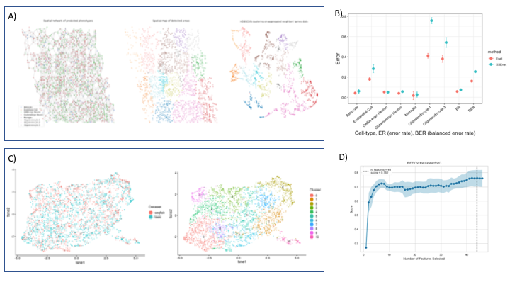
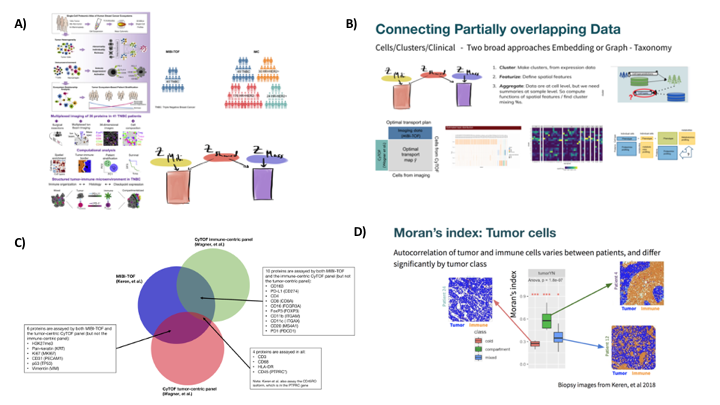
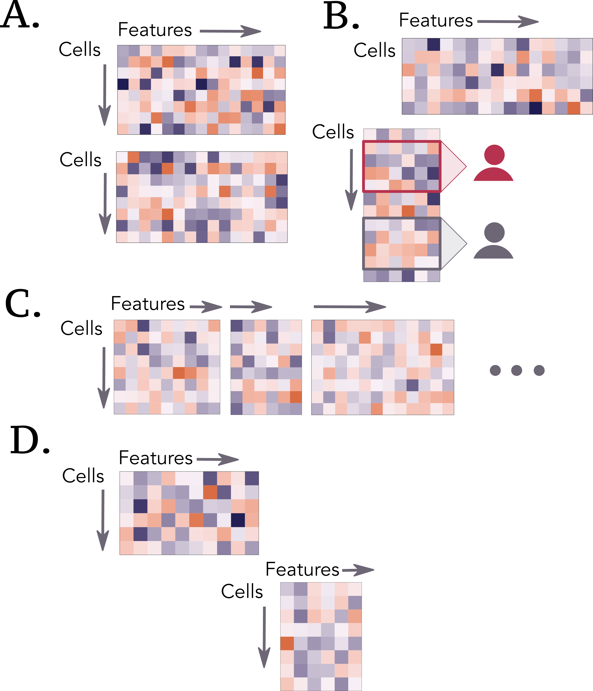
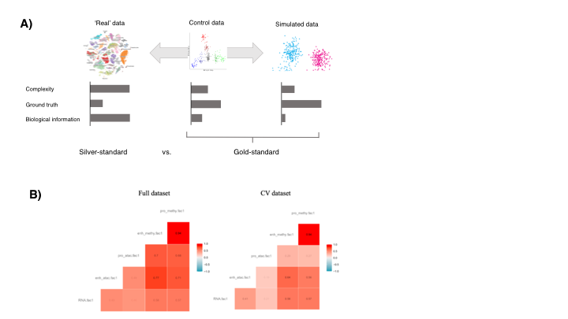
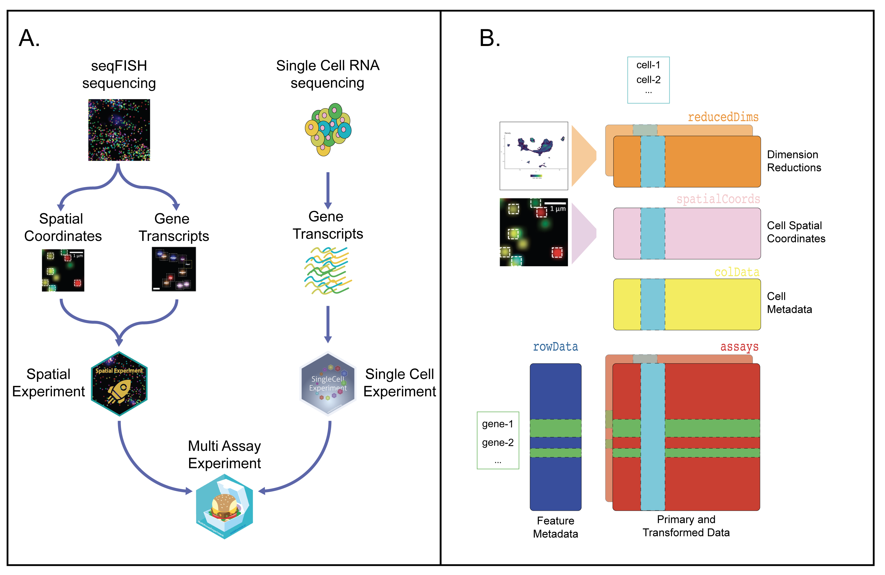

---
author-meta:
- "Kim-Anh L\xEA Cao"
- Aedin C Culhane
- Elana Fertig
- Vincent J. Carey
- Ricard Argelaguet
- Susan Holmes
- Michael I. Love
- Guo-Cheng Yuan
- Al J Abadi
- Casey S. Greene
- Ayshwarya Subramanian
- Amrit Singh
- Alexis Coullomb
- Arshi Arora
- Joshua S. Sodicoff
- Joshua D. Welch
- Emily F. Davis-Marcisak
- Jane Roe
bibliography:
- content/manual-references.json
date-meta: '2020-09-03'
header-includes: "<!--\nManubot generated metadata rendered from header-includes-template.html.\nSuggest improvements at https://github.com/manubot/manubot/blob/master/manubot/process/header-includes-template.html\n-->\n<meta name=\"dc.format\" content=\"text/html\" />\n<meta name=\"dc.title\" content=\"Community-wide hackathons establish foundations for emerging single cell data integration\" />\n<meta name=\"citation_title\" content=\"Community-wide hackathons establish foundations for emerging single cell data integration\" />\n<meta property=\"og:title\" content=\"Community-wide hackathons establish foundations for emerging single cell data integration\" />\n<meta property=\"twitter:title\" content=\"Community-wide hackathons establish foundations for emerging single cell data integration\" />\n<meta name=\"dc.date\" content=\"2020-09-03\" />\n<meta name=\"citation_publication_date\" content=\"2020-09-03\" />\n<meta name=\"dc.language\" content=\"en-US\" />\n<meta name=\"citation_language\" content=\"en-US\" />\n<meta name=\"dc.relation.ispartof\" content=\"Manubot\" />\n<meta name=\"dc.publisher\" content=\"Manubot\" />\n<meta name=\"citation_journal_title\" content=\"Manubot\" />\n<meta name=\"citation_technical_report_institution\" content=\"Manubot\" />\n<meta name=\"citation_author\" content=\"Kim-Anh L\xEA Cao\" />\n<meta name=\"citation_author_institution\" content=\"Melbourne Integrative Genomics, School of Mathematics and Statistics, University of Melbourne, Australia\" />\n<meta name=\"citation_author_orcid\" content=\"0000-0003-3923-1116\" />\n<meta name=\"twitter:creator\" content=\"@mixOmicsTeam\" />\n<meta name=\"citation_author\" content=\"Aedin C Culhane\" />\n<meta name=\"citation_author_institution\" content=\"Data Sciences, Dana-Farber Cancer Institute, Boston, MA, USA\" />\n<meta name=\"citation_author_institution\" content=\"Biostatsitics, Harvard TH Chan School of Public Health, Boston, MA, USA\" />\n<meta name=\"citation_author_orcid\" content=\"0000-0002-1395-9734\" />\n<meta name=\"twitter:creator\" content=\"@AedinCulhane\" />\n<meta name=\"citation_author\" content=\"Elana Fertig\" />\n<meta name=\"citation_author_institution\" content=\"Department of Oncology, Sidney Kimmel Comprehensive Cancer Center, Johns Hopkins University School of Medicine, Baltimore, MD, USA\" />\n<meta name=\"citation_author_institution\" content=\"Department of Biomedical Engineering, Johns Hopkins University School of Medicine, Baltimore, MD, USA\" />\n<meta name=\"citation_author_institution\" content=\"Department of Applied Mathematics and Statistics, Johns Hopkins University Whiting School of Engineering, Baltimore, MD, USA\" />\n<meta name=\"citation_author_orcid\" content=\"0000-0003-3204-342X\" />\n<meta name=\"twitter:creator\" content=\"@FertigLab\" />\n<meta name=\"citation_author\" content=\"Vincent J. Carey\" />\n<meta name=\"citation_author_institution\" content=\"Channing Division of Network Medicine, Brigham and Women&#39;s Hospital, Harvard Medical School\" />\n<meta name=\"citation_author_orcid\" content=\"0000-0003-4046-0063\" />\n<meta name=\"citation_author\" content=\"Ricard Argelaguet\" />\n<meta name=\"citation_author_institution\" content=\"European Bioinformatics Institute (EMBL-EBI)\" />\n<meta name=\"citation_author_orcid\" content=\"0000-0003-3199-3722\" />\n<meta name=\"twitter:creator\" content=\"@RArgelaguet\" />\n<meta name=\"citation_author\" content=\"Susan Holmes\" />\n<meta name=\"citation_author_institution\" content=\"Department of Statistics, Stanford University, USA\" />\n<meta name=\"citation_author_orcid\" content=\"0000-0002-2208-8168\" />\n<meta name=\"twitter:creator\" content=\"@SherlockpHolmes\" />\n<meta name=\"citation_author\" content=\"Michael I. Love\" />\n<meta name=\"citation_author_institution\" content=\"Department of Biostatistics, UNC-Chapel Hill\" />\n<meta name=\"citation_author_institution\" content=\"Department of Genetics, UNC-Chapel Hill\" />\n<meta name=\"citation_author_orcid\" content=\"0000-0001-8401-0545\" />\n<meta name=\"twitter:creator\" content=\"@mikelove\" />\n<meta name=\"citation_author\" content=\"Guo-Cheng Yuan\" />\n<meta name=\"citation_author_institution\" content=\"Department of Pediatric Oncology, Dana-Farber Cancer Institute\" />\n<meta name=\"citation_author_institution\" content=\"Department of Pediatrics, Harvard Medical School\" />\n<meta name=\"citation_author_orcid\" content=\"XXXX-XXXX-XXXX-XXXX\" />\n<meta name=\"twitter:creator\" content=\"@gc_yuan\" />\n<meta name=\"citation_author\" content=\"Al J Abadi\" />\n<meta name=\"citation_author_institution\" content=\"Melbourne Integrative Genomics, School of Mathematics and Statistics, University of Melbourne, Australia\" />\n<meta name=\"citation_author_orcid\" content=\"0000-0002-4146-2848\" />\n<meta name=\"twitter:creator\" content=\"@aljabadi\" />\n<meta name=\"citation_author\" content=\"Casey S. Greene\" />\n<meta name=\"citation_author_institution\" content=\"Department of Systems Pharmacology and Translational Therapeutics, Perelman School of Medicine, University of Pennsylvania, Philadelphia, PA, USA\" />\n<meta name=\"citation_author_orcid\" content=\"0000-0001-8713-9213\" />\n<meta name=\"twitter:creator\" content=\"@greenescientist\" />\n<meta name=\"citation_author\" content=\"Ayshwarya Subramanian\" />\n<meta name=\"citation_author_institution\" content=\"Klarman Cell Observatory, Broad Institute\" />\n<meta name=\"citation_author_institution\" content=\"Kidney Disease Initiative, Broad Institute\" />\n<meta name=\"citation_author_orcid\" content=\"0000-0002-4134-7612\" />\n<meta name=\"twitter:creator\" content=\"@ayshwaryas\" />\n<meta name=\"citation_author\" content=\"Amrit Singh\" />\n<meta name=\"citation_author_institution\" content=\"Department of Pathology and Laboratory Medicine, University of British Columbia\" />\n<meta name=\"citation_author_institution\" content=\"PROOF Centre of Excellence\" />\n<meta name=\"citation_author_orcid\" content=\"0000-0002-7475-1646\" />\n<meta name=\"twitter:creator\" content=\"@asingh_22g\" />\n<meta name=\"citation_author\" content=\"Alexis Coullomb\" />\n<meta name=\"citation_author_institution\" content=\"Toulouse Cancer Research Center (CRCT), INSERM\" />\n<meta name=\"citation_author_orcid\" content=\"0000-0003-3164-6640\" />\n<meta name=\"twitter:creator\" content=\"@AlexisCoullomb\" />\n<meta name=\"citation_author\" content=\"Arshi Arora\" />\n<meta name=\"citation_author_institution\" content=\"Department of Epidemiology and Biostatistics, Memorial Sloan Ketterign Cancer Center\" />\n<meta name=\"citation_author_orcid\" content=\"0000-0002-4040-1787\" />\n<meta name=\"twitter:creator\" content=\"@arorarshi\" />\n<meta name=\"citation_author\" content=\"Joshua S. Sodicoff\" />\n<meta name=\"citation_author_institution\" content=\"Department of Computational Medicine and Bioinformatics, University of Michigan\" />\n<meta name=\"citation_author_institution\" content=\"Department of Biomedical Engineering, University of Michigan\" />\n<meta name=\"citation_author_orcid\" content=\"0000-0001-5182-960X\" />\n<meta name=\"citation_author\" content=\"Joshua D. Welch\" />\n<meta name=\"citation_author_institution\" content=\"Department of Computational Medicine and Bioinformatics, University of Michigan\" />\n<meta name=\"citation_author_institution\" content=\"Department of Computer Science and Engineering, University of Michigan\" />\n<meta name=\"citation_author_orcid\" content=\"0000-0002-5869-2391\" />\n<meta name=\"twitter:creator\" content=\"@LabWelch\" />\n<meta name=\"citation_author\" content=\"Emily F. Davis-Marcisak\" />\n<meta name=\"citation_author_institution\" content=\"McKusick-Nathans Institute of the Department of Genetic Medicine, Johns Hopkins School of Medicine, Baltimore, MD, USA\" />\n<meta name=\"citation_author_orcid\" content=\"0000-0001-8624-1013\" />\n<meta name=\"twitter:creator\" content=\"@efaithd\" />\n<meta name=\"citation_author\" content=\"Jane Roe\" />\n<meta name=\"citation_author_institution\" content=\"Department of Something, University of Whatever\" />\n<meta name=\"citation_author_institution\" content=\"Department of Whatever, University of Something\" />\n<meta name=\"citation_author_orcid\" content=\"XXXX-XXXX-XXXX-XXXX\" />\n<meta name=\"twitter:creator\" content=\"@XXX\" />\n<link rel=\"canonical\" href=\"https://BIRSBiointegration.github.io/whitePaper/\" />\n<meta property=\"og:url\" content=\"https://BIRSBiointegration.github.io/whitePaper/\" />\n<meta property=\"twitter:url\" content=\"https://BIRSBiointegration.github.io/whitePaper/\" />\n<meta name=\"citation_fulltext_html_url\" content=\"https://BIRSBiointegration.github.io/whitePaper/\" />\n<meta name=\"citation_pdf_url\" content=\"https://BIRSBiointegration.github.io/whitePaper/manuscript.pdf\" />\n<link rel=\"alternate\" type=\"application/pdf\" href=\"https://BIRSBiointegration.github.io/whitePaper/manuscript.pdf\" />\n<link rel=\"alternate\" type=\"text/html\" href=\"https://BIRSBiointegration.github.io/whitePaper/v/b37c7e4bd8d6ff77ac1774a806c3db038a109f30/\" />\n<meta name=\"manubot_html_url_versioned\" content=\"https://BIRSBiointegration.github.io/whitePaper/v/b37c7e4bd8d6ff77ac1774a806c3db038a109f30/\" />\n<meta name=\"manubot_pdf_url_versioned\" content=\"https://BIRSBiointegration.github.io/whitePaper/v/b37c7e4bd8d6ff77ac1774a806c3db038a109f30/manuscript.pdf\" />\n<meta property=\"og:type\" content=\"article\" />\n<meta property=\"twitter:card\" content=\"summary_large_image\" />\n<link rel=\"icon\" type=\"image/png\" sizes=\"192x192\" href=\"https://manubot.org/favicon-192x192.png\" />\n<link rel=\"mask-icon\" href=\"https://manubot.org/safari-pinned-tab.svg\" color=\"#ad1457\" />\n<meta name=\"theme-color\" content=\"#ad1457\" />\n<!-- end Manubot generated metadata -->"
keywords:
- single cell
- data integration
- hackathons
lang: en-US
manubot-clear-requests-cache: false
manubot-output-bibliography: output/references.json
manubot-output-citekeys: output/citations.tsv
manubot-requests-cache-path: ci/cache/requests-cache
title: Community-wide hackathons establish foundations for emerging single cell data integration
...

<small><em>
This manuscript
([permalink](https://BIRSBiointegration.github.io/whitePaper/v/b37c7e4bd8d6ff77ac1774a806c3db038a109f30/))
was automatically generated
from [BIRSBiointegration/whitePaper@b37c7e4](https://github.com/BIRSBiointegration/whitePaper/tree/b37c7e4bd8d6ff77ac1774a806c3db038a109f30)
on September 3, 2020.
</em></small>

## Authors

+ **Kim-Anh Lê Cao** 
    {.inline_icon}
    [0000-0003-3923-1116](https://orcid.org/0000-0003-3923-1116)
    · {.inline_icon}
    [mixOmicsTeam](https://github.com/mixOmicsTeam)
    · {.inline_icon}
    [mixOmicsTeam](https://twitter.com/mixOmicsTeam) 
  <small>
     Melbourne Integrative Genomics, School of Mathematics and Statistics, University of Melbourne, Australia
     · Funded by Grant National Health and Medical Research Council  Career Development fellowship (GNT1159458)
  </small>

+ **Aedin C Culhane** 
    {.inline_icon}
    [0000-0002-1395-9734](https://orcid.org/0000-0002-1395-9734)
    · {.inline_icon}
    [aedin](https://github.com/aedin)
    · {.inline_icon}
    [AedinCulhane](https://twitter.com/AedinCulhane) 
  <small>
     Data Sciences, Dana-Farber Cancer Institute, Boston, MA, USA; Biostatsitics, Harvard TH Chan School of Public Health, Boston, MA, USA
     · Funded by Chan Zuckerberg Initative, NIH, DoD (need to get grant IDs)
  </small>

+ **Elana Fertig** 
    {.inline_icon}
    [0000-0003-3204-342X](https://orcid.org/0000-0003-3204-342X)
    · {.inline_icon}
    [ejfertig](https://github.com/ejfertig)
    · {.inline_icon}
    [FertigLab](https://twitter.com/FertigLab) 
  <small>
     Department of Oncology, Sidney Kimmel Comprehensive Cancer Center, Johns Hopkins University School of Medicine, Baltimore, MD, USA; Department of Biomedical Engineering, Johns Hopkins University School of Medicine, Baltimore, MD, USA; Department of Applied Mathematics and Statistics, Johns Hopkins University Whiting School of Engineering, Baltimore, MD, USA
     · Funded by National Institute of Health, National Cancer Institute; National Institute of Health, National Institute of Dental and Craniofacial Research; Lustgarten Foundation; Emerson Foundation; Allegheny Health Network
  </small>

+ **Vincent J. Carey** 
    {.inline_icon}
    [0000-0003-4046-0063](https://orcid.org/0000-0003-4046-0063)
    · {.inline_icon}
    [vjcitn](https://github.com/vjcitn) 
  <small>
     Channing Division of Network Medicine, Brigham and Women's Hospital, Harvard Medical School
     · Funded by National Institutes of Health, National Human Genome Research Institute; National Institutes of Health, National Cancer Institute; Chan-Zuckerberg Initiative
  </small>

+ **Ricard Argelaguet** 
    {.inline_icon}
    [0000-0003-3199-3722](https://orcid.org/0000-0003-3199-3722)
    · {.inline_icon}
    [rargelaguet](https://github.com/rargelaguet)
    · {.inline_icon}
    [RArgelaguet](https://twitter.com/RArgelaguet) 
  <small>
     European Bioinformatics Institute (EMBL-EBI)
     · Funded by EMBL PhD programme
  </small>

+ **Susan Holmes** 
    {.inline_icon}
    [0000-0002-2208-8168](https://orcid.org/0000-0002-2208-8168)
    · {.inline_icon}
    [spholmes](https://github.com/spholmes)
    · {.inline_icon}
    [SherlockpHolmes](https://twitter.com/SherlockpHolmes) 
  <small>
     Department of Statistics, Stanford University, USA
     · Funded by National Institute of Health, NIAID
  </small>

+ **Michael I. Love** 
    {.inline_icon}
    [0000-0001-8401-0545](https://orcid.org/0000-0001-8401-0545)
    · {.inline_icon}
    [mikelove](https://github.com/mikelove)
    · {.inline_icon}
    [mikelove](https://twitter.com/mikelove) 
  <small>
     Department of Biostatistics, UNC-Chapel Hill; Department of Genetics, UNC-Chapel Hill
     · Funded by National Institutes of Health, National Human Genome Research Institute; National Institutes of Health, National Institute of Mental Health
  </small>

+ **Guo-Cheng Yuan** 
    {.inline_icon}
    [XXXX-XXXX-XXXX-XXXX](https://orcid.org/XXXX-XXXX-XXXX-XXXX)
    · {.inline_icon}
    [gcyuan](https://github.com/gcyuan)
    · {.inline_icon}
    [gc_yuan](https://twitter.com/gc_yuan) 
  <small>
     Department of Pediatric Oncology, Dana-Farber Cancer Institute; Department of Pediatrics, Harvard Medical School
     · Funded by National Institutes of Health, National Cancer Institute; National Institutes of Health, National Institute on Aging
  </small>

+ **Al J Abadi** 
    {.inline_icon}
    [0000-0002-4146-2848](https://orcid.org/0000-0002-4146-2848)
    · {.inline_icon}
    [ajabadi](https://github.com/ajabadi)
    · {.inline_icon}
    [aljabadi](https://twitter.com/aljabadi) 
  <small>
     Melbourne Integrative Genomics, School of Mathematics and Statistics, University of Melbourne, Australia
     · Funded by Chan Zuckerberg initiative (HCA2-A-1708-02277); Australian Research Council (DP200102903)
  </small>

+ **Casey S. Greene** 
    {.inline_icon}
    [0000-0001-8713-9213](https://orcid.org/0000-0001-8713-9213)
    · {.inline_icon}
    [cgreene](https://github.com/cgreene)
    · {.inline_icon}
    [greenescientist](https://twitter.com/greenescientist) 
  <small>
     Department of Systems Pharmacology and Translational Therapeutics, Perelman School of Medicine, University of Pennsylvania, Philadelphia, PA, USA
     · Funded by National Institutes of Health, National Cancer Institute (R01 CA237170); National Institutes of Health, National Human Genome Research Institute (R01 HG010067)
  </small>

+ **Ayshwarya Subramanian** 
    {.inline_icon}
    [0000-0002-4134-7612](https://orcid.org/0000-0002-4134-7612)
    · {.inline_icon}
    [ayshwaryas](https://github.com/ayshwaryas)
    · {.inline_icon}
    [ayshwaryas](https://twitter.com/ayshwaryas) 
  <small>
     Klarman Cell Observatory, Broad Institute; Kidney Disease Initiative, Broad Institute
  </small>

+ **Amrit Singh** 
    {.inline_icon}
    [0000-0002-7475-1646](https://orcid.org/0000-0002-7475-1646)
    · {.inline_icon}
    [singha53](https://github.com/singha53)
    · {.inline_icon}
    [asingh_22g](https://twitter.com/asingh_22g) 
  <small>
     Department of Pathology and Laboratory Medicine, University of British Columbia; PROOF Centre of Excellence
     · Funded by Michael Smith Foudation for Health Research; Mitacs
  </small>

+ **Alexis Coullomb** 
    {.inline_icon}
    [0000-0003-3164-6640](https://orcid.org/0000-0003-3164-6640)
    · {.inline_icon}
    [alexcoul](https://github.com/alexcoul)
    · {.inline_icon}
    [AlexisCoullomb](https://twitter.com/AlexisCoullomb) 
  <small>
     Toulouse Cancer Research Center (CRCT), INSERM
     · Funded by Pierre Fabre
  </small>

+ **Arshi Arora** 
    {.inline_icon}
    [0000-0002-4040-1787](https://orcid.org/0000-0002-4040-1787)
    · {.inline_icon}
    [arorarshi](https://github.com/arorarshi)
    · {.inline_icon}
    [arorarshi](https://twitter.com/arorarshi) 
  <small>
     Department of Epidemiology and Biostatistics, Memorial Sloan Ketterign Cancer Center
  </small>

+ **Joshua S. Sodicoff** 
    {.inline_icon}
    [0000-0001-5182-960X](https://orcid.org/0000-0001-5182-960X)
    · {.inline_icon}
    [jsodicoff](https://github.com/jsodicoff) 
  <small>
     Department of Computational Medicine and Bioinformatics, University of Michigan; Department of Biomedical Engineering, University of Michigan
  </small>

+ **Joshua D. Welch** 
    {.inline_icon}
    [0000-0002-5869-2391](https://orcid.org/0000-0002-5869-2391)
    · {.inline_icon}
    [jw156605](https://github.com/jw156605)
    · {.inline_icon}
    [LabWelch](https://twitter.com/LabWelch) 
  <small>
     Department of Computational Medicine and Bioinformatics, University of Michigan; Department of Computer Science and Engineering, University of Michigan
     · Funded by National Human Genome Research Institute, NIH; National Institute of Allergy and Infectious Diseases, NIH; National Institute of Mental Health, NIH
  </small>

+ **Emily F. Davis-Marcisak** 
    {.inline_icon}
    [0000-0001-8624-1013](https://orcid.org/0000-0001-8624-1013)
    · {.inline_icon}
    [edavis71](https://github.com/edavis71)
    · {.inline_icon}
    [efaithd](https://twitter.com/efaithd) 
  <small>
     McKusick-Nathans Institute of the Department of Genetic Medicine, Johns Hopkins School of Medicine, Baltimore, MD, USA
     · Funded by National Institute of Health, National Cancer Institute
  </small>

+ **Jane Roe** 
    {.inline_icon}
    [XXXX-XXXX-XXXX-XXXX](https://orcid.org/XXXX-XXXX-XXXX-XXXX)
    · {.inline_icon}
    [janeroe (PLEASE COPY/PASTE DO NOT EDIT THIS ONE)](https://github.com/janeroe (PLEASE COPY/PASTE DO NOT EDIT THIS ONE))
    · {.inline_icon}
    [XXX](https://twitter.com/XXX) 
  <small>
     Department of Something, University of Whatever; Department of Whatever, University of Something
     · Funded by XX
  </small>

## List of Figures, Tables and online resources
### Figures
- Figure 1: spatial transcriptomics hackathon 
- Figure 2: spatial proteomics single cell hackathon 
- Figure 3: scNMT-seq hackathon 
- Figure 5: Common challenges across hackathons
- Figure 6: Interpretation challenges
- Figure 6: Benchmarking strategies
- Figure 7: Software infrastructure for multi modal single cell

### Tables
- Table 1: Summary of tasks and methods across all hackathons highlighting methods and common challenges
- Table 2: Glossary of terms
- Table 3: List of single cell analysis software
- Table 4: Reproducible vignettes for analysis

### Online resources (optional as referred above)
- Online resource 1: Three hackathon datasets (github)
- Online resource 2: R packages with open source reproducible vignettes (12 vignettes)

<!---
# Draft outline
Full outline described in 01.outline.md as comment if you need to go back to the big picture.

{#fig:outline}

## Introduction [Figure 1 outline]

### Comprehensive characterization of biological systems with multi-omics
 - Single cell community has advanced technologies to enable concurrent processing of biological systems at multiple molecular resolutions
 - The lack of prior knowledge and gold standard benchmark naturally leads to a data-driven approach

### New single cell multi omics initiatives:
 - Human Cell Atlas (HCA): assess variation in normal tissues
 - Brain initiative and Allen Brain
 - Human Tumor Atlas Network (HTAN): Single-cell, longitudinal, and clinical outcomes atlases of cancer transitions for diverse tumor types.

### What bulk multi-omics (e.g. TCGA, ENCODE) have taught us:
 - Type of omics that can answer a specific biological question
 - The value of open resources for methodological developments
 - New hypotheses

### Using hackathons to illustrate analysis standards and challenges for capturing biological information from multi-omics technologies
 - Brief overview of our three hackathon studies highlighting state of the art challenges (e.g., spatial transcriptomics, cross-study analysis, epigenetic regulation)
 - Challenges include issues with noise and experimental design, Time lag between regulatory levels not addressed and many open questions
remain (e.g methylation / gene expression), Direction of regulation not captured
 - We present our findings from hackathon case studies that helped us obtain benchmarks and define a common language for multi-omics

## Hackathon case studies

### scRNA-seq + seqFISH as a case study for spatial transcriptomics [Figure 2 results]
#### Overview and biological question
#### Main challenges and how it was overcome by the participants
- Challenge 1: overlay of scRNA-seq onto seqFISH for resolution enhancement
- Challenge 2: determine signatures of cellular co-localization or spatial coordinates in non-spatial scRNA-seq

### Spatial proteomics and cross-study analysis [Figure 3 results]
#### Overview and biological question
#### Main challenges and how it was overcome by the participants
- Challenge 1: address the lack of overlap between proteins across studies
- Challenge 2: spatial protein expression analysis

### scNMT-seq as a case-study for epigenetic regulation [Figure 4 results], lead: Ricard Argelaguet
#### Overview and biological question
#### Main challenges and how it was overcome by the participants
- Challenge 1: defining genomic features
- Challenge 2: DNA methylation imputation
- Challenge 3: Linking epigenetic features / chromatin accessibility to gene expression

## Analytical approaches for hackathons and commonalities for multi-omics analysis illustrated by the series of hackathons [Figure 5 + Table 1]

Short introduction explaining that we focus here on the common challenges across hackathons

### Summary of hackathon study-specific methods
 - Table describes method, foundation in the context of previous bulk and single cell literature, and technology dependence
    - Attempts to tweak existing methods and challenges associated in hackathons
    - List methods that are either technology dependent (e.g. spatial) vs universal and how to choose them

### Dependence on pre-processing method and/or variable selection
- These steps are key and affect downstream analyses
  - Normalization / data transformation (seqFish), pre-processing, gene summaries (scNMT-seq) to variable selection (seqFish)
  - reproducibility difficult / no consensus. e.g. Alexis selected 19 genes whereas Zhu original paper based on 47 genes (difference in methods / processed data)
- Hackathon data pre-processed enable better comparisons across methods
- No consensus reached as those are emerging data with no ground truth nor established biological results

### Approaches for partial overlap of information (cells / features) and how to predict (cell type, dataset) using another data set
- Overlap in each study
  - seqFish: same features but not cells; scProt: same proteins, not cells but similar patients; scNMT-seq: same cells but not features
  - How it was solved (Table)
- Anchoring information across datasets or studies is needed (Figure)
- Incorporation of existing biological knowledge
  - ‘From discovery to detection’ (Meuleman + debrief), time is ripe to include more knowledge in our data driven approaches
- Challenge: Partial cell overlap (but no features matching) and No overlap were not addressed

### Managing differences in scale and size for datasets that do not match cells or features
- Hackathons datasets did not match cells or features.
  - scNMTQ-seq: MOFA limitation when # features vary (and size of datasets).
  - seqFish: greedy approach to select the best gene subset (Alexis, size); consider batch effect removal method (Amrit, scale)

- Consensus on projection based methods, even if pre-processing was applied (Table)
- Additional weighting is needed (e.g. Arora, Abadi).

## Interpretation challenges [Table 2: Glossary of terms]

### Interpretation requires a good understanding of the methods
- Glossary needed for communication
- Incorporation of contiguous information to facilitate interpretation of analytical results
- Biological knowledge and incorporation of information from databases are important, including bridges to data bases (KEGG, Gene Ontology, HCA) to validate through complementary data.

### Visualization tools for interpretation and communication
- Example: tSNE/ UMAP.

### Explaining results to biologists through generative models and simulations
- Example: factor analysis.

### Issues of over-discretization (premature-summarization) and over-simplification
- Example: notion of cell-type is insufficient (rare cell types vs. more “continuous” view on cell types).
- Problem with loss of information in the desire to simplify.
- Over interpretation / over reliance of graphical outputs

## Benchmarking in gold standard datasets [Figure 6, Table 3]

### Definition of benchmarking
- Goal 1: recovery of known cell types (processing of raw data, quantification, and clustering)
- Goal 2: benchmark methods for their ability to discover known relationships between data modalities, e.g. gene regulatory relationships observed between chromatin accessibility and gene expression (relationships are not fully known at the single cell level).

### Strategies for benchmarking
- Simulation useful for known truth, but difficult to simulate realistic covariance structure across features and across data modalities.
- Benchmarking datasets for single cell studies (Table): limited focus on sequencing depth and diversity of cell types derived from a single assay:
ground truth for the intended effect of exposure in a proposed study design.
validation for a data integration task for which a new computational method may be proposed.
- Multi-modal assays benchmarking:
- Design to address biological question (co-embedding, mapping or correlation, and inferring causal relationships).
- Design for either data integration or further downstream analyses (e.g. differential analysis)
- Study design should take into account:
  - Biological and technical variability via replicates, block design, and randomization.
  - Power analysis for the intended effect or data integration task.
  - Dependencies between modalities.
- Challenge: No universal benchmark data scheme suits every combination of modality, benchmark datasets may be established for commonly used combinations of modalities or technologies, towards specific data integration tasks.

### Hackathons
- Cross-validation within study can be performed via Hackathons, e.g. cross-validation analysis of the scNMT-seq dataset using MOFA+
- Assess if relationships discovered in one dataset present in other datasets, potentially looking across single cell and bulk.
- Challenge: how to match dimensions of latent space across folds. (examples: permutation or cross-validation to assess model performance)

## Software infrastructure [Figure 7, Table 4]

### Key questions

- Q1: How should multimodal single cell data be managed for interactive and batch analyses?
- Q2: What methods will help software developers create scalable solutions for multimodal single cell analysis?
- Q3: How can we ensure that visualization methods that are central to multimodal single cell analysis are usable by researchers with visual impairments?

### Data management strategies

- Abstract data type with “multiassay experiment”:
  - each mode =  different collection of features on possibly non-overlapping collections of samples;  
  - metadata on features conventionally defined
  - metadata on samples include all relevant information on experimental conditions.
- Data container for a multi assay analysis:  
  - assays from the same cells, or measurements from distinct cells.
  - Assay slots containing variables or features from multiple modalities (e.g. gene expression units from scRNA-seq and protein units from sc-proteomics), feature may be multidimensional (e.g. spatial coordinates, locations of eQTLs).
- Map between the different assays to enable analysis

### Scalability strategies

- Reducing barriers to interpretable visualizations
- Color is a powerful data visualization tool to represent complex and rich scientific data.
- Color vision deficiencies affect a substantial portion of the population. Include colorblind friendly visualizations [1] as a default setting in our visualizations

## Future directions

### What do we need for the future computation of multi omics single cell

### Upcoming cell atlases technologies

- What is coming?
- how they provide contexts for experimental perturbations
- How they provide context for novel datasets

### Unifying analysis goals for new computational methods

### Moving towards spatiotemporal omics and integration with mathematical models.

--->

## Abstract {.page_break_before}

<!--
## Introduction
### Comprehensive characterization of biological systems with multi-omics
 - Single cell community has advanced technologies to enable concurrent processing of biological systems at multiple molecular resolutions
 - The lack of prior knowledge and gold standard benchmark naturally leads to a data-driven approach
<!--
### New single cell multi omics initiatives:
 - Human Cell Atlas (HCA): assess variation in normal tissues
 - Brain initiative and Allen Brain
 - Human Tumor Atlas Network (HTAN): Single-cell, longitudinal, and clinical outcomes atlases of cancer transitions for diverse tumor types.
<!--
### What bulk multi-omics (e.g. TCGA, ENCODE) have taught us:
 - Type of omics that can answer a specific biological question
 - The value of open resources for methodological developments
 - New hypotheses
<!--
### Using hackathons to illustrate analysis standards and challenges for capturing biological information from multi-omics technologies
 - Brief overview of our three hackathon studies highlighting state of the art challenges (e.g., spatial transcriptomics, cross-study analysis, epigenetic regulation)
 - Challenges include issues with noise and experimental design, Time lag between regulatory levels not addressed and many open questions
remain (e.g methylation / gene expression), Direction of regulation not captured
 - We present our findings from hackathon case studies that helped us obtain benchmarks and define a common language for multi-omics
<!--
- **Objectives of this paper**
    - Provide guidelines on tools / data / technologies / methods and needs to model the multi-scale regulatory processes in biological systems for a computational biologist audience
<!--
- **Outline and messages**
    - Cellular and molecular regulation is fundamentally multi-scale and captured by distinct data modalities
    - Traditional hypothesis-driven multi-omics/view studies only consider one facet of these technologies, but more can be learned through a holistic approach extending into atlases
    - We present our findings from hackathon case studies that helped us obtain a broader picture and language
--> 

## Multi-omics hackathon studies illustrate standards and computational challenges in cell biology

Single-cell multimodal omics has claimed the title of method of the year only six years after single-cell sequencing [@https://www.nature.com/articles/s41592-019-0703-5], demonstrating the rapid pace of technological development in biology. Multi-omics technologies provide a unique opportunity to characterize cellular systems at both the spatial and molecular level. While each high-throughput measurement technology can resolve specific biological scales, complementary data integration techniques can reveal multi-scale interactions between modalities. While advances in multi-omics have coincided with the formation of tremendous new data resources and atlas-based initiatives to characterize biological systems, computational techniques and benchmarking strategies to integrate these datasets remains an active area of research. 

To determine the optimal methods and new developments required to analyze multi-modal data effectively, we selected hackathon studies focused on data integration for the Mathematical Frameworks for Integrative Analysis of Emerging Biological Data Workshop. The first challenge included spatial molecular profiling. While this technology is rapidly emerging, it often provides lower molecular resolution than its non-spatial counterparts. Integration strategies that merge spatial and omics datasets have the promise to enhance the molecular resolution of spatially resolved profiling. Thus, we designed a hackathon using spatially resolved transcriptional data from seqFISH with corresponding non-spatial single-cell profiling data from the mouse visual cortex [@doi:10.1038/nn.4216, @doi:10.1038/nbt.4260]. The second challenge dealt with the limited availability of tissue to obtain multiple measurements in samples from identical conditions, raising the question as to whether information can be transferred from datasets between distinct sample cohorts. Therefore, we designed the second hackathon to contain two triple-negative breast cancer cohorts profiled with single-cell proteomics profiling from mass cytometry (CyTOF) [@doi:10.1016/j.cell.2019.03.005] and spatial in-situ proteomics from Multiplexed Ion Beam Imaging (MIBI) [@doi:10.1016/j.cell.2018.08.039]. In contrast to the previous challenges, the third challenge presented data at different molecular scales but from the same cells to investigate how genetic and epigenetic alterations to DNA drive the transcriptional regulation underlying cellular state transitions. Our third hackathon was designed with scNMT-seq data to obtain concurrent DNA methylation, chromatin accessibility, and RNA expression from the same cells to delineate the regulatory networks that underlie mouse gastrulation [@doi:10.1093/humupd/dmy021]. 

Altogether, the analysis approaches employed to address these hackathons provide a unique opportunity to identify technology-specific challenges and unifying themes across disparate biological contexts, which are essential to effectively leverage multi-omics datasets for new biological knowledge. This article presents the study-specific and common challenges faced during this workshop. We provide guidelines and articulate the needs of technologies, data, tools, and computational methods to model the multi-scale regulatory processes of biological systems. 

<!--
{#fig:outline width = 50%}
-->

## scRNA-seq + seqFISH as a case study for spatial transcriptomics

### Overview and biological question  

The first hackathon aimed to leverage the complementary strengths of sequencing and imaging-based single-cell transcriptomic profiling by using computational techniques to integrate scRNA-seq and seqFISH data in the mouse visual cortex. While single cells are considered the smallest units and building blocks of each tissue, they still require proper spatial and structural three-dimensional organization in order to assemble into a functional tissue that can exert its physiological function. In the last decade, single-cell RNA-seq (scRNA-seq) has played a key role in capturing single-cell gene expression profiles, allowing us to map different cell types and states in whole organisms. Despite this remarkable achievement, this technology is based on cellular dissociation and hence does not maintain spatial relationships between single cells. Emerging technologies can now profile the transcriptome of single cells within their original environment, offering the possibility to examine how gene expression is influenced by cell-to-cell interactions and how it is spatially organized. One such approach is sequential single-molecule fluorescence in situ hybridization (seqFISH [@doi:10.1038/nmeth.2892, @doi:10.1016/j.neuron.2016.10.001]), which can identify single molecules at (sub)cellular resolution with high sensitivity.

In contrast with scRNA-seq, seqFISH and many other spatial transcriptomic technologies often pose significant technological challenges, resulting in a small number of profiled genes per cell (10-100s). The newer generation of seqFISH technology (called seqFISH+ [@doi:10.1038/s41586-019-1049-y]) has dramatically enhanced its capacity to profile up to 10,000 genes, but this technology is more complex and costly than seqFISH.

New computational approaches are needed to integrate scRNA-seq and seqFISH data effectively. This first hackathon provided seqFISH and scRNA-seq data corresponding to the mouse visual cortex ([@doi:10.1038/nbt.4260], [@doi:10.1038/nn.4216]) and our participants were challenged to accurately identify cell types. The scRNA-seq data included transcriptional profiles at a high molecular resolution whereas the seqFISH data provided spatial characterization at a lower molecular resolution. Two key computational challenges were identified to enable high-resolution spatial molecular resolution. First, we explored several strategies to identify the most likely cell types in the seqFISH dataset based on information obtained from the scRNA-seq dataset. Second, we sought to transfer spatial information obtained from the seqFISH dataset to that of the scRNA-seq dataset. Cell type labels were derived from scRNA-seq analysis [@doi:10.1038/nn.4216] and previous seqFISH/scRNA-seq integration [@doi:10.1038/nbt.4260] were also provided as reference.
 **Could we have a more detailed description of the data chracteristics here please (number of cells, genes per data set, any filtering applied in the hackathon, is applicable**

{#fig:spatial width = 60%}

Caption Figure: **Overview of seqFISH and scRNA-seq integration analysis**. 
**A** Assessment of cell type prediction using different data normalizations and classifiers. Normalization strategies included none (raw), counts per million (cpm), ComBat batch correction applied to cpm (cpm_combat), scRNA-seq and seqFISH scaled using the first eigenvalue (cpm_eigen), latent variables retained for both datasets after applying Partial Least Squares regression to cpm_eigen normalized data (cpm_pls). Classifiers approaches included a supervised multinomial classifier with elastic net penalty (enet), a semi-supervised multinomial classifier with elastic net penalty (ssenet) and Support Vector Machine (SVM, supervised). Each classifier was trained using the scRNA-seq data and the known (provided) cell type labels, then predicted the cell type labels in the seqFISH data; for the SVM we used the predictions from the original study (Challenge 1). The Gower distance between each method-normalization pair was computed and depicted on a multidimensional scaling plot. The first dimension (x-axis) separates methods that normalize the scRNA-seq and seqFISH data together (dashed) and separately (solid), showing that normalization had a stronger impact on cell type predictions than the classification method used.
**B** SVM classification models with different C parameters were trained with different number of genes in scRNA-seq data using Recursive Feature Elimination (RFE) to evaluate the minimal number of genes required for data integration. The results show that a smaller gene list than what the original study proposed was sufficeint to identify cell types in both data types (Challenge 1).
**C** LIGER was applied to combine spatial and single cell transcriptomic datasets. From the separate and integrative analyses, plots of identified and known clusters were generated and metrics of integration performance were compared, showing some loss of information as a result of the integration (Challenge 1).
**D** Construction of a spatial network from cells' positions using Voronoi tessellation, where cell types were inferred from SVM trained on scRNA-seq data. Left: A neighbors aggregation method computes aggregation statistics on the seqFISH gene expression data for each node and its first order neighbors to address Challenge 2. Right: Identification of spatially coherent areas that can contain one or several cell types and can be used to detect genes whose expression is modulated by spatial factors rather than cell type.

### Computational challenges

#### Challenge 1: overlay of scRNA-seq onto seqFISH for resolution enhancement

<!--
**[suggestion 1]**  
Sequencing and imaging based single-cell transcriptomic profiling have complementary strengths.
Whereas single-cell RNAseq generates transcriptome-wide information, it does not have spatial information.
On the other hand, seqFISH (Lubeck 2014; Shah 2016) provides single-cell resolution spatial information, but typically profiles the expression level of only 100-300 genes.
Although the newer generation of seqFISH technology (called seqFISH+) has greatly enhanced its capacity which can now be used to profile 10,000 genes (Eng 2019), the technology is significantly more complex and costly.
As such, it is desirable to develop computational approaches to effectively integrate scRNA-seq and seqFISH data analyses.
In this hackathon, the participants were provided with seqFISH (Zhu 2018) and scRNA-seq (Tasic 2016) data corresponding to the mouse visual cortex and challenged to accurately identify cell-types by integrating both datasets.
Cell type labels, derived from scRNA-seq analysis (Tasic 2016) and previous seqFISH/scRNA-seq integration (Zhu 2018) were also provided as reference.
-->

<!-- A variety of computational approaches were applied to achieve this goal, including: supervised classification with support vector machines (Coullomb, Xu), supervised and semi-supervised (self-training) elastic net classifiers (Singh), and unsupervised matrix factorization methods (Sodicoff) (Figure {@fig:spatial}).
While the methodologies are different, a number of themes recur, such as the importance of gene selection and batch effect correction.
As expected, the ability to identify refined cell-type structure relies on the selection of cell-type specific marker genes in seqFISH data, suggesting a potential benefit of using single-cell RNAseq data to guide seqFISH experimental design.
Batch effect is another important factor affecting the accuracy of data integration.
While a number of batch effect correction methods have been developed (COMBAT, Seurat, Scanorama, etc), it remains challenging to distinguish technical from biological variations if the biological samples do not match exactly.
-->

The mouse visual cortex consists of multiple complex cell types. However, the seqFISH dataset was limited to 125 profiled genes, which were not prioritized based on their ability to discriminate between cell types. Assigning the correct cell identity presents an important challenge. In contrast, the scRNA-seq dataset is transcriptome-wide and includes the 125 genes profiled by seqFISH.
This challenge proposed to use all genes to identify the cell type labels for each cell in the scRNA-seq data with high certainty. Next, we leveraged the cell type information to build a classifier based on a subset of the 125 genes shared between both datasets. The classifier was then applied to the seqFISH dataset to assign cell types.

During the hackathon, participants aimed to test various machine learning and data integration models. Preliminary analyses highlighted that normalization strategies had a significant impact on the final results (Figure {@fig:spatial}A). In addition, although unique molecular identifier (UMI) based scRNA-seq and seqFISH can both be considered as count data, we observed dataset specific biases that could be attributed to either platform (imaging vs. sequencing batch effects) or sample specific sources of variation. We opted to apply a quantile normalization approach that forces a similar expression distribution for each shared gene.

Two classification approaches were considered: supervised and semi-supervised generalized linear model regularized with elastic net penalty (enet and ssenet) and supervised support vector machines (SVM). The ssenet approach builds a model iteratively: it combines both datasets and initially only retains the highest confidence labels, then gradually adds more cell type labels until all cells are classified (Figure {@fig:spatial}A). This type of self-training approach might be promising to generalize information to other datasets. To improve the SVM model, several combinations of kernels and optimal hyperparameters were assessed using a combination of randomized and zoomed search. In addition, different flavors of gene selection using recursive feature elimination were considered to identify the optimal or minimal number of genes needed to correctly classify the majority of the cells (Figure {@fig:spatial}A). Finally, different classification accuracy metrics were considered to alleviate the major class imbalance in the dataset. More than 90% of cells were excitatory or inhibitory neurons, using balanced classification error rates. We applied LIGER, an approach based on integrative non-negative matrix factorization (NMF) to integrate both datasets in a subspace based on shared factors. This enabled the transfer of cell type labels using a nearest neighbor approach (Figure {@fig:spatial}D).

<!-- Mention limitation in the biological relevance of the genes seelcted in RFE? , but the lack of goad standard hinders our ability to evaluate the relevance of such genes -->

**could we have some elements of conclusion here?**

#### Challenge 2: Identifying spatial expression patterns at the tissue level through the integration of gene expression and spatial cellular coordinates 

While most tools originally developed for scRNA-seq data can be adapted for spatial transcriptomic datasets ([Section](./40.common-challenges.md)), methods to extract sources of variation from spatial factors are still lacking. Novel methods that can integrate the information obtained from gene expression with that of the spatial coordinates from each cell or transcript (for sub-cellular resolution) within a tissue of interest are needed.

To identify spatial expression patterns in the seqFISH dataset, the participants first formed a spatial network based on Voronoi tessellation ([@doi:10.1101/701680]). The gene expression of each cell was spatially smoothed by calculating the average gene expression of all neighboring cells. UMAP was applied to the smoothed and aggregated data matrix to identify cell clusters with a density-based clustering approach (Figure {@fig:spatial}D). Interestingly, these results showed that the obtained clusters themselves are spatially separated and do not necessarily overlap with specific cell types, suggesting that the spatial dimension cannot be captured from the expression data only.

An unanswered question is whether the identified combinatorial spatial patterns can be extracted directly from scRNA-seq data, as previous studies have shown cellular mapping between gene expression profiles and known spatial locations ([@doi:10.1038/nbt.3192], [@doi.org/10.1016/j.cell.2019.05.006]). However, this still constitutes both a technological and analytical challenge that will require careful benchmarking in the near future ([Section](./50.benchmarking.md)).

<!-- integrating different datasets and extrapolating observed trends is challenging and will require more work and careful benchmarking in the future. -->

<!--
**[suggestion 1]**  
How could one identify spatial patterns in the seqFISH data? This broad question can be divided into a number of specific tasks, such as detecting genes whose expression is spatially coherent, cell types whose spatial distribution is confined to distinct regions, recurrent multi-cell-type interaction clusters, etc, and the spatial scale may vary from subcellular all the way to tissue-wide organizations.
While there have been abundant studies in the geo-spatial analysis domain, computational tools targeting specific spatial transcriptomic questions are still lacking.
In this hackathon, one group tackled this challenge by aggregating gene expression data from neighboring cells followed by spatial clustering (Coullomb).
Much more work in the future is need to further explore such information.
--> 

<!--
**[suggestion 2]**  
Most analyses that were originally developed for scRNA-seq data can be immediately applied to spatial transcriptomic datasets, however methods to extract sources of variation that originate from spatial factors are still sparse.
To incorporate spatial information the cells from the seqFISH dataset were first connected through a spatial network based on Voronoi tessellation and then the expression of each individual cell was spatially smoothed by calculating the average gene expression levels over all the neighboring cells.
This smoothened and aggregated data matrix was subsequently used to create a 2 dimensional UMAP from which clusters were identified through a density based clustering approach.
The obtained cluster labels can then be mapped back to the original spatial locations  for further visual inspection and analysis.
-->

<!--
**[suggestion 2 detailed]**  
Most analyses that were originally developed for scRNA-seq data can be adapted for spatial transcriptomic datasets, however methods to extract sources of variation that originate from spatial factors are still sparse. The latter requires the development of novel methods which can integrate the information obtained from gene expression with that of the spatial coordinates from each individual cell or transcript (for sub-cellular resolution) within a tissue of interest.
For this hackaton we aimed to incorporate the spatial information by connecting the cells from the seqFISH dataset through a spatial network based on Voronoi tessellation. Then, for each node, its RNA count data was aggregated with its first order neighbors' count data. The mean and standard deviation were computed for each gene in the gathered data in order to capture the global tendency as well as the variability in the area arround each node.
Thus, each node has `nb_genes x nb_statistics (here 2)` variables.
These "aggregation statistics" can be visualized on a 2D UMAP projection.
These data were clustered in UMAP reduced spaces of dimensionality between 2 and 9, higher dimensions allowing to define more fine-grained clusters.
The clustering was performed with HDBSCAN, a noise-aware density-based algorithm that can define arbitrary-shaped clusters.
These clusters can then be visualized on the 2D UMAP projection and on the 2D spatial map of seqFISH data.
The clusters are spatially coherent, some of them contain several cell types, and a given cell type is not necessarily limited to one specific cluster.
During the exploratory phase consisting in varying the number of dimensions and the minium cluster size, a specific spot area was found clustered for several parameters combinations, suggesting it wasn't an artifact of the choice of parameters.
"Differential expression" analysis was performed between this spot and the other areas, although we don't look at differences in gene data but in aggregation metrics.
This area seems to correspond to a "regeneration hub", but this analysis has to be considered carefully and further analyzes is required to confirm this hypothesis.
This "neighbors  aggregation" method has been extended to aggregate RNA counts (or other node attributes) to higher orders of neighbors in order to define aggregation metrics on wider areas, which could be useful for analyzes of bigger tissues.
One interesting extension would be to substract phenotypes contributions to RNA counts for each cell before performing the neighbors aggregation analysis in order to highlight genes that are modulated by spatial factors.
But if we want to retrieve the mean expression of a cluster for cells belonging to it, we should first check cluster's convexity and be sure that no other cluster lies within it.
-->

## Spatial proteomics as a case for cross-study and cross-platform analysis

### Overview and biological question

Contrary to the first hackathon, which included seqFISH and and scRNA-seq data of samples from the same biological conditions, our second hackathon used single-cell targeted proteomics data of primary breast cancer tissue from different cohorts of patients to study the tumor-immune microenvironment in primary breast cancer. Analyzing tumor samples from different individuals involves considerable challenges, including cross-study and cross-platform integrative analysis with a low number of overlapping features ([Section](./40.common-challenges.md)). Single-cell proteomics data were generated on different antibody-based targeted proteomics technological platforms and in different laboratories. Mass cytometry (CyTOF) measured 73 proteins in two panels (immune and tumor) in 194 tissue samples from 143 subjects, of which 6 patients had triple-negative negative breast cancer [@doi:10.1016/j.cell.2019.03.005], while the second dataset applied Multiplexed Ion Beam Imaging (MIBI) to quantify spatial in-situ expression of 36 proteins in 41 triple-negative breast cancer patients [@doi:10.1016/j.cell.2018.08.039] (Figure {@fig:proteomics}AB). **what about the third study, can you describe in 1 sentence here**

<!-- Whilst this is a formidable data integration challenge, it reflects the bioinformatics analysis of clinical teams who wish to compare and investigate data collected on different measurement platforms and cohorts of cancer patients. -->
This formidable data integration task included three challenges. The first challenge was to assess whether analytical methods could integrate partially-overlapping proteomic data from different patients with similar phenotypes. In addition, we sought to determine whether measurements from one technology (MIBI spatial location and expression of proteins) could be used to predict information in the second technology (spatial expression patterns of proteins measured on mass-tag). The second challenge aimed to determine if integrated analyses of single-cell spatial technologies could capture unique information about immune cell populations in breast cancer beyond cell type composition. 
<!-- Could information about the spatial location of immune cell populations in breast cancer be discovered in integrated analyses of these datasets. -->
The third challenge addressed the critical issue of a lack of overlap between patients to assess whether heterogeneous phenotype information could be used to integrate patient omics data with a low number of shared features.

{#fig:proteomics width = 50%}

Caption figure: **Overview of spatial proteomics cross-study and cross-platform integration analysis.** 
**A** Overview of single-cell targeted proteins hackathon challenge.
**B** Challenge 1: Partial to no overlap between protein features across studies.
**C** Challenge 2: Spatial analysis with Moran's index computed on Gabriel graph shown in boxplot according to tumor/immune status showing a significant difference between groups (Red asterisks indicate significance of an ANOVA of each group with all others with p-value from an overall ANOVA across the three groups reported).
<!--(using both dummy variables and protein expression measurements) differs significantly between groups. Boxplot of Moran’s index values on tumor/immune status with examples from Keren et al. [@doi:10.1016/j.cell.2018.08.039] corresponding to each tumor category. Red asterisks indicate significance of an ANOVA of each group with all others, and the p-value from an overall ANOVA across the three groups is reported. -->

### Computational challenges

#### Challenge 1: Low overlap between protein features across studies

There were only 20 proteins assayed in both studies (Figure {@fig:proteomics}A-B **numbers dont match, specify which study**), which precluded integration of features at the gene set or pathway level and required the use of surrogate measures for cross-study association. The majority of included proteins were cell type markers or therapeutic biomarkers, providing the opportunity to perform cross-study integration of cell type proportions in tumor tissue samples.

Several semi-supervised and supervised algorithms were applied to transfer cell labels and cell compositions from one dataset to the second. Random forest was considered to capture the hierarchical structure of cell lineage and perform feature transfer learning of cell type labels, using an adaptation of the prediction strength approach [@doi:10.1198/106186005X59243]. To assess model robustness: first, a model was trained on the labeled dataset, then used to predict labels in the unlabeled dataset; next, a second model was trained based on the second dataset with the newly predicted labels; finally, the ability of the second model to recover the correct original labels when making predictions on the labeled dataset was assessed. Mapping cells from CyTOF to imaging with spatial information was handled by solving an entropic regularization optimal transport problem [4, 11] **proper DOI ref please, in google doc**, using the cosine distance of the common proteins between the two datasets as transport cost. The constructed optimal transport plan can be considered as the likelihood of cells from one modality being mapped to cells from the other modality, which allows the prediction of protein expression measured only in CyTOF on imaging data. Cluster analysis of the resulting imputed expression matrix revealed that sub tumor cell type could be identified, which was not previously detectable in the original matrix.

This challenge raised other topical issues. The scales of protein expression limited the ability to integrate cell compositions through correlation analysis, as some protein markers were expected to be present on a range of cell types (e.g. CD45 on immune cells), while others were more specialized and represented only in a subset of those cells (e.g. CD4 on T-cell subtypes). Other limitations associated with proteomics-based cell type composition analysis included the uncertainty of antibody specificity and lack of consistency between studies, accuracy of protein markers for cell type identifcation, as well as tissue and disease heterogeneity. Cell type assignment was also seen as a major hurdle, as it relies on manually curated annotation and is dependent on domain-specific knowledge. To date, methods for cell type assignment or differential expression cannot be easily applied to targeted proteomics. Therefore, there is an urgent need for a unifying map between cells present in different datasets and for annotation resources to provide quality metric or priors of protein cell type markers. The construction of protein expression atlases would support cell type classification, even if antibodies used and their performance varies between labs.

<!--and potentially if this could be developed from  large scale consortiums IHC of proteins (Human Protein Atlas [5, 6]), although the antibodies used and their performances might vary between labs. -->

<!--Standards/QC/Normalization -->

#### Challenge 2: spatial protein expression analysis

CyToF mass spectrometry data provided protein expression and counts/composition of cells in the breast tumor-immune environment, while the MIBI-TOF data provided spatial information that quantified cell attributes (e.g. shape, size, spatial coordinates) in addition to expression levels. These datasets allowed us to examine protein expression within the tumor microenvironment to predict cell-cell interactions.

Spatial information can be encoded as a set of XY coordinates (cell centroid), a line (e.g. tumor-immune boundary), or a polygon that can define complex shapes such as a cell or a community of cells. Spatial protein expression can be summarized by descriptive statistics, such as the autocorrelation protein expression within a neighborhood of polygons. These statistics can be computed by techniques developed in geographical information science or ecology to assess whether a spatially measured variable has a random, dispersed, or clustered pattern [7]. **ref DOI**.

<!--The neighborhood of polygons can be defined with a Euclidean distance or sphere, by a number of bounded cells or other measures, many of which were developed in geographical information science or ecology and assess if a spatially measured variable has a random, dispersed or clustered pattern [7].
-->

We used a variety of approaches to investigate whether protein expression data could be used to predict the spatial properties of tissue samples. A K-nearest neighbor graph was used to build spatial response variables and a random forest model was trained on protein expression data to predict spatial features. Topic modeling was trained on protein expression and cell compositions in the CyToF data to predict cell co-locations in a fraction of MIBI-ToF considered as test data (10%),or vice versa. Among the five topics identified, the first topic was predominant in most of the immune cells from CyTOF data, while the other four were dominant in all other cells. We examined the prognostic performance of different higher level spatial metrics using Moran’s Index with a sphere distance, cell type localization using nearest neighbor correlation, or cell type interaction composition with Ripley's L-function. Cox models with fused lasso penalty and random forest survival models were then fitted based on clinical features such as patient age, tumor stage, grade, size, and cell type composition. We found that the spatial metrics were predictive of prognosis, which was particularly notable in triple-negative breast cancer, where the clinical features are considered poorly prognostic. Further investigation into spatial metrics using a graph-based neighborhood measure (Gabriel graph, based on Delaunay triangulation) found that Moran’s I differed significantly between the three prognostic tumor scores described [@doi:10.1016/j.cell.2018.08.039](Figure {@fig:proteomics}C). Thus, this challenge emphasizes the need to develop new spatial measures specific for single-cell spatial proteomics data. **Note: we will need to link back to the vignettes**

<!--
Note from KA: I had to cut back a lot, but understood very little of what was described originally.
Kris Sankaran examined the extent to which expression data could be used to predict spatial properties of tissue samples.
To build predictors, cells were first clustered (K = 20) on the basis of protein expression.
Sample-level expression summaries were defined as the proportions of cells belonging to each cluster.
To build the spatial response variables, a K-nearest neighbor graph was obtained from cell centroids (K = 5).
For each cell, the average distance to its 5 nearest neighbors was computed, reflecting its local density.
Further, the entropy of the cluster memberships across nearest neighbors was found, reflecting local heterogeneity.
To summarize samples’ cell ecosystems, cell-level statistics were averaged across each sample’s cells.
A random forest model trained from expression to spatial predictors achieved an average cross validation RMSEs of (tk ) for neighborhood size and entropy, respectively, relative to baselines of () obtainable by predicting the mean.
Dr. Pratheepa Jeganathan applied topic modelling and defined five topic trained on protein expression and cell compositions in the CyToF data were sufficient to predict cell co-locations, in 10% MIBI-ToF Test data.
Pratheepa Jeganathan (Stanford) applied a Bayesian modelling approach based on latent Dirichlet allocation (Blei, Latent dirichlet allocation Journal of machine Learning research 3.Jan (2003): 993-1022).
Topic modeling was used to identify the dominated topics and assign
spatial location of MIBI-TOF cells to the CyTOF data or vice-versa, based on the topic distribution in each cell (**Ref topic modelling?**).
Among the five topics identified, the first topic was dominated in most of the immune cells from CyTOF data and the other four dominated in all other cells.
Cells from MIBI-TOF were depicted in five clusters (link to vignette) and were consistently based on the observed and predicted marker expression, but these clusters were not identified with only observed marker expressions.
[ further details from Pratheepa available in pdf file in debrief folder]
Yingxin Lin (Sydney) examined the prognostic performance of different higher level spatial metrics.
She measured protein autocorrelation using Moran’s Index (I)  with a sphere distance, cell type localisation using nearest neighbour correlation, or cell type interaction composition, Ripley's L-function.
High-dimensional Cox models with fused lasso penalty and random forest survival models were fitted utilising different features, including clinical features such as tumour stage, tumour grade, age and tumour size, as well as features like cell type composition.
Evaluating by the c-index via cross-validation, the spatial metrics are found to be predictive, especially in triple negative breast cancer where clinical features such as grade are poorly prognostic.
Lauren Hsu (Harvard) also considered Moran’s I but used a graph-based neighborhood measure (Gabriel graph, based on Delaunay triangulation) instead of a sphere euclidean distance, and found that Moran’s I differed significantly between the three prognostic tumor scores described by Keren, et al. [@doi:10.1016/j.cell.2018.08.039](Figure {@fig:proteomics}C).
Need for development of spatial measure  - different in dimensions of RNA v proteins
-->

#### Challenge 3: Fourth corner Integration of data at the level of phenotype

Cross-study integration also raises the challenge of non-overlapping biological samples with similar phenotypes. We aimed to identify biomarkers predictive of phenotype from the different data types and explore the agreement between biomarkers selected across multiple datasets. Such biomarkers should enable the extension of biological knowledge that is not available by single omics data **please reword to be more specific - ie extention to what**. To solve this third challenge, we used phenotypic data (such as the cell attributes) to link the two datasets (Figure {@fig:common}D).

We first integrated clinical phenotype measures such as grade, stage, and overall **How can you say it was successful? on which basis?**. However, the inherent differences between datasets obtained from distinct approaches and the limited number of overlapping proteins posed an extreme challenge for integration. Only 13 proteins were shared between datasets **numbers dont match, specify which study**. Borrowing from ecology and the French school of ordination, this problem can be described as a case of the fourth corner problem (or RLQ, Figure {@fig:common}D). Briefly, given two omics datasets with available phenotypic data and non-overlapping features and samples, multiplying the two phenotypic factors should derive a bridging matrix that links the features of two datasets. This requires the two phenotypic matrices to be multipliable, i.e. describing the same phenotypical factors. While not attempted in this hackathon, we hypothesize that the fourth corner RLQ could be solved by using matrix decomposition methods [@doi:10.1007/BF02427859; doi:10.1111/ecog.02302]. **was it too hard or lack of time?**

<!--
The participants were successful at data integration using patient phenotype measures such as grade, stage and overall survival.
Breast cancer is highly heterogeneous, and multiple breast cancer molecular subtypes have been described [8, 9].
Both MIBI and Jackson data used different approaches to cell type annotation and had 13 proteins in common.
-->
<!-- Yingxin. MIBI, Jackson data.  13 proteins in common and both had used different approaches to cell type annotation, optimal transport.  KM curve Fig 1e?  
benchmarking datasets - Jackson. Assessment of biological relevance/success of methods -->

<!-- Borrowing from ecology and the French school of ordination, Chen Meng (Munich) described this problem as a case of the fourth corner problem (or RLQ).
Briefly, given two omics data where both rows (features) and columns (samples) are non overlapping, and phenotypical data available for each omics data, multiplying the two phenotypical factors will derive a bridging matrix that links the features of two omics data.
We should note that the two phenotypical matrices need to be multipliable, i.e. the phenotypical data should describe the same phenotypical factors over the samples in the corresponding dataset.
The Chessel fourth corner RLQ is a matrix decomposition method to solve the problem [@doi:10.1007/BF02427859; doi:10.1111/ecog.02302].
It decomposes the bridging matrix (phenotypical matrix) into components, each of which often represents a specific phenotypical pattern in the data.
The loading matrix of each of the omics data indicate how a feature is correlated with phenotypical factors.
-->
 

## scNMT-seq as a case-study for epigenetic regulation
 
### Overview and biological question
 
In contrast to the first two hackathons, which leveraged datasets from complementary technologies to enable high molecular and spatial resolution of biological systems, the third hackathon used datasets spanning disparate molecular scales (e.g. DNA and RNA measurements) to resolve the regulatory networks that mediate cell fate decisions. While the maturation of scRNA-seq technologies has enabled the identification of transcriptional profiles associated with lineage diversification and cell fate commitment [@doi:10.15252/msb.20178046], the accompanying epigenetic changes and the role of epigenetic layers in driving cell fate decisions remains poorly understood [@doi:10.1016/j.stem.2014.05.008]. **these are both very wordy, should be simplified**
 
scNMT-seq is one of the first experimental protocols that enable simultaneous quantification of RNA expression and epigenetic information from individual cells [@doi:10.1038/s41467-018-03149-4]. Briefly, cells are incubated with a GpC methyltransferase enzyme that labels accessible GpC sites via DNA methylation. Thus, GpC methylation marks can be interpreted as direct read-outs for chromatin accessibility, whereas CpG methylation marks can be interpreted as endogenous DNA methylation. By physically separating the genomic DNA from the mRNA, scNMT-seq can profile RNA expression, DNA methylation and chromatin accessibility read-outs from the same cell. This third hackathon focused on data integration strategies to detect global covariation between RNA expression and DNA methylation variation from scNMT-seq data in a mouse gastrulation study [@doi:10.1038/s41586-019-1825-8].
 
Mouse gastrulation is a major lineage specification event in mammalian embryos that is accompanied by profound transcriptional rewiring and epigenetic remodeling [@doi:10.1093/humupd/dmy021]. In this study, four developmental stages were profiled, spanning exit from pluripotency to germ layer commitment (E4.5 to E7.5). For simplicity in this hackathon, we focused on the integration of RNA expression and DNA methylation, quantified over the following genomic contexts: gene bodies, promoters, CpG islands, and DHS open sites. A total of 799 cells passed quality control (Figure {@fig:scnmtseq}A). Preliminary analyses using dimensionality reduction methods confirmed that all four embryonic stages could be separated on the basis of RNA expression (Figure {@fig:scnmtseq}B). The main challenge was to leverage the multi-faceted nature of measurements to better resolve the single-cell subpopulations from distinct embyonic stages.
 
### Computational challenges
 
Our participants considered 3 computational strategies: MOSAIC, LIGER, and Multi-block sparse Projection to Latent Structures. MOSAIC is a Multi-Omics Supervised Integrative Clustering algorithm inspired by `survClust`[@doi:10.1101/2020.05.11.084798] that classifies samples by creating weighted distance matrices of effect sizes across data modalities with an outcome of interest. The weights are defined as the maximum of the ratio of cluster specifc vs population log likelihoods. To facilitate integration, weighted distance matrices are standardized and Multidimensional scaling (MDS) is then used to map the subjects into an n-dimensional space that preserves between-subject distances for clustering. (Figure {@fig:scnmtseq}C). LIGER is an unsupervised non-negative matrix factorization model for manifold alignment that assumes a common feature space by aggregating DNA methylation over gene-centric elements (promoters or gene bodies) but allows cells to vary between data modalities [@doi:10.1016/j.cell.2019.05.006] (Figure {@fig:scnmtseq}D). Multi-block sparse Projection to Latent Structures (multiblock sPLS), is a sparse generalization of canonical correlation analysis that maximizes paired covariances between the RNA data set and each of the other genomic context data sets [@doi:10.1093/biostatistics/kxu001 [@doi:10.1371/journal.pcbi.1005752] (Figure {@fig:scnmtseq}E). **this paragraph could be rewritten for clarity**
 
{#fig:scnmtseq width="60%"} 
Caption Figure: **Overview of hackathon analyses for the scNMT-seq challenge.**
**A** Summary of the data modalities analyzed, including different putative regulatory regions.
**B** UMAP of RNA measurements using 671 highly variable genes shows separation of the four embryonic stages.  
**C** Supervised analysis using view-specific and integrative distance measures with MOSAIC: The integration identifies five clusters of cell populations based on Adjusted Mutual Information and Standardized Pooled Within Sum of Squares that outperforms individual (single omics) analyses.  
**D** LIGER joint alignment using gene body methylation and RNA expression: cells are colored by stage (left) or original data modality (right).
**E** Unsupervised integration using multiblock sPLS: cells are projected into the space spanned by each data view components that are maximally correlated. For performance assessment, two types of analyses were considered, either by omitting the missing DNA methylation values or incorporating imputed values. K-means clustering analysis based on the multiblock sPLS components was used to calculate balanced accuracy measures.
 
 
#### Challenge 1: defining genomic features
 
The first challenge presented in this hackathon concerns the definition of the input data. The output of single-cell bisulfite sequencing are binary DNA methylation measurements for individual CpG sites. Integrative analysis at the CpG level is extremely challenging due to the sparsity levels, the binary nature of the read-outs, and the intricacy in interpretation of individual dinucleotides. To address these problems, DNA methylation measurements are typically aggregated over pre-defined sets of genomic elements (i.e. promoters, enhancers, etc.). This preprocessing step reduces sparsity, permits the calculation of binomial rates that are approximately continuous and can also improve interpretability of the model output.
 
<!-- There are two common strategies to define genomic elements. The first one is to use a running window approach across the entire genome. This strategy has been successful to distinguish heterogeneous cell types, but it does not improve interpretability and it typically leads to an enormously large feature set. The alternative strategy is to adopt a biologically-informed approach where genic annotations (e.g. gene body, exon, or promoter regions) as well as ChIP-seq data or chromatin accessibility information is employed to restrict the feature space to genomic regions of regulatory potential. -->
 
We observed remarkable differences between genomic contexts on the integration performance. In MOSAIC, stages are better separated when using DNA methylation measurements on promoter regions and at least four clusters (AMI=0.45). Interestingly, this setting performed better than using RNA expression alone (AMI=0.40). Notably, when using an integrated solution across data modalities, stages were better classified (AMI = 0.68) (Figure {@fig:scnmtseq}C). LIGER, that was also applied in the first hackathon ([Section](./10.scSpatial.md)) requires a common feature space to perform alignment of cells when profiled for different data modalities. This hackathon provides unambiguous cell matching between the data modalities and thus represents a gold standard for testing this approach. LIGER was applied to gene expression and gene body methylation: the poor alignment suggested a complex coupling of gene expression and gene body methylation during gastrulation (Figure {@fig:scnmtseq}D). Finally, multiblock sPLS identified covarying components between RNA expression and DNA methylation that separated cell stages in all putative regulatory contexts considered (Figure {@fig:scnmtseq}E). Taken altogether, these results confirmed that the appropriate selection of the feature space is critical for a successful integration with RNA expression.
 
 
#### Challenge 2: Missing values in DNA methylation
 
Single-cell bisulfite sequencing protocols are limited by incomplete CpG coverage because of the low amounts of starting material. Nonetheless, in contrast to scRNA-seq, missing data can be distinguished from dropouts. Integrative methods can be divided into approaches that can handle missing values (e.g. MOSAIC, multiblock sPLS which omit the missing values during inference), or approaches that require *a priori* imputation (e.g. LIGER). In this hackathon, missing values were imputed using nearest neighbor averaging (as implemented in the `impute` package [@doi:10.18129/B9.bioc.impute]) in the methylation data.
 
We compared the integration performance of multiblock sPLS either with original or with imputed data. The missing values were inferred using nearest neighbor averaging (as implemented in the `impute` package [@doi:10.18129/B9.bioc.impute]) in the methylation data. The components associated to each data set showed varying degree of separation of the embryonic stages, depending on the genomic contexts (Figure {@fig:scnmtseq}E). Accuracy measures based on k-means clustering analysis on the multiblock sPLS components showed that gene body methylation components were better at characterizing embryonic stage after imputation (from 70% with original data to 86% after imputation).
 
Missing values in regulatory context data represent a topical challenge in data analysis, and further methodological developments are needed to either handle and accurately estimate missing values.
 
 
#### Challenge 3: Linking epigenetic features to gene expression
 
One of the main advantages of scNMT-seq is the ability to unbiasedly link epigenetic variation with gene expression. Transcriptional activation is associated with specific chromatin states near the gene of interest. This includes deposition of activatory histone marks such as H3K27ac, H3K4me3 and H3K36me3, binding of transcription factors, promoter and/or enhancer demethylation and chromatin remodeling. All these events are closely interconnected and leave a footprint across multiple molecular layers that can only be (partially) recovered by performing an association analysis between a specific chromatin read-out and mRNA expression. However, given the large amount of genes and regulatory regions, this task can become prohibitively large, with the associated multiple testing burden. In addition, some of our analyses have shown that the correlations between epigenetic layers and RNA expression calculated from individual genomic features can be generally weak or spurious.
 
A practical and straightforward approach from a computational perspective involves considering only putative regulatory elements within each gene's genomic neighborhood. Nonetheless, this might miss important links with regulatory elements located far away from the neighborhood.
 
In recent years, chromosome conformation capture experiments, have uncovered a complex network of chromatin interactions inside the nucleus connecting regions separated by multiple megabases along the genome and potentially involved in gene regulation. Early genome-wide contact maps generated by HiC uncovered domains spanning on the order of 1 Mb (in humans) within which genes would be coordinately regulated. Thus, a second strategy to associate putative regulatory elements and genes is to build on existing promoter-centered chromatin contact networks to restrict the association analysis to putative regulatory elements that are in 3D contact with genes.
Although this is a promising strategy to reduce the complexity of the association analysis, most of our 3D interaction datasets are produced in bulk samples and it is so far unclear how much of these structures are preserved across individual cells. While single-cell conformation capture experiments remain limited by data sparsity and high levels of technical noise, we envision that technological advances in this area will deepen our understanding of the regulatory roles of chromatin states.
  
 

## Commonalities between analytical multi-omics approaches for hackathons {#sec:common}

Each hackathon study highlighted disparate challenges to multi-omics from different measurement technologies. Yet, these studies were unified by the underlying problem of data integration. We summarize the common problems faced across all hackathons and shared approaches adopted by participants. These commonalities highlight the critical computational issues in multi-omics single-cell data analysis. 

The choice of methods mostly relied on the biological question to address: data integration was conducted using projection approaches, cell prediction required machine or statistical learning methods (SVM, Enet), and spatial analysis was conducted using Hidden Markov random field or Moran's Index. As computational methodologies span technologies, so do the central challenges highlighted in each hackathon. For example, the accuracy of the analysis critically depended on data pre-processing (e.g. normalization, upstream feature selection), differences in scale across data sets, and overlap (or lack thereof) of features (Figure {@fig:common}). In many cases, preprocessing can yield data mapping to common molecular features, such as genes, that can be the focus of the integration task. However, the spatial proteomics challenge showed that many multi-omics datasets have limited shared features between studies. In cross-study and cross-platform analyses, methods that investigate hierarchical structure and apply measures of higher order concordance among the omics, cell, and phenotype layers are critical. Even in cases with matching molecular features, such analyses can reveal novel aspects of biology.

Table {@tbl:common} summarizes the main methods that were applied across all hackathons. A large number of computational analysis methods that were applied derive from bulk RNA-seq literature, with the exception of projection methods developed for single-cell such as tSNE, UMAP, and LIGER. In this section, we briefly highlight the three common challenges faced across all hackathons. 

### Common challenge 1: Dependence on pre-processing method and/or variable selection

Pre-processing steps strongly affect downstream analyses. Our participants thoroughly assessed the effect of normalization and data transformation (e.g. spatial transcriptomics, Figure {@fig:spatial}A), as well as preliminary feature selection (mostly on based on highly variable genes) or feature summarization (scNMT-seq study). Ease of comparisons between analyses was facilitated by providing processed input data ([Section](./60.software.md)), which still encountered reproducibility issues between the original published study and the new analyses. For example, in the spatial transcriptomics study, 19 genes were selected in [COullomb vignette to ref] (*in scRNA-seq? or seqFISH?*) whereas the original paper selected 47 genes based on the same feature selection process [@doi:10.1038/nbt.4260]. No consensus was reached across participants’ analyses regarding the best way to process such emerging data, as no extensive benchmark, ground truth, or established biological results are yet available, which we discuss in [benchmarking](./50.benchmarking.md). **the last sentences here are unclear**

### Common challenge 2: Managing differences in scale and size across datasets

Various techniques were used to address the differences in scale or resolution across data sets. For spatial transcriptomics and proteomics, participants focused on a common set of genes (via feature selection in spatial transcriptomics) or proteins. The scNMT-seq study that included overlap between cells raised the issue of differences in data set size with a varying number of features per dataset ranging from 6,673 to 18,345 (Figure {@fig:scNMT-seq}A). Some projection-based methods, such as MOFA [@doi:https://doi.org/10.1186/s13059-020-02015-1], require a similar number of features in each data set, while others such as PLS / sGCCA [@doi:10.1093/biostatistics/kxu001] do not have this limitation and enable more flexible analysis (Abadi vignette). Differences in data scale may result in one data set contributing to either too much variation or noise during data integration. Techniques such as re-scaling (Jenagan vignette), batch effect removal approaches, such as Combat [@doi:10.1093/biostatistics/kxj037] (Singh vignette) or weighting specific data sets (Arora, Abadi vignettes), were considered and each offered further improvement in the analyses.

### Common challenge 3: Addressing partial overlap of information across cells or features

The degree of feature or cell overlap between datasets varied dramatically within each study. Intuitively, to integrate information across modalities, at least one type of overlap (whether on the features or cells, Figure {@fig:common}) is required. The field has made progress in developing methods to integrate data sets across the same (bulk) samples of single cells, mostly based on dimension reduction techniques. Amongst them, NMF (LIGER) and Projection to Latent Structures (sGCCA [@doi:10.1093/biostatistics/kxu001]) were used for the scNMT-seq study. When there was no cell overlap, such as in the spatial studies, imputation methods were used to predict gene, protein, or spatial expression values based on nearest neighbors, latent variables, or optimal transport. These methods were also used to predict cell types (Hsu vignette). The most challenging study was the spatial proteomics, which raised the issue of no overlap between cells or features - the so called fourth corner that relies on phenotypes (Challenge 3 in [proteomics](./20.scProteomics.md)). We anticipate that this scenario will be avoided once technological progress and increase in data availability is achieved [@doi: 10.1186/s13059-020-1926-6].

{#fig:common width="50%"}
Caption figure: **A.** Overlap of features (genes) but not cells (e.g. spatial transcriptomics where cell type prediction for seqFISH data was performed based on scRNA-seq where cell types are known.
**B.** Partial overlap of features (proteins) but no overlap of cells (e.g. spatial proteomics that required data imputation or cell type prediction).
**C.** Overlap of cells across assays, but no overlap of features (e.g. scNMT-seq where data integration was performed).
**D.** Lack of overlap between cells and features (the so-called fourth corner problem [proteomics](./20.scProteomics.md)).

Table: Different methods were used in the hackathon. * indicates that the method was not applied on the hackathon data. For some common challenges, ‘bulk’ indicates the method was originally developed for bulk omics, 'sc’ indicates the method was specifically developed for single-cell data **table will include links to vignettes rather than name of participants TO DO** {#tbl:common}

<table class="tg">
  <thead>
    <tr>
      <th>Common challenges</th>
      <th>Tasks</th>
      <th>sc Spatial</th>
      <th>sc targeted proteomics</th>
      <th>sc NMT-seq</th>
    </tr>
  </thead>
  <tbody>
    <tr>
      <td class="tg-bold">Pre-processing</td>
      <td class="tg-bold">Normalization & data transformation</td>
      <td>Data distribution checks (Coullomb, Singh)  High Variable Genes selection (Xu) </td>
      <td>Variance Stabilization Normalisation [@doi:10.1093/bioinformatics/18.suppl_1.s96] (Meng)  Arcsinh transformation (Jeganathan).  Inverse transformation (Jenagan)  Selection of patients (Jenagan) </td>
      <td>Summaries of DNA measurements (input data provided in hackathon)</td>
    </tr>
    <tr>
      <td class="tg-bold"> Managing differences in scale 
      </td>
      <td class="tg-bold"> Data integration </td>
      <td> LIGER [@doi:10.1101/459891] (Sodicoff) (sc)  ComBat (Singh)  Projection methods MFA, sGCCA [@doi:10.1093/biostatistics/kxu001] (Singh*) (bulk)  UMAP/tSNE (Sodicoff) (sc) </td>
      <td> Multi-block PCA [@doi:10.18129/B9.bioc.mogsa]  Weighting matrices based on their similarities: STATIS, MFA (Chen*)(bulk)  Scale MIBI-TOF to the range of CyTOF values (Jenagan) </td>
      <td> LIGER [@doi:10.1101/459891] (Welch) (sc)  Projection method sGCCA [@doi:10.1093/biostatistics/kxu001] (Abadi) (bulk)  Multi Omics Supervised Integrative Clustering with weights (Arora) (bulk) </td>
    </tr>
    <tr>
      <td class="tg-bold" rowspan="6">Overlap</td>
      <td><b>Cell overlap</b>  (features not matching) </td>
      <td></td>
      <td></td>
      <td>
        <b>Dimension reduction and projection methods:</b>  LIGER [@doi:10.1101/459891] (Welch) (sc)  sGCCA [@doi:10.1093/biostatistics/kxu001] (Abadi) (bulk) 
      </td>
    </tr>
    <tr>
      <td>
        <b>Partial feature overlap</b>  (cells not matching)
      </td>
      <td></td>
      <td>
        <b>Imputation:</b>  Direct inversion with latent variables (Sankaran)  Optimal transport to predict protein expression (Lin)  K Nearest Neighbor averaging (Jenathan*) 
         
        <b>No imputation:</b>  Biological Network Interaction (Foster*)
      </td>
      <td></td>
    </tr>
    <tr>
      <td><b>Partial cell overlap</b>  (features not matching) </td>
      <td></td>
      <td>Multi block PCA [@doi:10.18129/B9.bioc.mogsa] (Meng*)</td>
      <td></td>
    </tr>
    <tr>
      <td><b>No cell overlap</b>  (complete feature overlap) </td>
      <td>Averaging nearest neighbors in latent space to impute unmeasured expression values (Coullomb?)</td>
      <td>Transfer cell type label with Random Forest (Hsu)</td>
      <td>LIGER [@doi:10.1101/459891] (Welch)</td>
    </tr>
    <tr>
      <td><b>No cell overlap</b>  (partial feature overlap) </td>
      <td></td>
      <td> Topic modeling to predict cell spatial co-location or spatial expression (Jenathan, partial feature overlap) 
      </td>
      <td></td>
    </tr>
    <tr>
      <td class="tg-bold">No overlap</td>
      <td></td>
      <td>RLQ [@doi:10.1890/13-0196.1] (Chen*)</td>
      <td></td>
    </tr>
    <tr>
      <td class="tg-bold" rowspan="4"> Generic approaches </td>
      <td class="tg-bold"> Classification &amp; feature selection </td>
      <td> Backward selection with SVM (Coullomb)  self training ENet (Singh)  Balanced error rate (Coullomb, Singh)  Recursive Feature Elimination (Xu) 
          (all bulk)
      </td>
      <td></td>
      <td> Multi Omics Supervised Integrative Clustering (Arora) (bulk)  Lasso penalization in regression-type models (bulk) </td>
    </tr>
    <tr>
      <td class="tg-bold">Cell type prediction</td>
      <td>Projection with LIGER [@doi:10.1101/459891] (Sodicoff)  SVM (Coullomb, Xu)  ssEnet (Singh)  (all bulk) </td>
      <td></td>
      <td></td>
    </tr>
    <tr>
      <td class="tg-bold">Spatial analysis</td>
      <td>Hidden Markov random field  Voronoi tesselation (Coullomb) (bulk) </td>
      <td>Spatial autocorrelation with Moran's Index (Hsu, Lin) 
          Selection of spatial discriminative features:  Moran's Index, NN correlation, Cell type, interaction composition, L function (Lin) 
          (all bulk?)
      </td>
      <td></td>
    </tr>
    <tr>
      <td class="tg-bold">Inclusion of additional information</td>
      <td></td>
      <td>Survival prediction: Cox regression based on spatial features (Lin)</td>
      <td>Include annotated hypersensitive sites index to anchor new/unseen data from DNase-seq, (sc)ATAC-seq, scNMT-seq, for <em>de novo</em> peak calling (Meuleman*) (bulk) </td>
    </tr>
  </tbody>
</table> 

## Challenges for interpretation

The analyses from each hackathon emphasized that regardless of the common difficulties faced by our participants, there is no one method fits all for multi-omics integration. An equally important complement to the diverse computational methods used to solve multi-omics analysis problems rests in the biological interpretation of their solutions. A notable challenge to interpretation is that the integrated data from these approaches are often higher dimensional than the input datasets. For example, even abstract lower dimensional representations of spatial coordinates are often interpreted in terms of their ability to capture higher level cellular structure or prognostics, requiring even further data than the high-throughput multi-omics data as input. These approaches also suggest that new measures of the tumor or cell ecosystems of interacting cells are needed because these interactions are fundamental to biological systems. Both the high dimensionality and biological complexity introduce further challenges in understanding and communicating the results from these analyses. Thus, efforts to interpret multi-omics data will require standardized vocabulary, benchmarked methods, and abstracted variables that can be compared between studies. 

### Supervised versus unsupervised {#subsec:super}

Interpretation hinges on the analysis method selected for a given dataset. One simple delineation between methods used throughout the hackathons and summarized in Table [test](./40.common-challenges.md#tbl:common), is that some
aim to predict a clearly defined outcome at the start of the project, such as recognizing the environment of tumor cells versus that of healthy cells ([proteomics](./20.scProteomics.md)).
The supervised setting  often provides easier interpretations, one can easily rank the covariates and contiguous data in terms of their predictive potential.

On the other hand when data are collected using multiple
different technologies the data integration needs to provide organizing patterns that enable interpretation.
Clustering is often used as one unsupervised method and is a good example of the use of a latent variable, in this case a factor or categorical variable which was not directly measured on the data but is often used to enable simple interpretations.

In cellular biology,  a favorite such division into clusters is that involved in the definition of cell type
[@doi:10.1016/j.cels.2017.03.006].

Sometimes people get carried away in "clustering data" and manipulate the data, in cytometry one often sees cell gating done.
The goal there is to eliminate cells in intermediary states to give clearly delineated inventories of cell types or cells in discrete states, this is a static description and will not enable researchers down the road to predict or understand transtitions between types.

Although a latent factor can be a useful first approximation,  keep in mind that development of cells and their fate is a dynamic process and it can often be beneficial to keep data that enable interpretation of the cell trajectories: in that case, locally the underlying latent variable of interest is continuous along a gradient of development.

So far, we have seen two types of latent variables: clusters and a one dimensional continuous "gradient", (pseduo-time, disease progression are two examples of such latent gradients).
However the idea of latent variables is a rich anchor for many multimodal methods and can often be useful in highlighting what the modalities have in "common" and how they differ.
The commonalities are well understood in the case of classical multivariate factor  analyses where the data are decomposed into "commonalities" and uniqueness components [@doi:10.1037/h0069792].

A schematic summary of the different stages in interpretation is provided here:

{#fig:interpretation width="70%"}
Caption figure: **A** Schematic diagram of stages of interpretaion and integration of data sources.
**B** Standards in Geographic Information Systems enable the integration of multiple layers of data.
**C** Brushing an UMAP with a covariate can illustrate the dynamics of cell changes (**Kris: I have this feeling this is not the type of figure Susan intended to show**).

Multiple domains of knowledge can be combined easily if there is a common coordinate system, as in geospatial analyses.This is often a goal in multimodal or conjoint analyses, when the first step is to find a common compromise or consensus on which to project each of the individual modalities.
Conjoint analyses also known as STATIS [@doi:10/c8xttz] was a very early multimodal method designed as PCA of PCAs where the first step in the analyses was to find what the different modalities had in common and define a consensus [@doi:10.1214/193940307000000455] onto which the individual tables were projected.
This method can be seen as an extension of the class of matrix decomposition methods to data cubes.
Many extensions to matrix decompositions have been designed for multimodal data, [@doi:10.3389/fgene.2019.00627] offers an overview of the relations between many of them.

### Reasoning by analogy with geospatial problems

In both the [proteomics](./20.scProteomics.md) example
and the [spatial](./10.scSpatial.md) examplary data, a spatial dimension is already naturally available.
As in previous studies one can leverage
extensive methods developed in spatial statistics to
quantify spatial effects [@doi:10.1371/journal.pone.0012420].
Contiguity and clustering can be tested and easily understood in the spatial context.

In these cases,  layers of information can be mapped to the natural coordinate system in the same way
a GIS system incorporates them (Figure {@fig:interpretation}B).

The spatial coordinate system analogy can be pursued
further by finding a "consensus space" that provides a common coordinate system.

There are however pitfalls in using very sophisticated dimension reduction techniques which lead to over-interpretation or misinterpretation
(size of clusters in tSNE related to sampling baselines rather than density, ...)

### Disparate sources of evidence are more compelling than more of the same.

Following [Cardinal Newman's principle](https://www.encyclopedia.com/people/philosophy-and-religion/roman-catholic-and-orthodox-churches-general-biographies/john-henry-newman)^[Supposes a thesis (e.g. the guilt of an accused man) is supported by a great deal of circumstantial evidence of different forms, but in agreement with each other; then even if each piece of evidence is in itself insufficient to produce any strong belief, the thesis is decisively strengthened by their joint effect.]
disparate sources of evidence, or in this case data from different technologies, are more compelling than many replicates of the same technology.
Thus, if different technologies allow a consensus on  underlying latent variables, this information is worth retaining.

### Explaining results to biologists through generative models and simulations (ex: Factor Analysis, Hierarchical models).

Several difficulties arise when explaining summaries and conclusions, problems encountered include non-identifiability of models
or non-sufficiency of summaries, simulations can often provide effective communication tools.

One can often generate data from different probabilistic models and show that the methods cannot differentiate between the generation processes, this is the identifiability problems that most overparametrized models lead to.
Added constraints on the parameters can often
be integrated into the analyses to make them more realistic and reduce if not eliminate the identifiability issues.

### Meaningful Interpretation by linking in databases

In the right side of Figure {@fig:interpretation}A we show how connections to layers of information from outside databases can be incorporated into the final output. Real biological understanding is often subordinated to the integration
 of this contiguous information.
Either from the metadata already available in the multiassay containers as for instance in the [MultiAssayExperiment package](https://bioconductor.org/packages/release/bioc/html/MultiAssayExperiment.html) or from exterior sources such as Gene Ontologies, Biomart [@doi:10.1038/nprot.2009.97 ], Kegg, Human Cell Atlas (HCA) or other sources often available through links provided within systems like bioconductor ().

Redundant biological knowledge is often enlightening,
as many methods suffer from identifiability issues (ie in a gradient, the direction of the direction is unknown).
By providing information on the extreme points in a map
or brushing a map with known gene expression features
one can delineate orientations and clusters.

For instance coloring by CD56 across time shows the dynamics of immune response [@doi:10.3389/fimmu.2020.00714] (Figure {@fig:interpretation}C).

### Visualization tools for interpretation and communication to biologists

An example of effective visual interpretation tools is interactive brushing of UMAP plot, see Figure {@fig:interpretation}C by Kris Sankaran.

### Interpretation for data scientists reading the methods sections requires a good understanding of the building blocks

Spanning all of these interpretation challenges is a further central communication barriers within the community of data scientists, computer scientists and computational biologists ie communicating about methods within a community of practitionners who do not have the same vocabulary or background.

Many tools are used as black boxes and users
don't know or agree on what exactly the methods are doing (MOFA and tSNE are examples).
The first step in unblinding these black boxes used as methodology shortcuts is to have a clear glossary of terms and how we are using them.
Many synonyms for multimodal data exist and some have nuances, see the table we have compiled (ref: Table1).
Understanding the relation between methods developed by different teams is essential and we often try to organize the methods first, thus it is useful to create a dichotomy of methods and their underlying properties.

A very useful tool for making methodological black boxes more transparent are simulated data.
These can follow benchmark methods such as those presented in [benchmarking](./50.benchmarking.md) and use well defined generative processes to clarify what some complex methods do.

Visualization of the data, following the step by step transformations and optimizations of data representations also help  clarify how certain methods fit models or  compress and reduce data dimensionality.
These visualizations are often very specialized (think for instance, correspondence analyses, goodness of fit plots like qqplots or rootograms or mean-variance fitting).
These intermediary plots don't usually end up in the main text of final biological publications and serve as intermediary checks to unpack the black boxes.

### Missing

 - Validation  through complementary data and sequential experimental design.

 - Examples from other parts, references and commentary here missing until documents become availabe (@sec:seqFish)

### References

Cell type definition:
[@doi:10.1016/j.cels.2017.03.006]

Factor Analysis:
[@doi:10.1037/h0069792]

Statis, conjoint analysis:
[@doi:10/c8xttz]

The French way:
[@doi:10.1214/193940307000000455]

Overview and connections of methods: KS
[@doi:10.3389/fgene.2019.00627]

Kevin Murphy:
Probabilistic Machine Learning, MIT Press
[@doi:10.5555/2380985]
[@isbn:978-0262018029]
[@isbn:0262018020]

GIS: reference
https://www.usgs.gov/faqs/what-a-geographic-information-system-gis

Original: https://prd-wret.s3.us-west-2.amazonaws.com/assets/palladium/production/s3fs-public/styles/full_width/public/thumbnails/image/8BaseLayersofTheNationalMap.JPG

Biomart:
[@doi:10.1038/nprot.2009.97]

UMAP:
[@doi:10.1038/nbt.4314]
https://arxiv.org/abs/1802.03426v2

Spatial tumor and immune cells:
[@doi:10.1371/journal.pone.0012420]

CD56 Immune cell coloring, paper with C. Blish:
[@doi:10.3389/fimmu.2020.00714]

Footnote:
Cardinal Newman wrote  **The Grammar of Assent.** and cited in  [Bruno de Finetti, Volume 1, 1974 Theory of Probability]:

*Supposes a thesis (e.g. the guilt of an accused man) is supported by a great deal of circumstantial evidence of different forms, but in agreement with each other; then even if each piece of evidence is in itself insufficient to produce any strong belief, the thesis is decisively strengthened by their joint effect.*

## Techniques and challenges for benchmarking methods

Visualizations and biological assessment of marker gene lists
resulting from multi-omics analyses provide a critical interpretation of high-throughput data integration, but additional
quantitative metrics are necessary to delineate biologically-relevant
features from features arising from either computational or
technical artifacts. Quantitative benchmarks
are also essential to enable unbiased comparisons between analytical
methods. For example, the goal of multi-platform single-cell data
analysis is often the recovery of known cell types through
computational methods. Metrics such as the adjusted Rand Index
(ARI) enable a direct assessment of the clustering results with respect
to known cell types. When cell types or biological features are not
known *a priori*, benchmark methods can also be used to discover known
relationships between data modalities. For example, *cis* gene
regulatory mechanisms observed between chromatin accessibility and
gene expression. Our hackathons highlighted that many of these relationships are not fully understood
at the single-cell level, and that benchmarking standards are critically needed for validation (Figure {@fig:benchmark}A).
  
{#fig:benchmark width="50%"}

Caption figure: **A** Systematic benchmarking of single-cell multi-omic analysis 
methods can involve experimental data (as per our hackathons), 
custom control datasets, where known structure is imposed through the experimental design or simulated data. The amount of biological signal and ground truth available varies 
considerably between these types of data. The resulting multi-omics datasets are analysed 
by competing methods and compared using metrics that have general purpose or take ground truth into account (e.g. cell type labels or number of cell types simulated).
**B** scNMT-seq study: correlations with linear projections (MOFA+) evaluated with cross-validation.

### Challenges and strategies for benchmarking

Benchmarking multi-modal methods is inherently difficult, as ground
truth is rarely known. Ground truth can be introduced through simulating
high-throughput data *in silico*, but in the context of data integration,
the simulation of a realistic covariance structure across features and
across data modalities are challenging
[@doi:10.1093/bioinformatics/bty1054] and must rely on an underlying
generative model that may introduce further biases into the benchmarking
analysis. Another strategy is to use cross-validation within a study,
or conduct cross-study validation to assess whether solutions found by
multi-modal methods generalize to held-out observations or held-out
studies. The latter was attempted in the spatial [proteomics](./20.scProteomics.md)
cross-study hackathon, but where ground truth was unknown.

<!--. Moreover, these simulations can inadvertently embed the same underlying assumptions as the computational methods employed for analysis, introducing further biases into benchmark studies. Therefore, high-throughput datasets with known ground truth are also critical for multi-omics studies and robust test grounds for future hackathon studies that were widely discussed throughout the workshop.-->

#### Challenge 1: creating benchmarking datasets

Benchmark datasets serve two main purposes: to provide ground truth for the intended effect of exposure in a proposed study design, and to provide validation for an analytic task for which a new computational method may be proposed (e.g. data integration in our hackathons), Figure {@fig:benchmark}A.

For single-cell studies, benchmark datasets have largely focused on  measuring sequencing depth and diversity of cell types derived from a single assay of interest (e.g. scRNA-seq). Common experimental designs involve creating artificial samples through the mixing of cells in known proportions [@doi:10.1038/s41592-019-0425-8; @doi:10.1038/s41587-020-0469-4; @doi:10.1038/s41587-020-0465-8] or creating dilution series to simulate variation in cell size [@doi:10.1038/nmeth.2645; @doi:10.1038/s41592-019-0425-8]. Simulating data is also popular and made more convenient through software such as the `splatter` R package [@doi:10.1186/s13059-017-1305-0]. 

For multi-modal assays, while the intended effects can vary based on the leading biological questions, one may abstract out common data integration tasks such as co-embedding, mapping or correlation, and inferring causal relationships. We distinguish data integration from further downstream analyses that may occur on integrated samples such as differential analysis of both assays with regard to a certain exposure. Both the intended effects and data integration task rely on study design that takes into account the biological and technical variability via replicates, block design, randomization, the power analysis for the intended effect or data integration task, and the dependencies between modalities. For example, gene expression depends on gene regulatory element activity and thus requires that experiment design must also account for spatial and temporal elements in sampling for a given observation.

As such, no universal benchmark data scheme may suit every combination of modalities (e.g. mising cells design does not generalise to the spatial context), and benchmark datasets should be established for commonly used combinations of modalities or technologies towards specific data integration tasks.
  
  
#### Challenge 2: cross-validation within study

Cross-validation within a representative
multi-modal study is one possible approach for quantitative assessment
for unbiased comparison of methods. We note that the approach of
cross-validation -- in which observations are split into folds or left
out individually for assessing model fit -- has been used often for
parameter tuning within methods, or for other aspects of model selection
[@doi:10.2202/1544-6115.1390; @doi:10.1016/j.jmva.2007.06.007;
@doi:10.2202/1544-6115.1329; @doi:10.18637/jss.v023.i12;
@doi:10.1142/S0218339009002831; @doi:10.1093/biostatistics/kxp008;
@doi:10.2202/1544-6115.1406; @doi:10.1186/1471-2105-11-191;
@doi:10.1186/1471-2164-13-160; @doi:10.1093/bioinformatics/bts476;
@doi:10.1371/journal.pcbi.1005752;
@doi:10.1093/bioinformatics/bty1054].  
Similarly, permutation has been used to create null datasets, either
as a demonstration that a particular method is not overfitting, or for
parameter tuning, where the optimal parameter setting should result in
a model score that is far from the null distribution of model scores
[@doi:10.1186/1471-2105-4-59;
@doi:10.2202/1544-6115.1470; @doi:10.1074/mcp.TIR118.001251].
Cross-validation is particularly useful as a quantitative assessment
of a method's self-consistency, even though it cannot determine the
*accuracy* of a method in a completely unbiased way if we do not have
access to an external test data set for further confirmation. 

As part of the third hackathon, a cross-validation analysis of the scNMT-seq dataset using MOFA+ demonstrated that strong
relationships found among pairs of modalities in single-cells used
for training the model was often found to be equally strong
in held out cells (Figure {@fig:benchmark}B)**this sentence is unclear**. This analysis revealed how we could reliably match dimensions of
latent space across cross-validation folds. Previous evaluations of
multi-modal methods have focused only on the top 'latent factor'
[@doi:10.1093/bib/bbz070], however, we showed in our analyses, many latent factors can be reliably
discovered in held out cells in studies of complex biological
processes such as the differentiation of embryonic cells.

For clustering assessment, several studies have used resampling or
data-splitting strategies to determine prediction strength
[@doi:10.1073/pnas.161273698;
@doi:10.1186/gb-2002-3-7-research0036; @doi:10.1198/106186005X59243;
@doi:10.1093/jnci/djr545]. These techniques could be further extended
in a multi-modal setting for clustering of cells into putative cell
types or cell states. Community-based benchmarking efforts in the
area of multi-modal data analysis could follow the paradigm of
the [DREAM Challenges](http://dreamchallenges.org/), with multi-modal
training data provided and test samples held out, in order to evaluate
the method submissions from participating groups.

<!--
Mike: I will add the vignettes refs in a supp table and cross refer appropriately
[cross-validation analysis of the scNMT-seq dataset](https://mikelove.github.io/BIRSBIO2020.Benchmarking.CVmofa/)
was performed as part of the hackathon for this meeting using MOFA+ (Figure {@fig:benchmark}B).
-->

#### Challenge 3: cross-validation between studies

Our benchmarking hackathons have emphasized the need to access
external studies for methods assessment and validation, where either
the ground truth is based on biological knowledge of the system being 
studied, or via high-quality control experiments where the ground truth 
(e.g. cell type labels) are known (Figure {@fig:benchmark}A). 
To take advantage of all data and technologies available, cross-study 
validation could also extend to cross-platform to assess whether 
relationships discovered in one dataset are present in other datasets, 
such as looking across single-cell and bulk omics, as was recently proposed in [@doi:10.1101/2020.03.09.984468].

## Software strategies to enable analyses of multimodal single-cell experiments

Open-source software is essential in bioinformatics and computational biology. Benchmark datasets, analysis pipelines, and the development of multimodal genome-scale experiments are all enabled through community-developed, open-source software, and data sharing platforms.  A wide array of genomics frameworks for multi-platform single-cell data have been developed in R and Python. Along with other software, these frameworks use standardized licensing in Creative Commons, Artistic, or GNU so that all components are accessible for full vetting by the community. Our hackathons hinged on the central challenges such as widescale adoption, extension, and collaboration to enable inference and visualization of the multimodal single-cell experiments in our analytic frameworks. We designed each case study to leverage and build on these open frameworks to further develop and evaluate robust benchmarking strategies. Easy to use data packages to distribute the multi-omics data and reproducible vignettes were key outputs from our workshop. 

#### Collaboration enabled through continuous integration 
Open-source software efforts facilitate a community-level coordinated approach to support collaboration rather than duplication of effort between groups working on similar problems. Real-time improvements to the tool-set should be feasible, respecting the needs for stability, reliability, and continuity of access to evolving components. To that end, exploration and engagement with all these tools is richly enabled through code sharing resources. Our hackathons directly leveraged through GitHub with our [reproducible analyses reports](https://github.com/BIRSBiointegration/Hackathon/blob/master/analysis-vignettes.md) to enable continuous integration of changes to source codes (using Github Action), and containerized snapshots of the analyses environments. The hackathons analyses conducted in R were assembled into R packages to facilitate libraries loading, while those conducted in Python enabled automatic installation and deployment 
<!--(using https://github.com/fastai/fastpages).-->

#### Usability and adoption by the community
Robust software ecosystems are required to build broad user bases [@doi:10.1126/science.aaf6162; @https://chaoss.github.io/grimoirelab/; @http://ceur-ws.org/Vol-987/3.pdf]. Bioconductor is one example of such ecosystem, that provides multiplatform and continuous delivery of contributed software while assisting a wide range of users with standardized documentation, tests, community forums, and workshops [@https://bioconductor.org; @https://bioconductor.org/checkResults/; @https://bioconductor.org/support/]. In the case of the hackathons, the R/Bioconductor ecosystem for multi-omics enabled data structures and vignettes to support reproducible, open-source, open development analysis. During this workshop, we identified key software goals needed to advance the methods and interpretation of multi-omics.

<!-- consider removing
The hackathons highlighted central challenges that require further community-level software development, in particular: 
* The management of multimodal single-cell data for interactive and batch analyses,
* The development of software infrastructure to support scalable solutions for multimodal single-cell analysis,
* The implementation of robust visualization methods for multimodal single-cell analysis and ensure their accessibility to researchers with visual impairments?
-->
<!--A wide array of open-source genomics frameworks for multi-platform single-cell data are also developing in R, Python, and in other software frameworks that enable graphical user interfaces for point-and-click exploration. We take it for granted that __openness__ is a _sine qua non_ for computational tooling in 
bioinformatics.  This widespread availability, combined with standardized licensing
in Creative Commons, Artistic, or GNU frameworks enables all components need to be accessible for full vetting by the community, thereby facilitating widescale adoption, extension, and collaboration. 
These open source software efforts also facilitate a community-level __coordinated approach__,
to support collaboration rather than duplication of effort between groups working on similar problems. Real-time improvements to the tool-set should
be feasible, respecting the needs for stability, reliability, and continuity of access to evolving components. To that end, exploration and engagement with all these tools is richly enabled through code sharing resources like GitHub. Our hackathons directly leveraged such code sharing through GitHub, with contributed analyses reports [https://github.com/BIRSBiointegration/Hackathon/blob/master/analysis-vignettes.md] compiled into reproducible workflows [using GitHub Actions] enabling continuous integration of changes to source codes and continuous delivery of vignettes as well as containerized snapshots of the analyses environments. For challenge studies conducted in R, the source code and vignettes were assembled into R packages, which took the loaded libraries as dependencies. For those carried out in Python, the requirements were included in the source files for automatic installation and deployment[using https://github.com/fastai/fastpages].
-->
<!-- 
While GitHub enables code distribution and accessibility, it does not address issues of useability or adoption. The open-source and community needs for multi-omics go beyond code sharing and ultimately addressed through robust software ecosystems [@doi:10.1126/science.aaf6162; @https://chaoss.github.io/grimoirelab/; @http://ceur-ws.org/Vol-987/3.pdf]. As an example of an ecosystem of broad scope, we cite bioconductor.org [@https://bioconductor.org].  Bioconductor supports developers who seek to build broad user bases by providing multiplatform/multistream continuous integration/continuous delivery of contributed packages [@https://bioconductor.org/checkResults/], and users with different skill sets by articulating standards for documentation, and testing, and by hosting community forums and workshops [@https://bioconductor.org/support/]. In the case of the hackathons, the R/Bioconductor ecosystem for multi-omics enabled data structures and vignettes to support reproducible, open-source, open development analysis. The further community engagement and communication from the workshop were critical to identify additional key software goals needed to advance the methods and interpretation of multi-omics. 
-->
<!-- In this section, we reflect on the software infrastructure that enabled our analytic frameworks for inference and visualization of the multimodal single-cell experiments. Notably, the hackathons highlighted the following central challenges that require further community-level software development. 
* How should multimodal single-cell data be managed for interactive and batch analyses?
* What methods will help software developers create scalable solutions for multimodal single-cell analysis?
* How can we implement robust visualization methods for multimodal single-cell analysis and ensure their accessibility to researchers with visual impairments?
-->

### Challenge 1: data accessibility 
Providing data to the scientific community is a long-standing issue. A particular challenge in our hackathons was that each data modality was characterized by a different collection of features from possibly non-overlapping collections of samples ([Section](./40.common-challenges.md)). Thus, common data structures are needed to store and operate on these data collections, and support data dissemination with robust metadata and implementation of analytical frameworks. 

The `MultiAssayExperiment` integrative data class from Bioconductor was our class of choice to enable the collation of standard data formats, easy data access, and processing. It uses the S4 object-oriented structure in R [@doi:10.18129/B9.bioc.MultiAssayExperiment; @doi:10.1158/0008-5472.CAN-17-0344] and includes several features to support multi-platform genomics data analysis, to store features from multiple data modalities (e.g. gene expression units from scRNA-seq and protein units in sc-proteomics) from either the same or distinct cells, biological specimen of origin, or from multiple dimensions (e.g. spatial coordinates, locations of eQTLs). This class also enables to store sample metadata (e.g. study, center, phenotype, perturbation) and provides a map between the datasets from different assays for downstream analysis.

<!--
questions still unanswered from Elana / Vince
Is this a unique storage feature of Bioconductor or is there something comparable in python or other bioinformatics ecosystems that we should discuss as well to be comprehensive?
-->

In our hackathons, pre-processing steps applied to the raw data were fully documented. The input data were stored as `MultiAssayExperiment` objects that were centrally managed and hosted on `ExperimentHub`[@doi:10.18129/B9.bioc.ExperimentHub] as a starting point for all analyses. The `SingleCellMultiModal` package was used to query the relevant datasets for each analysis [doi:10.18129/B9.bioc.SingleCellMultiModal] (Figure {@fig:spatialExpt}). Text-based machine-readable data were also made available for non-R users, and also to facilitate alternative data preprocessing for participants.

<!--Aedin, could you please check me that this is what you meant to say by "At the moment, it includes the hackathons scNMT-seq and the seqFISH+scRNA-seq (Fig. {@fig:spatialExpt}) datasets, easily stored because of the samples overlapping between multiple modalities, while we are working on the integration of the scProteomics dataset which has no overlap between samples."
-->

Besides efficient data storage, several hackathon contributors used the `MultiAssayExperiment` class to implement further data processing and extraction of spatial information from raster objects in their analyses. This infrastructure was readily suitable for the spatial and scNMT-seq hackathons but the lack of overlap between samples in the spatial proteomics hackathon revealed an important area of future work to link biologically related datasets without direct feature or sample mappings for multi-omics analysis.  Further, our hackathons highlighted the need for scalability of storing and efficiently retrieving single-cell data datasets [@doi:10.18129/B9.bioc.DelayedArray; @doi:10.18129/B9.bioc.rhdf5]. New algorithms are emerging, that allow for data to be stored in memory or on disk (e.g. [@doi:10.1101/2020.05.27.119438; @doi:10.18129/B9.bioc.mbkmeans] in R or [@doi:10.1186/s13059-017-1382-0] in Python).

<!-- Note from Kim-Anh
This line 50 does not flow very well, should it be included elsewhere?
-->

{#fig:spatialExpt width="50%"}

Caption figure: **A** Software infrastructure using Bioconductor for the first hackathon to combine seqFISH-based `SpatialExperiment` and `SingleCellExperiment` instances into a `MultiAssayExperiment`.  **B** To combine these two different experiments, the seqFISH data were stored into a `SpatialExperiment` S4 class object, while the scRNA-seq data were stored into a `SingleCellExperiment` class object [@doi:10.18129/B9.bioc.SingleCellExperiment]. These objects were then stored into a `MultiAssayExperiment` class object and released with the `SingleCellMultiModal` Bioconductor package [@doi:10.18129/B9.bioc.SingleCellMultiModal]. 

<!--
Common data structures to store and operate on these data collections can support data dissemination with robust metadata and implementation of the common analysis frameworks for multi-omics data interpretation that can be employed across diverse measurement technologies. As an example, Bioconductor has built a ready-to-use integrative data class `MultiAssayExperiment` on the S4 object oriented structure in R [@doi:10.1158/0008-5472.CAN-17-0344]. The `MultiAssayExperiment` class includes the following features to support multi-platform genomics data analysis
   1) Storage for variables or features from multiple data modalities (e.g. gene expression units from scRNA-seq and protein units in sc-proteomics), either from the same cells or distinct cells from the same or distinct starting samples or biological specimen of origin. In some cases, the feature may be multidimensional (e.g. spatial coordinates, locations of eQTLs).  
   2) Metadata for sample of origin for the individual cells, e.g. study, center, phenotype, perturbation, in all the variables or features stored.
   3) A map between the datasets from the different assays to enable analysis.
-->
<!-- I removed this part (Kim-Anh)
The `MultiAssayExperiment` class is designed so that the variables or features stored for each assay in `MultiAssayExperiment` each independently use Bioconductor data structures for the stored data modality and bind metadata annotating the molecular features for each assay into this class instance. For example,
genes and transcripts can be enumerated using gene labels from Ensembl [@doi:10.1093/nar/gkz966] as catalog identifiers, represented as
genomic regions through `GRanges` instances [@doi:10.1371/journal.pcbi.1003118], etc.  
-->
<!-- I reedited this part and included in caption
In our context, input data across all hackathons were pre-processed with steps documented, and the data were stored in `MultiAssayExperiment` [@doi:10.18129/B9.bioc.MultiAssayExperiment] objects which allows collating of standard data formats as well as powerful data access and data processing methods. The datasets were centrally managed and hosted on `ExperimentHub`[@doi:10.18129/B9.bioc.ExperimentHub] and the `SingleCellMultiModal` package [doi:10.18129/B9.bioc.SingleCellMultiModal] was used to query the relevant datasets for each analysis. Figure {@fig:spatialExpt} shows how this
class was used to amalgamate and annotate the multimodal dataset consisting of seqFISH and scRNA-seq experimental data employed for this first hackathon.
To combine these two different experiments, the seqFISH data were stored into the SpatialExperiment S4 class object, while the scRNA-seq data were stored into a SingleCellExperiment Bioconductor class object [@doi:10.18129/B9.bioc.SingleCellExperiment]. 
Then, these objects were easily stored into a MultiAssayExperiment class object and released with the SingleCellMultiModal Bioconductor package [@doi:10.18129/B9.bioc.SingleCellMultiModal]. 
<!-- In our hackathon context, we considered multi-assay measurements from the same cell (e.g. scNMT-seq) or integration of multi-assay measurements from  (seqFish, scProteomics).
-->

### Challenge 2: software infrastructure to handle assay-specific features
The hackathons further highlighted emerging challenges to handle different data modalities.

RNA-seq has well-defined units and IDs (e.g., transcript names), but other assays need to be summarized at different genomic scales (e.g., gene promoters, exons, introns, or gene bodies), as was highlighted in the scNMT-seq hackathon. Tools such as the `GenomicRanges` R package [@doi:10.18129/B9.bioc.GenomicRanges] have been proposed to compute summaries at different scales and overlaps between signal (e.g., ATAC-seq peaks) and genomic annotation. 

Further, the observations of different modalities may not be directly comparable: for instance, gene expression may be measured from individual cells in single-cell RNA-seq, but spatial transcriptomics may have a finer (sub-cellular) or coarser (multi-cellular) resolution. Methods such as SPOTlight [@doi:10.1101/2020.06.03.131334] can be used to deconvolute multi-cellular spots signal. 

Finally, in the absence of universal standards, the metadata available may vary from modalities, or independent studies (e.g. spatial proteomics), thus urging the need from the computational biology community to define the minimum set of metadata variables necessary for each assay, as well as for pairs of assays to be comparable for common analyses. 

<!--Is this problem solved through the multiAssayExperiment and/or broader Bioconductor ecosystem? If so how and if not what are areas of future work needed as a field.--> 

### Challenge 3: accessible vizualization
Our brainstorm discussions on the Data Interpretation Challenge ([Section](./45.interp-challenges.md)) highlighted the importance of novel data visualization strategies to make sens of multi-modal data analyses. Often, these visualization strategies rely on heatmaps or reduced dimension plots, and utilize color to represent the different dimensions. These colors and low dimensional plots facilitate pattern detection and interpretation of increasingly complex and rich data. However, relying on color for interpretation leads to difficulties in perceiving patterns for a substantial proportion of the population with color vision deficiencies and can result in different data interpretations between individuals. 

<!--
(the basis for the Ishihara's color vision tests) in multi-colored figures Moreover, relying on perceived patterns through color can result in different data interpretations between individuals, particularly reflecting their individual color detection capacities. 
-->

Presenting accessible scientific information requires the inclusion of colorblind friendly visualizations [@https://doi.org/10.1038/nmeth.1618; @doi:10.1038/nmeth0810-573] standardized as default settings through use of color palettes such as R/viridis [@https://cran.r-project.org/web/packages/viridis/vignettes/intro-to-viridis.html] and dittoSeq [@https://github.com/dtm2451/dittoSeq] with a limit of 10 colors. Additional visual cues to differentiate regions or cells can also reduce the dependence on colors using hatched areas or point shapes. The inclusion an "accessibility caption" accompanying figures which to guide the reader's perception of the images would also greatly benefit broader data accessibility. Thus, implementing community standards for accessible visualizations is essential for bioinformatics software communities to ensure standardized interpretation of multi-platform single-cell data.

<!-- Overall, a broader discussion regarding the accessibility of our figures that is not just limited to color vision deficiencies would be greatly beneficial towards improving data accessibility.
Perhaps one tool to address broader accessibility could be
[US Government tools for accessibility](https://accessibility.18f.gov/tools/)
-->

<!--### Details of working components
you can interact with underlying data at [google sheet](https://docs.google.com/spreadsheets/d/1tSUQ9iDKqq72TB9G3Cx1evg2sekS-ytx5wRXDv6vxfg/edit?usp=sharing)
-->

|Type|Brief name (link)|Description|
|----|-----------------|-----------|
|Matlab package|[CytoMAP](https://gitlab.com/gernerlab/cytomap)|CytoMAP: A Spatial Analysis Toolbox Reveals Features of Myeloid Cell Organization in Lymphoid Tissues|
|Matlab package|[histoCAT](https://github.com/BodenmillerGroup/histoCAT)|histoCAT: analysis of cell phenotypes and interactions in multiplex image cytometry data|
|Python library|[PyTorch](https://pytorch.org)|General framework for deep learning|
|Python package|[SpaCell](https://github.com/BiomedicalMachineLearning/SpaCell)|SpaCell: integrating tissue morphology and spatial gene expression to predict disease cells|
|Python package|[Scanpy](https://github.com/theislab/scanpy)|Python package for single cell analysis|
|R data class|[MultiAssayExperiment](https://bioconductor.org/packages/MultiAssayExperiment)|unify multiple experiments|
|R data class|[SpatialExperiment](https://github.com/drighelli/SpatialExperiment)|SpatialExperiment: a collection of S4 classes for Spatial Data|
|R package|[Giotto](https://github.com/RubD/Giotto)|Spatial transcriptomics|
|R package|[cytomapper](https://github.com/BodenmillerGroup/cytomapper)|cytomapper: Visualization of highly multiplexed imaging cytometry data in R|
|R package|[Spaniel](https://github.com/RachelQueen1/Spaniel/)|Spaniel: analysis and interactive sharing of Spatial Transcriptomics data|
|R package|[Seurat](https://github.com/satijalab/seurat)|R toolkit for single cell genomics|
|R package|[SpatialLIBD](https://github.com/LieberInstitute/spatialLIBD)|Transcriptome-scale spatial gene expression in the human dorsolateral prefrontal cortex|
|R package|[Cardinal](https://cardinalmsi.org/)|Cardinal: an R package for statistical analysis of mass spectrometry-based imaging experiments|
|R package|[CoGAPS](https://github.com/FertigLab/CoGAPS)|scCoGAPS learns biologically meaningful latent spaces from sparse scRNA-Seq data|
|R package|[projectR](https://github.com/genesofeve/projectR)|ProjectR is a transfer learning framework to rapidly explore latent spaces across independent datasets|
|R package|[SingleCellMultiModal](https://github.com/waldronlab/SingleCellMultiModal)|Serves multiple datasets obtained from GEO and other sources and represents them as MultiAssayExperiment objects|
|R scripts|[SpatialAnalysis](https://github.com/drighelli/SpatialAnalysis)|Scripts for SpatialExperiment usage|
|Self-contained GUI|[ST viewer](https://github.com/jfnavarro/st_viewer)|ST viewer: a tool for analysis and visualization of spatial transcriptomics datasets|
|Shiny app|[Dynverse](https://zouter.shinyapps.io/server/)|A comparison of single-cell trajectory inference methods: towards more accurate and robust tools|
|R package|[mixOmics](https://github.com/mixOmicsTeam/mixOmics)|R toolkit for multivariate analysis of multi-modal data|
|Python package|[totalVI](https://github.com/YosefLab/scVI)|A variational autoencoder (deep learning model) to integrate RNA and protein data from CITE-seq experiments|
|Python web application||[ImJoy](https://imjoy.io/#/)|Deep learning for image analysis|
|Python package|[napari](https://github.com/napari/napari)|Interactive big multi-dimensional 3D image viewer|
|Software|[QuPath](https://qupath.github.io/)|Multiplex whole slide image analysis|
|Python package|[Cytokit](https://github.com/hammerlab/cytokit)|Multiplex whole slide image analysis|
|Python package|[cmIF](https://gitlab.com/engje/cmif)|Multiplex whole slide image analysis|
|Software|[Facetto](https://github.com/kruegert/facetto)|Multiplex whole slide image analysis, not available yet|
|Software, Python based|[CellProfiler](https://cellprofiler.org/)|Image analysis|

## Discussion

The Mathematical Frameworks for Integrative Analysis of Emerging Biological Data Workshop demonstrated the power of hackathons to both inform and develop new analysis methods to capture the complex, multi-scale nature of biological datasets from high-throughput data modalities. Notably, the hackathon studies of the workshop were specifically designed to span state-of-the-art multi-omics challenges to map the epigenetic, molecular, and cellular interaction across time and sample populations. Single-cell measurements spanning molecular modalities can inherently simplify the challenge of linking disparate biological scales, but layering new sets of molecular measurements increases the complexity of the analyses to interpret these data. The computational needs hinge on the underlying biological question being asked as well as the characteristics of the data themselves. In our workshop, different modelling considerations had to be made for multi-modal integration, as higlighted in the seqFISH and scNMT-seq challenges (matching on the same genes, or cells) and the scProteomics challenge (partially unmatched measurements). Regardless, through these hackathons we identified several common analysis themes spanning algorithmic advances, interpretation, benchmarking, and software infrastructure necessary for biological interpretation. All hackathons required methods for dealing with data quality, data loss from summarization, timing variances between and within omics layers, and batch effects. These represent the necessary challenges to overcome in the coming years, along with efficient and insightful data visualization strategies to infer regulatory relationships between different omics.

Technologies to profile biological systems at single-cell resolution and across molecular scales are advancing at an unprecedented pace. Analytically, these advances require the computational community to pursue research that can first enable robust analyses tailored to a specific biology or measurement technology, and second, that can scale and adapt to these rapid advances. Our hackathons highlighted current technologies for spatial molecular profiling. The two technologies used in this study both have limited molecular resolution. Therefore, multi-platform data combining the spatial molecular data from either seqFISH, MIBI, or imaging mass cytometry require complementary data from other single-cell technologies to provide both high spatial and molecular resolution enabled through data integration. We note that additional technologies, such as slide-seq [@doi:10.1126/science.aaw1219] and Visium from 10X Genomics produce spatially resolved molecular measurements approaching measurements of the whole transcriptome, but lack the fine spatial resolution of these alternative imaging technologies. As such, emerging technologies still require further multi-platform data integration for comprehensive analysis. 
The scNMT-seq challenge did not include spatially resolved data but highlighted the potential of further inference of gene regulation through concurrent profiling of RNA, methylation, and chromatin state. Technological advances for multi-omics spatial data and epigenetics data are rapidly advancing and becoming increasingly available through Nanostring, 10X Genomics, Akoya Biosciences, and others. Our workshop keynote Bernd Bodenmiller presented new research-level technological advances that enable three-dimensional spatial molecular profiling [@doi:10.1101/2020.05.24.113571]. Other technologies are currently expanding to allow for temporally resolved profiling [@doi:10.1038/s41592-020-0880-2]. Integration strategies aware of these future directions and the mathematical challenges that span technologies will be most adept at advancing biological knowledge: this was the primary aim of this workshop. 

The implementation of novel analysis tools requires further robust software ecosystems, including Bioconductor [@doi:10.1038/s41592-019-0654-x], Biopython, and toolkits such as Scanpy [@doi:10.1186/s13059-017-1382-0], Seurat [@doi:10.1038/nbt.4096], or Giotto [@doi:10.1101/701680], in which users can create their analysis approaches and while anticipating stable and adaptive data structures robust for these emerging technologies. The size of these emerging datasets, particularly in the context of their application to atlas projects (e.g. the Human Tumor Atlas Network [@doi:10.1016/j.cell.2020.03.053], Human Cell Atlas [@doi:10.7554/eLife.27041, @doi:10.1038/550451a], Allen Brain Initiative or ENCODE, to cite a few) are key examples that computational efficiency and scalability of these implementations are becoming ever more critical.
<!--are there others or citations I should be using for this?--!> 

In addition to new technologies, we wish to emphasize that arising multi-omics analysis methods can support the generation of new data sources to resolve the multi-scale nature of biological systems. For example, while the workshop posed the scNMT-seq data and spatial molecular datasets as distinct challenges for data integration, integration of matched datasets between these spatial and epigenetic profiling techniques could further resolve the dependence of cell-type and cellular-interactions of regulatory networks. By embedding prior biological knowledge as rules in the analysis approaches, additional sources of data can generate a new representation of a biological system. For example, curated regulatory networks from databases such as KEGG, Biocarta, GO, or MSigDB 
<!-- are there more resources and add citations--!> provide commonly used frameworks for this prior knowledge. These gene regulatory networks must be extended to map the impact of cellular context on transcriptional regulation that are being uncovered by emerging single-cell atlases. The regulatory networks and dynamic features captured in single-cell data also provide the potential for future techniques to predict molecular and cellular states. Our hackathons and workshop have shown that merging single-cell data with mathematical models have the potential to predict behaviors in biological systems using rules derived from only prior biological knowledge. 

## Vignettes

|Hackathon|Participant|Title|Language|Vignette|Additional info|
|----|----|-----------------|-----------|-----------|-----------|
|scNMTseq|Al JalalAbadi|[PLS](https://github.com/ajabadi/BIRSBIO2020.scNMTseq.PLS)|R|[Vignette](https://ajabadi.github.io/BIRSBIO2020.scNMTseq.PLS/articles)|[Docker](https://hub.docker.com/repository/docker/aljabadi/birs_bio_2020-scnmtseq-pls)| |
|scNMTseq|Wancen Mu and Michael Love|[CV-MOFA](https://github.com/mikelove/BIRSBIO2020.Benchmarking.CVmofa)|R|[Vignette](https://mikelove.github.io/BIRSBIO2020.Benchmarking.CVmofa/articles/MOFA-scNMTseq.html)|[Docker](https://hub.docker.com/repository/docker/aljabadi/birs_bio_2020-benchmarking-cv_mofa)| |
|scNMTseq|Josh Welch|[LIGER analysis of scNMT-seq](https://github.com/jw156605/BIRSBIO2020.scNMTseq.LIGER)|R|[Vignette](https://jw156605.github.io/BIRSBIO2020.scNMTseq.LIGER/articles/scNMT_liger.html)|[Docker](https://hub.docker.com/r/joshuawd/birsbio2020_scnmtseq_liger)| |
|scNMTseq|Arshi Arora|[MOSAIC analysis of scNMT-seq](https://github.com/arorarshi/BIRSBIO2020.scNMTseq.MOSAIC)|R|[Vignette](https://arorarshi.github.io/BIRSBIO2020.scNMTseq.MOSAIC/articles)|[Docker](https://hub.docker.com/repository/docker/arorarshi/birs_bio_2020-scnmtseq-mosaic)| |
|scProteomics|Lauren Hsu|[Exploratory analyses](https://github.com/laurenhsu1/BIRSBIO2020.scProteomics.exploratory)|R|[Vignette](https://laurenhsu1.github.io/BIRSBIO2020.scProteomics.exploratory/articles)|[Docker](https://hub.docker.com/repository/docker/laurenhsu/birsbio2020_scproteomics_exploratory) | |
|scProteomics|Chen Meng|[Predicting partially overlapping data](https://github.com/mengchen18/BIRSBIO2020.scProteomics.predictPartialOverlappingData)|R|[Vignette](https://mengchen18.github.io/BIRSBIO2020.scProteomics.predictPartialOverlappingData/articles/predictPartialOverlapData.html)| | |
|scProteomics|Pratheepa  Jeganathan|[Latent Dirichlet Allocation](https://github.com/PratheepaJ/BIRSBIO2020scProteomicsLDA)|R|[Vignette](https://pratheepaj.github.io/BIRSBIO2020scProteomicsLDA/articles)|| |
|scProteomics|Yingxin Lin|[Integrative analysis of breast cancer survival based on spatial features](https://github.com/YingxinLin/BIRSBIO2020.scProteomics.survival)|R|[Vignette](https://yingxinlin.github.io/BIRSBIO2020.scProteomics.survival/index.html)|[Docker](https://hub.docker.com/repository/docker/yingxinlin/scproteomics) | |
|scSpatial|Alexis Coullomb|[Neighbours Aggregtion](https://github.com/AlexCoul/BIRSBIO2020.seqFISH.neighbors_aggregation)|Python|[Vignette](https://alexcoul.github.io/BIRSBIO2020.seqFISH.neighbors_aggregation/spatial%20analysis/transcriptomics/2020/07/15/BIRS_Biointegration-seqFISH_challenge-neighbors_aggregation.html)|
|scSpatial|Joshua Sodicoff|[Utilizing LIGER for the integration of spatial transcriptomic data](https://github.com/jsodicoff/BIRSBIO2020.seqFISH.LIGERintegration)|R|[Vignette](https://jsodicoff.github.io/BIRSBIO2020.seqFISH.LIGERintegration/articles)|[Docker](https://hub.docker.com/r/sodicoff/birsbio2020.seqfish.liger_int)|
|scSpatial|Dario Righelli|[SpatialExperiment Analysis](https://github.com/drighelli/BIRSBIO2020.seqFISH.SpatialAnalysis)|R|[Vignette](https://drighelli.github.io/BIRSBIO2020.seqFISH.SpatialAnalysis/articles)|[Docker](https://hub.docker.com/r/drighelli/birsbio2020_seqfish_spatialanalysis)|
|scSpatial|Amrit Singh|[seqFISH+scRNASeq integration using semi-supervised glmnet](https://github.com/singha53/BIRSBIO2020.seqFISH.SSEnet)|R|[Vignette](https://singha53.github.io/BIRSBIO2020.seqFISH.SSEnet/articles)|[Docker](https://hub.docker.com/repository/docker/singha53/birsbio2020_seqfish_ssenet)|
|scSpatial|Hang Xu|[Cortex seq-FISH + scRNA data - gene selection](https://github.com/gooday23/BIRSBIO2020.seqFISHChallenge.geneSeletction)|Python|[Vignette](https://gooday23.github.io/BIRSBIO2020.seqFISHChallenge.geneSeletction/seqfish/scrna/2020/07/20/BIRS_Biointegration-seqFish_challenge-geneselection.html)|

## Glossary

| Consensus Term | Related Terms | Description | Citation |
|----------|----------|----------|----------|
| network | graph, adjacency matrix | A set of *nodes*, representing objects of interest, linked by *edges*, representing specific relationships between nodes. | ? |
| node | vertex | Element of interest in a network and linked to other nodes. For example: people, cells, proteins or genes. Nodes can have several properties called *attributes* like cell type or position. | ? |
| edge | link | The relationship between 2 nodes in a network. For example: friendship in social networks, cells in contact in a spatial network, or gene-gene interactions in a gene regulatory network. | ? |
| concordant | concordant, coherent, consistent | ? | @doi:10/gghpmf |
| contributions | variable weights, loadings, eigenvector, axis, direction, dimension, coefficients, slopes | Contributions of the original variables in constructing the components. | @doi:10/gcj84s, @doi:10/f52wrr |
| latent factors | variates, scores, projections, components, latent/hidden/unobserved variables/factors | Weighted linear combinations of the original variables. | @doi:10/gcj84s, @doi:10/f52wrr |
| multimodal | Multiview, multiway arrays, multimodal, multidomain, multiblock, multitable, multi-omics, multi-source data analysis methods, N-integration | Methods pertaining to the analysis of multiple data matrices for the same set of observations. | @doi:10/gcj84s, @doi:10/gf8dqn, @doi:10/f83qvd |
| conjoint analysis | conjoint analysis, P-integration, meta-analysis, multigroup data analysis | Methods pertaining to the analysis of multiple data matrices for the same set of variables. | @doi:10/gcj84s, @doi:10/f52wrr, @doi:10/f7nnbm |
| variable | feature, variable | A measurable quantity that describes an observation's attributes. Variables from different modalities include age, sex, gene or protein abundance, single nucleotide variants, operational taxonomic units, pixel intensity *etc.* | ? |
| biomarker | marker, biomarker | A variable that is associated with normal or disease processes, or responses to exposures, or interventions. Any change in this variable is also associated with a change in the associated clinical outcome. These variables may be used for diagnostic, monitoring, Pharmacodynamic responses. Examples include LDL cholesterol, CD4 counts, hemoglobin A1C. | @doi:10/gcxh8n |
| panel | biomarker panel, biomarker signature | A subset of the originally measured variables that are determined to be associated with the outcome or response variable. This may be determined using statistical inference, feature selection methods, or machine/statistical learning.  | @doi:10/d2cm, @doi:10/d2cn |
| observation | sample, observation, array | A single entity belonging to a larger grouping. Examples include patients, subjects, participants, cells, biological sample, usually the unit of observation on which the variables are measured *etc.* | ? |

Table: Glossary of interchangeable terms in the field of single-cell and bulk multi-omics (multi-source) data analysis. {#tbl:table_gloss}

## References {.page_break_before}

<!-- Explicitly insert bibliography here -->

